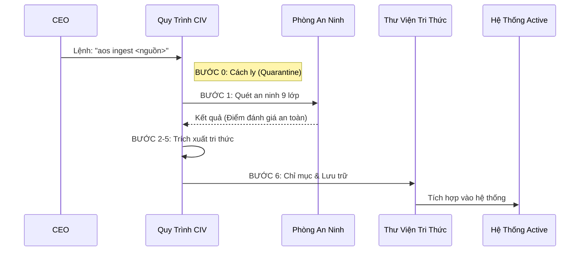

# 🌌 AI OS CORP — Hệ Điều Hành Trí Tuệ Nhân Tạo Tự Trị
> **Phiên bản 3.0 | Chu kỳ 8 | [LongLeo287/aios-local](https://github.com/LongLeo287/aios-local)**


AI OS là một **hệ sinh thái tự trị, 100% di động và tuân thủ Zero-Trust**. Hệ thống được thiết kế để điều phối các luồng công việc AI phức tạp thông qua 21 phòng ban chuyên biệt, vận hành như một tập đoàn kỹ thuật số thực thụ với các quy tắc kiến trúc nghiêm ngặt.

---

## 🏛️ 1. Cấu Trúc Tổ Chức (21 Phòng Ban)

Hệ thống được tổ chức theo mô hình phân tầng với đội ngũ lãnh đạo C-Suite giám sát các đơn vị thực thi.

```mermaid
graph TD
    subgraph Tier0 [Tầng 0: Quyền Lực Tối Thượng]
        CEO(CEO — Con Người)
        AOS_OP(Orchestrator Pro — Trợ Lý Điều Hành)
    end

    subgraph Tier1 [Tầng 1: Chiến Lược C-Suite]
        CTO(CTO — Kiến Trúc Sư Trưởng)
        CMO(CMO — Giám Đốc Tăng Trưởng)
        COO(COO — Quản Lý Vận Hành)
        CFO(CFO — Quản Lý Chi Phí)
        CSO(CSO — Giám Đốc Chiến Lược)
    end

    subgraph Tier2 [Tầng 2: Các Phòng Ban Chức Năng]
        %% Khối Kỹ thuật
        ENG[Engineering]
        QA[QA & Kiểm Thử]
        IT[Hạ Tầng IT]
        REG[Quản Lý Năng Lực]
        SYSTEM[Sức Khỏe Hệ Thống]

        %% Khối Tăng trưởng
        MKT[Marketing]
        SUP[Hỗ Trợ]
        CR[Kiểm Duyệt Nội Dung]
        RD[Nghiên Cứu & Phát Triển]

        %% Khối Vận hành & An ninh
        OPS[Vận Hành]
        SEC[An Ninh & GRC]
        FIN[Tài Chính]
        HR[Nhân Sự]
        LEG[Pháp Lý]
        CIV[Tiếp Nhận Nội Dung - CIV]
        PLAN[Kế Hoạch & PMO]
        MON[Giám Sát & Thanh Tra]
        LIB[Thư Viện Tri Thức]
        OD[Phát Triển Tổ Chức]
        CR_DEPT[Phòng Lễ Tân]
        FAC[Bảo Trì Hệ Thống]
    end

    CEO --> AOS_OP
    AOS_OP --> CTO & CMO & COO & CFO & CSO

    CTO --> ENG & QA & IT & REG & SYSTEM
    CMO --> MKT & SUP & CR & RD
    COO --> OPS & SEC & HR & CIV & PLAN & MON & LIB & CR_DEPT & FAC
    CFO --> FIN
    CSO --> LEG & RD & OD
```



---

## 🤖 2. Hệ Thống Agent & Trí Tuệ Nhân Tạo

Hệ thống sử dụng mô hình 3 tầng Agent để đảm bảo an ninh, khả năng mở rộng và tính chuyên môn hóa cao.

```mermaid
graph LR
    subgraph T0 [Tầng 0: Thủ Lĩnh]
        ANT[Antigravity]
        OPR[Orchestrator Pro]
    end

    subgraph T1 [Tầng 1: Lãnh Đạo]
        SWE[Software Architect]
        GRO[Growth Agent]
        SCM[Scrum Master]
        CSM[Cost Manager]
        PM[Product Manager]
    end

    subgraph T2 [Tầng 2: Thực Thi & Subagents]
        FE[Frontend Agent]
        ML[AI/ML Engineer]
        SEC_ENG[Security Engineer]
        WEB[Web Researcher]
        KNOW[Knowledge Agent]
        SKILL[Skill Creator]
    end

    T0 --> T1
    T1 --> T2
```



### Các Agent Chủ Chốt:
- **Antigravity (Tier 0)**: Bộ não điều phối chính, quản lý việc bàn giao nhiệm vụ giữa các agent.
- **Claude Code (Tier 2)**: Chuyên gia nghiên cứu và thực thi các tác vụ kỹ thuật chuyên sâu.
- **Nova (R&D)**: Phụ trách tổng hợp tri thức và quy trình học tập tự động (Learning Loop).
- **Strix (Security)**: Giám sát an ninh tự động và rà soát lỗ hổng.

---

## ⚡ 3. Quy Trình Tự Động Hóa (CIV Pipeline)

AI OS ưu tiên an toàn dữ liệu thông qua quy trình **CIV (Tiếp Nhận & Thẩm Định)** để đảm bảo mọi dữ liệu bên ngoài đều được kiểm soát chặt chẽ.



### Các Tự Động Hóa Chính:
- **Chu kỳ hàng ngày (`aos corp start`)**: Đồng bộ hóa toàn bộ phòng ban và tạo báo cáo hàng ngày.
- **Bàn giao (Handoff Protocol)**: Tự động chuyển giao trạng thái giữa các agent qua `blackboard.json`.
- **Tự sửa lỗi (Self-Healing)**: `system_health` giám sát độ trễ API và quản lý chi phí 24/7.

---

## 🛠️ 4. Công Nghệ & Kỹ Năng

Hệ thống được xây dựng trên hạ tầng mô-đun, nạp dữ liệu theo yêu cầu (lazy-loaded).

### 🧠 Trí Tuệ & RAG (Truy xuất dữ liệu)
- **LightRAG**: Công cụ truy xuất tri thức lõi (Port 9621).
- **Mem0**: Bộ nhớ dài hạn giúp lưu giữ ngữ cảnh qua nhiều phiên làm việc.
- **GitNexus**: Phân tích cấu trúc code nâng cao để lập bản đồ kho lưu trữ.

### ⚙️ Hệ Sinh Thái MCP
- **Tier 1 (Cốt lõi)**: Firecrawl, Supabase, GitNexus.
- **Tier 2 (Nâng cao)**: Context7, AgentShield, Google Knowledge.
- **Plugins**: Hơn 50+ công cụ chuyên biệt về scraping, an ninh và thiết kế.

### 🚀 CI/CD & Cơ Sở Hạ Tầng
- **Zero-Trust**: Các điểm kiểm soát bắt buộc (**GATE_QA**, **GATE_SECURITY**).
- **Môi trường**: Runtimes Node/Python được quản lý qua `setup.ps1`.
- **Telemetry**: Toàn bộ lịch sử thực thi được ghi lại tại `system/telemetry/receipts/`.

---

## 🏁 5. Bắt Đầu Sử Dụng

### 1. Khởi Tạo
Chạy script cài đặt để cấu hình môi trường và nạp các khóa bí mật:
```powershell
./setup.ps1
```

### 2. Khởi Động Hệ Thống
Bật bộ não điều hành và kiểm tra kết nối:
```powershell
aos corp start
```

### 3. Lệnh Cơ Bản
- `aos ingest <repo>`: Tiếp nhận và nạp tri thức từ một repository an toàn.
- `aos status`: Kiểm tra sức khỏe hệ thống và trạng thái bảng tin (blackboard).
- `aos handoff <agent>`: Ủy quyền nhiệm vụ cho một agent chuyên trách.

---

## 📜 6. Quy Tắc Quản Trị
- **RULE-CIV-01**: Không clone trực tiếp. Mọi nguồn tin phải qua quy trình CIV thẩm định.
- **RULE-STORAGE-01**: Toàn bộ dữ liệu phải nằm trong thư mục gốc `D:\AI OS CORP` để đảm bảo tính di động.
- **RULE-TIER-01**: Tuân thủ nghiêm ngặt mô hình Plugin 3 tầng.

---
**AI OS CORP** — *Xây dựng tương lai của trí tuệ tự trị.*
Thiết kế bởi **LongLeo** | Điều phối bởi **Antigravity**
