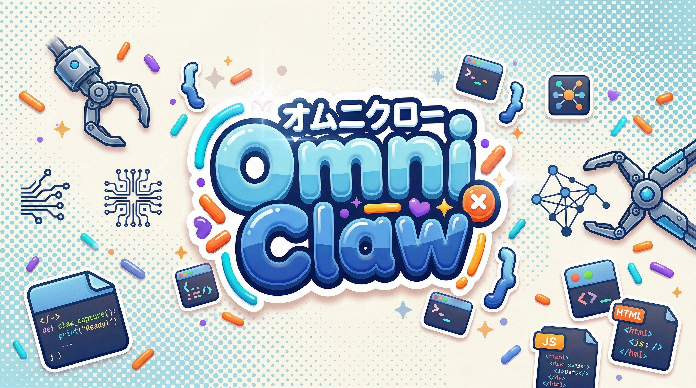
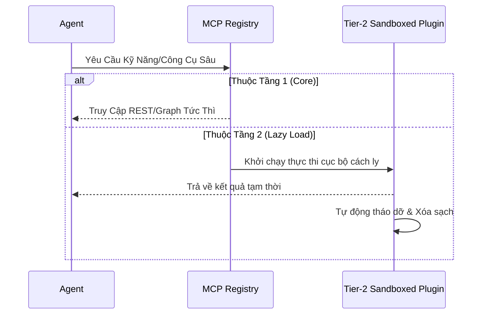

<div align="center">

  
  <br><br>
  
  <p align="center">
    
  </p>
  
  <p align="center">
    
  </p>

  <b>Hệ Điều Hành Đa Tác Nhân, Nguyên Khối và Tự Trị</b><br><br>

  [](#)
  [](https://github.com/LongLeo287/OmniClaw/commits/main)
  
  <br>

  [](#)
  [](#)
  [](#)
  [](https://github.com/LongLeo287/OmniClaw/discussions)
  <br>
  
  [**🇬🇧 English Version**](README.md)
  
  <br>

[Giới Thiệu](#-giới-thiệu-về-omniclaw) •
[Sức Mạnh](#-thế-mạnh-cốt-lõi--tại-sao-chọn-omniclaw) •
[Kiến Trúc](#-kiến-trúc--plugin-3-tầng) •
[Phòng Ban](#-phòng-ban-nhân-sự) •
[Cài Đặt](#-cài-đặt) •
[Thảo Luận](https://github.com/LongLeo287/omniclaw-local/discussions) •
[Lời Cảm Ơn](#-lời-cảm-ơn)

</div>

---

## 🌟 Giới Thiệu về OmniClaw

**OmniClaw** là một Hệ Điều Hành đa tác nhân có tính mô-đun cao, được thiết kế để chạy trực tiếp trên các LLM hàng đầu (Anthropic Claude, Google Gemini, OpenAI). Nó biến máy tính cá nhân của bạn thành một tập đoàn kỹ thuật số tự trị.

Thay vì chỉ hoạt động như một chatbot đơn giản, OmniClaw chủ động điều phối các chỉ thị phức tạp của bạn thông qua các **Phòng Ban Chức Năng** chuyên biệt, tự quản lý bộ nhớ bằng Graph RAG, và liên tục tiến hóa mã nguồn dựa trên hướng dẫn của bạn. Hệ thống được thiết kế với triết lý **Bảo Mật Zero-Trust**, đảm bảo mọi dữ liệu địa phương luôn nằm quyền kiểm soát của bạn.

---

## ⚡ Thế Mạnh Cốt Lõi & Tại Sao Chọn OmniClaw?

Điều gì khiến OmniClaw khác biệt hoàn toàn so với các trợ lý lập trình AI thông thường?

1. **Khả Năng Di Động Tuyệt Đối & Không Phụ Thuộc Nền Tảng**
   Chúng tôi không khóa bạn vào một IDE duy nhất. OmniClaw được thiết kế để tương thích với **Cursor**, **Claude Code CLI**, **Google Gemini**, và **OpenCode**. Các quy tắc hệ thống được kế thừa toàn cầu bất kể bạn thích giao diện nào.
2. **Bảo Vệ Git Zero-Trust**
   Được trang bị các daemon chạy ngầm `omniclaw_deep_cleaner.py` cực kỳ quyết liệt. Mỗi khi bạn đóng phiên làm việc, HĐH sẽ quét cache, xóa dữ liệu tạm thời (`.sqlite`, `.db`), và làm sạch các commit GitHub để ngăn nòng API key hoặc bí mật rò rỉ.
3. **Trình Khởi Tạo Siêu Tự Động**
   Quên việc quản lý hàng chục script shell phức tạp đi. Chỉ cần chạy `omniclaw` trong terminal (hoặc nhấp đúp vào file `omniclaw.bat` trên Windows) để mở Dashboard trung tâm. Nó tự động xử lý các phụ thuộc NPM, Extension VSCode và điều hướng Model.
4. **Thực Thi Tự Trị (Luồng Công Nhân)**
   Các Agent bậc thầy (như Claude hoặc Gemini) ủy quyền các tác vụ khổng lồ nhiều bước cho các sub-agent (CrewAI, script Node). Nó hoạt động như một Quản Trị Viên Dự Án, không chỉ là một lập trình viên.
5. **Khung Xương Nhận Thức Có Sẵn (Zero-Config Memory)**
   Khi clone OmniClaw, bạn kế thừa cấu trúc 300+ thư mục được khởi tạo sẵn qua `.gitkeep`. Bộ nhớ RAG địa phương và Cơ sở kiến thức đa tác nhân của bạn sẵn sàng hoạt động ngay từ ngày đầu tiên.
6. **Chính Sách Ngôn Ngữ Toàn Cầu**
   Kiến trúc tuân thủ nghiêm ngặt Tiếng Anh Kỹ Thuật cho tất cả các file hệ thống, Knowledge Item và Agent. Quy tắc này loại bỏ nghẽn tokenization và đảm bảo tương thích API hoàn hảo, trong khi vẫn hỗ trợ tài liệu Tiếng Việt cho con người qua các mẫu `-vn.md`.

---

## 🏛️ Kiến Trúc & Plugin 3 Tầng

Để duy trì hiệu năng nhẹ nhàng trong khi cho phép mở rộng vô hạn, tất cả công cụ trong OmniClaw đều tuân theo **Giao Thức Plugin 3 Tầng**:

- **Tầng 1 (Hạ Tầng Cốt Lõi)**: Các engine bản địa, luôn bật (vd: `LightRAG` cho bộ nhớ, `Firecrawl` cho quét web).
- **Tầng 2 (Plugin Load-Chậm)**: Công cụ chuyên biệt (như trình xử lý PDF hoặc tạo ảnh Python nặng) được đưa vào sandbox và **chỉ khởi động khi được yêu cầu**, sau đó tự động bị hủy để giải phóng RAM.
- **Tầng 3 (Danh Sách Đen)**: Các mô-đun lỗi thời hoặc xung đột mà hệ thống bị cấm thực thi.



---

## 🏢 28 Phòng Ban Kiến Trúc

| ID          | Phòng Ban               | Chức Năng                                                                                     | Agent Trưởng          |
| :---------- | :---------------------- | :-------------------------------------------------------------------------------------------- | :------------------ |
| **Dept 01** | **Engineering**         | Backend, UI/UX Frontend, và tích hợp mô hình AI.                                              | `backend-architect` |
| **Dept 05** | **Strategic Planning**  | Điều phối lộ trình, phân tích KPI, và tiến hóa tổ chức.                                       | `product-manager`   |
| **Dept 09** | **Content Review**      | Kiểm duyệt chất lượng đầu ra và giọng văn.                                                    | `editor-agent`      |
| **Dept 10** | **Strix Security**      | Kiểm toán an ninh mạng và thẩm định các thành phần bên ngoài.                                 | `strix-agent`       |
| **Dept 13** | **Nova Research**       | Nghiên cứu Web chuyên sâu và tạo nguyên mẫu kiến trúc.                                        | `rd-lead`           |
| **Dept 18** | **Asset Library**       | Quản lý luân chuyển bộ nhớ và Đồ thị kiến thức toàn diện.                                     | `library-manager`   |
| **Dept 20** | **CIV (Content Intake)**| Hệ thống hóa việc tiêu thụ, quét và phân tích GitHub/PDF thành Markdown thuần túy.            | `intake-chief`      |
| **Dept 22** | **Operations**          | Vệ sinh phần cứng, dọn dẹp thư mục gốc, bảo vệ Git Force-Push.                                | `scrum-master`      |
| **Dept 23** | **Reception**           | Tiếp nhận khách hàng tự động, thu thập yêu cầu và tạo đề xuất.                                | `project-intake`    |
| **...**     | **Và 19 phòng ban khác** | 28 phòng ban Zero-Trust đang quản lý 116 agent!                                               | `various`           |

---

> [!TIP]
> **Tìm hiểu sâu**: Để biết đầy đủ thông tin về tất cả 28 phòng ban, sơ đồ báo cáo và tương tác giữa các agent, hãy xem [**Mục Lục Hệ Thống Chính**](core/docs/architecture/MASTER_SYSTEM_MAP.md).

> [!NOTE]
> Lực lượng lao động được chia nghiêm ngặt thành 4 Trụ cột vật lý: `agents/` (116 nhân viên tự trị), `subagents/` (nhân viên chạy tác vụ tạm thời), `departments/` (cấu trúc báo cáo), và `system/` (Vùng Cấu hình Khai báo cho các prompt toàn cầu và bản đồ daemon HĐH).

---

---

## 🛡️ Pipeline OAP (Kiến Trúc Zero-Trust)

OmniClaw thực thi **Pipeline Tự Trị (OAP)** nghiêm ngặt để quản lý cách các tài sản, agent và kỹ năng mới gia nhập hệ thống.

- **Intake Qua Gateway (`OER_INBOX`)**: Các trình tạo không thể đổ file cấu hình trực tiếp vào hệ sinh thái. Chúng phải gửi bản thiết kế vào Hàng Đợi Cách Ly (Quarantine Queue).
- **Định Danh Trước (`_DIR_IDENTITY.md`)**: Không Agent hay Phòng ban nào có thể được triệu hồi nếu không có "hộ chiếu" `_DIR_IDENTITY.md`. Các node không ánh xạ sẽ bị từ chối.
- **Đồng Bộ Đồ Thị Tổng**: Các tài sản đã qua kiểm duyệt mới được đưa vào `FAST_INDEX.json` và Bản Đồ Năng Lực Toàn Cầu.

---

## ⚙️ Daemon Hệ Thống Cốt Lõi (7 Trụ Cột Quản Trị)

OmniClaw điều phối các chức năng tự trị thông qua 7 daemon chạy ngầm vĩnh viễn:

| Daemon | Định Danh | Trách Nhiệm Cốt Lõi |
| :--- | :--- | :--- |
| **OMA Architect** | `oma_architect` | Người quản lý bản đồ. Thực thi cấu trúc node và xác thực lưới hệ thống toàn cầu. |
| **OA Academy** | `oa_academy` | Động cơ tự cải thiện. Huấn luyện sub-agent, quản trị nhân sự 116 agent. |
| **OIW Intake** | `oiw_intake` | Kiểm soát biên giới internet (GitHub/Web), đưa dữ liệu thô vào HĐH. |
| **OER Registry** | `oer_registry` | Người giữ cổng. Xác thực định danh OAP và cấp quyền thực thi chính thức. |
| **OBD Bridge** | `obd_harbor` | Thuyền trưởng cảng. Xử lý khởi chạy tiến trình Docker và cầu nối Python. |
| **OHD Healer** | `ohd_healer` | Sửa lỗi cây cú pháp, tự động lint file nguồn và đặt lại các tag YAML bị thiếu. |
| **OSF Warden** | `osf_warden` | Quét sâu heuristic. Từ chối mã nguy hiểm thông qua các trạm kiểm soát biên giới. |

---

## 🗺️ Bản Đồ Tổng & Theo Dõi Kiến Thức

Để đảm bảo đồng bộ tuyệt đối trên toàn hệ thống file, OmniClaw tránh sử dụng các file bản đồ cục bộ. Thay vào đó, nó dựa trên hai Bản Đồ Tổng được theo dõi toàn cầu:

- **Chỉ Mục Nhanh (`FAST_INDEX.json`)**: Sổ cái có thẩm quyền của hệ điều hành. Mọi Agent, Phòng ban và Skill hợp lệ trên mạng lưới đều được đóng dấu tại đây. 
- **Đồ Thị Thư Viện (`LIBRARY_GRAPH.json`)**: Ánh xạ các ranh giới quan hệ phức tạp giữa các sub-agent và các file Kiến thức cần thiết.
- **Theo Dõi Tài Liệu (`core/docs`)**: Tất cả bộ nhớ tổ chức, Bảng điểm KPI và kiến trúc lưu trữ dài hạn được lưu tài liệu trong thư mục `core/docs/`.

---

## 🔒 Phân Tách Daemon Nghiêm Ngặt (Ranh Giới Zero-Trust)

Một nguyên tắc cơ bản của kiến trúc Zero-Trust của OmniClaw là sự tách biệt tuyệt đối giữa Thực thi vs Chữa lành vs Kiến trúc:
- **`system_security`**: Nắm quyền tối cao đối với các điểm kiểm soát (`QUARANTINE`). Chỉ những Border Agent chuyên dụng mới có quyền vô hiệu hóa các mối đe dọa.
- **`system_health`**: `ohd_healer` chỉ chạm vào những file mà OSF đánh dấu là lỗi, nhưng không thể từ chối hoặc xóa bỏ kiến trúc hợp lệ.
- **`system_daemons`**: Các daemon như **OA Academy** bị cấm truy cập các vùng cách ly dể tránh nhiễm độc nhận thức! Nếu OA cần phân tích một kho lưu trữ xấu, nó phải yêu cầu OSF xử lý trước.

---

## 💽 Cài Đặt

OmniClaw được xây dựng theo kiến trúc "Clone & Run".

```bash
# 1. Clone repository về máy địa phương
git clone https://github.com/LongLeo287/omniclaw-local.git "OmniClaw"
cd "OmniClaw"

# 2. Liên kết hệ thống toàn cầu qua NPM
npm install -g .

# 3. Khởi động Terminal HĐH (Có thể chạy từ bất cứ đâu)
omniclaw
```

---

## 📚 Tài Liệu & Quy Trình Nội Bộ

Để sử dụng hàng ngày và xử lý dữ liệu tự động, vui lòng tham khảo các hướng dẫn vận hành nội bộ của chúng tôi:

- [**Giao Thức Tiếp Nhận GitHub An Toàn (CIV)**](core/docs/workflows/data_intake.md)
- [**Dọn Dẹp Sâu HĐH & Bảo Vệ Vault**](core/docs/workflows/deep_cleaner.md)

---

## 📖 Hướng Dẫn & Bản Đồ Hệ Thống Toàn Diện

Để hiểu sâu hơn về kiến trúc hệ thống, các dịch vụ đang chạy và các năng lực đã tải, hãy tham khảo các bản đồ tổng của chúng tôi:

- 🏛️ [**Các Nguyên Tắc Kiến Trúc Cốt Lõi**](core/docs/architecture/CORE_PRINCIPLES.md) — Giải thích về khung xương bộ nhớ Zero-Config và chính sách ngôn ngữ không phụ thuộc OS.
- 🧭 [**Bản Đồ Hệ Thống Tổng**](core/docs/architecture/MASTER_SYSTEM_MAP.md) — Bản thiết kế đầy đủ: 28 phòng ban, Trình tự khởi động, Kiến trúc bộ nhớ và Quy trình cổng.
- 🚦 [**Hướng Dẫn Kích Hoạt**](core/docs/usage_guides/ACTIVATION_GUIDE.md) — Ánh xạ cổng và các lệnh khởi động thủ công cho các dịch vụ địa phương.
- 🧩 [**Bản Đồ Năng Lực Skill & Plugin**](core/docs/architecture/SKILLS_AND_PLUGINS_MAP.md) — Chỉ mục tổng hợp của hơn 100 kỹ năng và plugin bản địa.
- 📊 [**Thư Viện Khoa Học Dữ Liệu**](core/docs/usage_guides/DATA_SCIENCE_LIBRARY.md) — Danh sách các repository Machine Learning và RAG đang hoạt động.
- 🏛️ [**Quản Trị Core Daemons & OER**](core/docs/architecture/CORE_DAEMONS_AND_OER.md) — 4 Core Daemon (OIW/OHD/OA/OER), ma trận thẩm quyền và pipeline hệ sinh thái tự động 5 cổng.

---

## 🙏 Lời Cảm Ơn

OmniClaw đứng trên vai những người khổng lồ mã nguồn mở. Chúng tôi chân thành cảm ơn:
- **Anthropic** (Claude Code CLI), **Google Deepmind** (Gemini), **LightRAG**, **Firecrawl**, **Mem0**, **CrewAI**, **Cursor**.

<br>
<div align="center">
  <i>"Hệ Điều Hành của Tương Lai, Chạy Trên Bàn Làm Việc của Bạn Hôm Nhau."</i>
</div>
