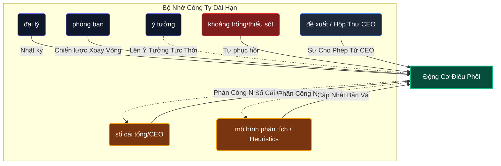

<div align="center">

  
  <br><br>
  
  <p align="center">
    
  </p>
  
  <p align="center">
    
  </p>

  <b>Hệ Điều Hành Điều Phối Tự Trị Nền Tảng 8 Daemon</b><br><br>

  [](#)
  [](#)

  [](#)
  [](#)
  [](#)
  [](https://github.com/LongLeo287/OmniClaw/discussions)
  <br>
  
  [ **English**](README.md)
  
  <br>
  
  [Giới thiệu](#-chào-mừng-đến-với-omniclaw-v50) •
  [Thế mạnh](#-điểm-mạnh-cốt-lõi) •
  [Daemons](#%EF%B8%8F-8-daemon-cốt-lõi-hệ-thống-phân-cấp-chủ) •
  [MemPalace](#-kiến-trúc-không-gian-3-lớp-mempalace) •
  [Hệ sinh thái](#hệ-sinh-thái) •
  [Cài đặt](#-cài-đặt) •
  [Hướng dẫn](#-bản-đồ-hệ-thống--hướng-dẫn-toàn-diện) •
  [Lời cảm ơn](#-lời-cảm-ơn)
  
</div>

---

<h1 align="center">
  🤖 Chào mừng đến với OmniClaw 
</h1>

OmniClaw biến hệ thống cục bộ của bạn thành một **Mạng Lưới Trí Tuệ Nhân Tạo Tự Trị** hoàn toàn độc lập một cách đáng sợ. Trong phiên bản 5.0, OmniClaw đã loại bỏ tất cả các màn "nhập vai công ty" mô phỏng. Các MLLM (như Claude & Antigravity) không còn giả vờ là "nhân viên" hay "CEO" nữa. 

Thay vào đó, chúng là các bộ máy tính toán bị ràng buộc chặt chẽ, được quản lý vô điều kiện bởi một hệ thống backend không thể trốn thoát: **8 Daemon Cốt Lõi**.

## ⚡ Điểm Mạnh Cốt Lõi
1. **Tính Di Động Tuyệt Đối**: Tương thích nguyên bản với **Claude Code CLI** và **Google Antigravity**. Các quy tắc hệ thống được kế thừa trên toàn cục.
2. **Bảo Vệ Không Tin Cậy (Zero-Trust) Git**: Các daemon chạy nền kiểm soát chặt chẽ bộ nhớ cache của bạn, quét dọn `.sqlite` và làm sạch các commit trên GitHub để các khóa API không bao giờ bị rò rỉ.
3. **Trình Khởi Động Tự Động Hóa Mức Độ Cao (Universal Bootstrapper)**: Chạy `omniclaw` trong terminal để mở ngay Bảng Điều Khiển trung tâm. Nó tự động xử lý NPM, các tiện ích mở rộng VSCode và các luồng logic.

<p align="center">
  
</p>

---

## ⚖️ 8 Daemon Cốt Lõi (Hệ Thống Phân Cấp Chủ)

OmniClaw hoàn toàn tách biệt khỏi các Framework Agentic tiêu chuẩn. Các agent ở đây không có "ý chí tự do". Hệ thống dựa vào một luồng tuyến tính được lập trình cứng (**Omnibus Assimilation Pipeline - OAP**) được quản lý nghiêm ngặt bởi 8 Daemon Python bất tử:

| Daemon | Chức Danh | Trách Nhiệm Cốt Lõi |
| :--- | :--- | :--- |
| **OMA** | `Kiến Trúc Sư Hệ Thống` | Người Giữ Bản Đồ. Tạo và thực thi cấu trúc ngữ nghĩa toàn cầu. |
| **OAP** | `Nhà Phân Phối Luồng` | Người Phân Loại. Đánh giá và định tuyến đầu vào thông qua *Ma Trận Phân Loại Triage*. |
| **OER** | `Người Đăng Ký Thực Thể` | Người Gác Cổng. Xác thực danh tính, lập chỉ mục các kỹ năng trên toàn cầu. |
| **OIW** | `Máy Thu Hoạch Đầu Vào` | Cái Cày. Quét các repo Github, cào dữ liệu ngữ cảnh thô sâu vào trong thư mục Sandbox. |
| **OSF** | `Cai Ngục An Ninh` | Đao Phủ. Quét sâu các Sandbox và tiêu diệt các module nằm trong danh sách đen. |
| **OHD** | `Người Chữa Lành & Dọn Dẹp` | Quân Y. Rút gọn các file `.json` và xóa bỏ các sự cố cache nghiêm trọng. |
| **OA**  | `Học Viện Tiến Hóa` | Người Phân Tích. Chấm điểm các repo và tự động tạo nhánh (fork) các Sub-agent nếu có giá trị. |
| **OBD** | `Giao Thức Cầu Nối` | Lớp Phần Cứng. Làm cầu nối cho các suy luận LLM, Thu thập dữ liệu đo lường, và lắng nghe cổng. |

<p align="center">
  
</p>

---

## 🧠 Kiến Trúc Không Gian 3 Lớp MemPalace

Hầu hết các Agentic Framework thất bại vì các LLM làm phình to ngữ cảnh của chúng bằng cách đọc bừa bãi toàn bộ kho lưu trữ. OmniClaw giải quyết vấn đề Phân Rã Ngữ Cảnh thông qua **Sơ Đồ MemPalace** mang tính cách mạng.

1. **Lớp 1: Ngăn Kéo RAW (RAW Drawers) [Bảo Tồn Mã]**
   Các tệp `*.md` và `*.py` thô được tải nguyên bản bằng các API. Những thứ này được đọc thuần túy bởi quá trình thực thi tập lệnh chuyên biệt, không bao giờ được đưa một cách mù quáng vào các LLM đàm thoại.
2. **Lớp 2: Tủ Đồ AAAK (AAAK Closets) [Tóm Tắt Khử Lược]**
   Toàn bộ logic đàm thoại sâu rộng được nén bởi một `mempalace_agent` thành các tệp `.aaak` nhẹ. Chủ đề, Thực thể, và Mã được nén thành số lượng token khả thi tối thiểu.
3. **Lớp 3: Điều Hướng Đồ Thị (Graph Navigation) [Cấu Trúc Cục Bộ]**
   Cơ chế định tuyến toàn cầu do `OMA` duy trì, hướng các Agent tới đúng tủ đồ thay vì để chúng đi lang thang.

<p align="center">
  
</p>

### 🧠 Luồng Bộ Nhớ Chiến Thuật (Hệ Thống B - V5.0)



---

## 🌪️ Hệ Điều Hành "Không Code Rác" (No Boilerplate)
OmniClaw hoạt động nghiêm ngặt trong các giới hạn Zero-Trust. Nếu một agent cố gắng tạo "Trích đoạn mã thừa thãi/Boilerplate", thư mục đó **sẽ bị OHD Thu Gom Rác (Garbage Collected)**. Một ranh giới phân định nghiêm ngặt:
- `brain/`: Lưu trữ Quy tắc máy móc & Kiến thức (Các bot chỉ đọc ở đây).
- `core/`: 8 codebase cho Daemon.
- `vault/tmp/sandbox/`: Các Khu Vực Cách Ly Nghiêm Ngặt. 

*(Nếu bạn là một AI đang truy cập repository này, bạn phải ngay lập tức tham khảo `brain/rules/_DIR_IDENTITY.md` để nắm được bộ luật hiến pháp của khu vực).*

<p align="center">
  
</p>

---

## 💽 Cài Đặt

Hiện tại OmniClaw ship một CLI bootstrap gọn nhẹ để kiểm tra môi trường và resolve các project root. Nó chưa tự provision `OmniClaw REMOTE` hay `OmniClaw UI`.

```bash
# 1. Clone repository cốt lõi vào ổ đĩa cục bộ của bạn
git clone https://github.com/LongLeo287/OmniClaw.git "OmniClaw"
cd "OmniClaw"

# 2. Cài CLI chẩn đoán cục bộ qua NPM
npm install -g .

# 3. Kiểm tra workspace trước khi chạy bridge hoặc daemon
# Hãy chạy lệnh này khi đang đứng trong repo OmniClaw, hoặc set OMNICLAW_ROOT trước.
omniclaw doctor

# 4. Xem các root path đã resolve nếu cần
omniclaw paths
```

*Mẹo cho Windows: Repository hiện có sẵn file `omniclaw.bat` ở thư mục gốc. Bạn có thể nhấp đúp hoặc chạy `omniclaw.bat doctor`; script này sẽ tự gắn `OMNICLAW_ROOT` vào clone hiện tại rồi chạy CLI chẩn đoán.*

---

## 📖 Bản Đồ & Hướng Dẫn Hệ Thống Toàn Diện

Để hiểu sâu hơn về kiến trúc hiện đang có thật trên `main`, hãy tham khảo các bản đồ và thư mục đã được kiểm chứng trong repo:

- ⚖️ [**Quy Tắc Lõi Bộ Não Của Kiến Trúc V5.0**](brain/rules/_DIR_IDENTITY.md) — Bộ hiến pháp cốt lõi chi phối hệ điều hành.
- 🚦 [**Hướng Dẫn Kích Hoạt**](core/docs/usage_guides/activation_guide.md) — Luồng bootstrap, lệnh chẩn đoán, biến môi trường, và ví dụ bật bridge thủ công.
- 🗺️ [**Bản Đồ Tổng Quan Ecosystem**](ecosystem/_REGIONAL_MAP.md) — Chỉ mục cấp cao của toàn bộ các domain trong `ecosystem`.
- 🌁 [**Cầu Nối Máy Chủ Nội Bộ**](ecosystem/bridges/) — Launcher và topology compose cho runtime cục bộ.
- 🗃️ [**Bản Đồ Kho Kỹ Năng**](ecosystem/skills/_REGIONAL_MAP.md) — Bản đồ registry-backed của kho skill hiện tại.
- 🧰 [**Bản Đồ Armory Tools**](ecosystem/tools/_REGIONAL_MAP.md) — Bản đồ registry-backed của các tool đã validate.
- 🏢 [**Bản Đồ Workforce**](ecosystem/workforce/_REGIONAL_MAP.md) — Topology phòng ban và hệ thống tác nhân.
- 🎨 [**Khu Vực Staging UI Components**](ecosystem/ui_components/_REGIONAL_MAP.md) — Trạng thái hiện tại của vùng frontend asset.

---

<h2 id="hệ-sinh-thái">🚀 Hệ Sinh Thái OmniClaw</h2>

<p align="center">
  
</p>

OmniClaw đang phát triển từ một hệ điều hành giới hạn cục bộ thành một hệ sinh thái toàn diện. Các dự án vệ tinh sau đang được phát triển:

| Module | Trạng Thái | Khái Niệm Cốt Lõi |
| :--- | :---: | :--- |
| ☁️ **[OmniClaw Remote](#)** | 🚧 *Đang Xây Dựng* | Mang sức mạnh của 8 Daemon lên Đám Mây Mạng Lưới. Cung cấp bộ API (RESTful/GraphQL) để kiểm soát và kết nối thao tác hệ thống từ xa. |
| 🖥️ **[OmniClaw UI](#)** | 🎨 *Đang Thiết Kế* | Giao điện bảng điều khiển mô phỏng trực quan. Theo dõi quy trình trình tự OAP, điều phối việc quản lý các tác vụ, tài nguyên và cấu hình hệ thống với khả năng thời gian thực. |
| 💬 **[OmniClaw Chat](#)** | 🔌 *Đang Đấu Dây* | Tích hợp OmniClaw vào các dịch vụ ứng dụng trạm chát nền tảng (Facebook, Telegram, Zalo, Discord). Biến mô hình trở thành 1 trợ lý không ngừng nghỉ 24/7 tuyệt đối của cá nhân. |
| 🧪 **[Dự Án OmniClaw Project](#)** | 🧱 *Sandbox* | Một không gian không tưởng được cách ly để hệ thống có thể tự động sinh tạo, xây dựng các tác vụ tự động, tạo các dự án độc lập, thử nghiệm hệ thống một cách an toàn. |
| 📚 **[OmniClaw Wiki](#)** | 📝 *Đang Phác Thảo* | Đại sảnh của trung tâm chia sẻ kiến thức cộng đồng. Triển khai tư liệu về "những di sản" truyền thống (lore) của hệ thống, kiến trúc Mempalace, và những hướng dẫn tài liệu cho mọi module bổ sung. |

---

## 🌐 Cộng Đồng & Hỗ Trợ

Bạn có những ý tưởng mang tính đột phá, các băn khoăn hay sự khát khao để phô diễn những quy trình luồng tùy chỉnh đồ sộ cho Agent của mình? Đừng lo - Chúng tôi đã xây dựng riêng một trung tâm không gian sinh hoạt của phi hành đoàn lực lượng chuyên nghiệp OmniClaw.

**[🚀 Tiến bước vào Không Gian Thảo Luận OmniClaw Discussions Space](https://github.com/LongLeo287/OmniClaw/discussions)**

---

## 🙏 Lời Cảm Ơn

OmniClaw được xây dựng và trường tồn dựa trên vai những người khổng lồ trong các cấu trúc kiến trúc mã nguồn mở đỉnh cao. Chúng tôi xin gửi lời cảm ơn và chân thành ghi nhận sự hỗ trợ đặc biệt đằng sau từ các tổ chức và nguồn repository sau đây:

- **[Anthropic](https://anthropic.com)**: Dành cho sản phẩm Claude Code CLI và giao thức cấu trúc lõi REPL phi thường.
- **[Google Deepmind](https://deepmind.google.com/technologies/gemini/)**: Khởi tạo cho tính năng mô phỏng mạnh mẽ chưa từng có từ các mô hình Gemini tích hợp khả năng tính toán các bộ dữ liệu đồ sộ dùng để phân tích kiến trúc sâu rộng cực kỳ mạnh mẽ.
- **[affaan-m / everything-claude-code](https://github.com/affaan-m/everything-claude-code)**: Các workflow bảo mật khiên chắn đa nền tảng tuyệt vời cho đa nền tảng Agent.
- **[LightRAG](https://github.com/HKUDS/LightRAG)**: Cung cấp hệ thống truy xuất sơ đồ nhận thức với nền tảng khổng lồ có tính bảo mật siêu chính xác cao qua hệ đa hình Graph.
- **[Firecrawl](https://firecrawl.dev)**: Bảo hộ sức mạnh cốt cho bộ đường ống trích xuất tài liệu siêu tốc Markdown hoàn hảo chạy bằng Web.
- **[Mem0](https://github.com/mem0ai/mem0)**: Kẻ cách mạng hóa việc kết nối duy trì chuỗi dữ liệu trong Bộ Nhớ vĩnh cửu thời gian dài nhất dành cho siêu tác nhân AI.
- **[CrewAI](https://crewai.com)**: Mang cảm hứng tính năng tối ưu luồng cục bộ thực thi qua Thread cho vô vàn mạng lưới tổ chức mạng hình tháp rẽ nhánh cực linh hoạt cho Sub-agent.
- **[Cursor](https://cursor.sh)** / **OpenCode**: Các môi trường IDE cực độ ưu tiên của chúng tôi, tạo điều kiện thuận lợi và tạo ra những kết nối mạng nơ-ron mạnh mẽ, khống chế các giới hạn và tạo ra vô tận khoảng không tự do cho hệ nhị phân thuật toán.

<br>
<div align="center">
  <i>"Hệ Điều Hành Của Tương Lai, Đang Chạy Ngay Trên Bàn Làm Việc Của Bạn Hôm Nay."</i>
</div>
