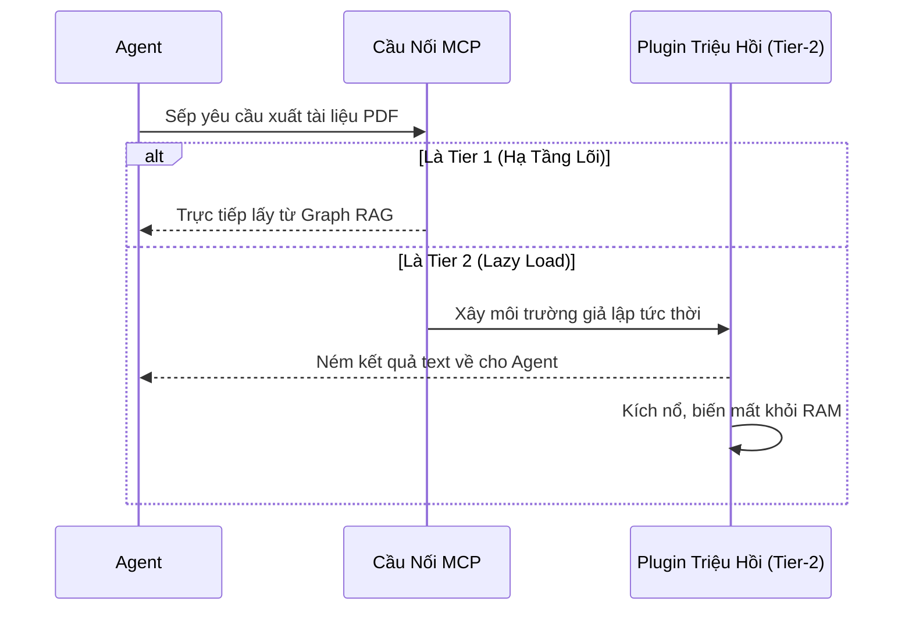

<div align="center">
  
  <h1>🌌 Tập Đoàn Kỹ Thuật Số AI OS</h1>
  <b>Hệ Điều Hành Đa Đặc Vụ Tự Trị (Autonomous Multi-Agent OS)</b><br>
  <br>

  [](#)
  [](#)
  [](#)
  [](https://github.com/LongLeo287/aios-local/discussions)
  
  <br>
  
  [**🇺🇸 Xem Phiên Bản Tiếng Anh (English)**](README.md)
  
  <br>

  [Giới Thiệu](#-giới-thiệu-ai-os) •
  [Sức Mạnh Tuyệt Đối](#-sức-mạnh-cốt-lõi--vì-sao-chọn-ai-os) •
  [Kiến trúc 3 Lớp](#-kiến-trúc--plugin-3-lớp) •
  [Hệ Thống Phòng Ban](#-hệ-thống-phòng-ban-công-sở) •
  [Cài Đặt](#-hướng-dẫn-cài-đặt) •
  [Cộng Đồng](https://github.com/LongLeo287/aios-local/discussions) •
  [Nguồn Mở](#-lời-cảm-ơn)

</div>

---

## 🌟 Giới Thiệu AI OS
**AI OS CORP** là một Hệ Điều Hành siêu tiến hóa (Multi-Agent Operating System) được thiết kế nguyên khối. Dự án mang lại khả năng biến chiếc máy tính Local của bạn thành một Tập Đoàn Kỹ Thuật Số hoạt động tự trị, khởi chạy trên các Bộ Não AI siêu việt (Claude, Gemini, OpenAI).

Thay vì chỉ là một "chatbot biết code", AI OS phân luồng các Mệnh lệnh tinh vi của Giám đốc (Sếp) xuống các **Phòng ban chuyên trách**. AI OS tự quản lý trí nhớ dài hạn thông qua Graph RAG, và tự động viết thêm mã lệnh để tự nâng cấp chính bản thân mình sau mỗi ngày làm việc.

Mọi thứ được bảo hành bằng nguyên tắc **Zero-Trust (Không Tin Tưởng Bất Kỳ Ai)** — đảm bảo 100% tài nguyên Local của sếp không bao giờ lọt ra môi trường bên ngoài.

---

## ⚡ Sức Mạnh Cốt Lõi: Vì Sao Chọn AI OS?

Điều gì tạo ra sự khác biệt hủy diệt giữa AI OS và các AI Assistant trên thị trường?

1. **Agnostic - Bất Khả Xâm Phạm Nền Tảng**
   Chúng tôi không giam cầm Sếp ở một IDE duy nhất. Mã nguồn được thiết kế cực đoan để chạy mượt mà ngay trên Terminal gốc của **Claude Code CLI**, chạy song song với **Cursor**, hoạt động trong **Google Gemini**, và bao phủ cả **OpenCode**. Quy định (Rules) của hệ thống sẽ được di truyền y nguyên đi bất cứ nền tảng nào.
2. **Lá Chắn Không Gian Zero-Trust (Bảo Mật Git)**
   Đội quân dọn dẹp âm thầm `aios_deep_cleaner.py` sẽ tự động kích hoạt sau mỗi Phiên Làm Việc (Session). Ngay khi bạn đóng terminal, OS lao vào quét bộ nhớ Cache, thiêu rụi các Database tạm thời (`.sqlite`, `.db`), và cắt xén lịch sử GitHub để cam đoan 100% không bao giờ có một dòng API Key nào của sếp sống sót trên Internet.
3. **Cỗ Máy Cài Đặt Nguyên Khối (Universal Bootstrapper)**
   Quên đi việc phải gõ 10 file Shell Script khác nhau. Từ nay, sếp chỉ cần gõ đúng 1 chữ thiết quân luật `aios` trên Terminal (hoặc click đúp file `aios.bat` trên Windows). Bảng điều khiển trung tâm (Dashboard) sẽ bung ra, tự cài đặt NPM, tự bơm tiêm (inject) Extension vào VSCode, và cấu hình Model hoàn toàn tự động.
4. **Phân Rã Đa Tuyến (Worker Threads)**
   Master AI (Antigravity hay Claude) không ngốc nghếch ôm đồm mọi việc. Trí tuệ đó chỉ đóng vai trò Tổng Tư Lệnh (Project Manager), và nó đem các công việc cực kỳ đồ sộ giao phó cho mạng lưới Đặc vụ con (CrewAI, Subagents, Python Scripts). Sự liên kết "truyền gậy" (Baton-pass) này tạo ra khả năng tự vận hành tuyệt đối.

---

## 🗺️ Kiến Trúc & Plugin 3 Lớp (3-Tier)

Để giữ cho Hệ Điều Hành chạy nhẹ nhàng như lông vũ mà vẫn đem lại sức mạnh vô hạn, AI OS vận hành toàn bộ công cụ qua giao thức **Plugin 3-Tier**:

*   **Tier 1 (Hạ Tầng Lõi)**: Nạp mọi lúc mọi nơi, không bao giờ tắt (vd: Nhúng `LightRAG` quản lý não bộ, `Firecrawl` cào nát dữ liệu Website).
*   **Tier 2 (Lazy-Load / Triệu Hồi Theo Yêu Cầu)**: Đây là phần kỳ diệu nhất. Các tool nặng nề (Scan PDF, Code tạo ảnh AI) sẽ bị giam lỏng. Khi Master AI cần, Tool sẽ được "Triệu Hồi" (Spin-up). Sau khi ói ra văn bản kết quả, Tool lập tức tự sát (Teardown) để giải phóng toàn bộ RAM cho hệ thống.
*   **Tier 3 (Danh Sách Đen)**: Mã nguồn lỗi thời hoặc xung đột, bị OS từ chối nạp thẳng tay.



---

## 🏢 Hệ Thống Phòng Ban Công Sở

Mọi Mệnh lệnh của CEO (Sếp) sẽ được định tuyến thông minh qua các Hành lang phòng ban:

| ID | Tên Phòng Ban | Vai trò Vận Hành |
| :--- | :--- | :--- |
| **Phòng 10** | **Strix Security** | Vệ binh mạng. Soi rọi từng dòng mã độc, test mọi Github Clone trước khi cho phép mã nguồn chảy vào AI OS. |
| **Phòng 13** | **Nova Research** | Học Viện Nghiên Cứu. Bóc tách Architecture, dạo sâu vào màng Dark Web để đem về chân lý (KIs - Trí tuệ đúc kết). |
| **Phòng 20** | **CIV (Hấp Thụ Dữ Liệu)** | Cơ quan Nhai. Tiêu hóa ngấu nghiến toàn bộ GitHub Repos, PDF khổng lồ, nghiền nát thành chuẩn Markdown tinh khiết. |
| **Phòng 22** | **Ops (Vận Hành)** | Lao công tàng hình. Trực gác dọn dẹp gốc Hệ điều hành, dập tắt các biến bộ nhớ ma, và Force-Push bảo vệ Git repo. |

---

## 💽 Hướng Dẫn Cài Đặt

AI OS được thiết kế để "Clone và Chạy" một cách cục súc và nguyên thủy nhất có thể.

```bash
# 1. Bê nguyên Kho Lưu Trữ Cốt Lõi về Máy Tính của Sếp
git clone [https://github.com/LongLeo287/aios-local.git](https://github.com/LongLeo287/aios-local.git) "AI OS"
cd "AI OS"

# 2. Cấy AI OS vào Global Environment của máy thông qua NPM
npm install -g .

# 3. Kích Ngoại Bảng Điều Khiển (Chạy từ bất cứ nơi đâu trên ổ cứng)
aios
```
*Ghi Chú Đặc Quyền Dành Cho Windows: Chúng tôi đã tích hợp sẵn phương thức Khai hỏa cực lẹ. Sếp chỉ cần nhấn đúp chuột vào file `aios.bat` nằm ngay tại thư mục chứa Code, hệ thống Bố Cáo Setup Console sẽ bùng nổ tức thì.*

---

## 🌐 Cộng Đồng & Hỗ Trợ

Sếp có ý tưởng mới, câu hỏi cần giải đáp, hay muốn khoe những workflow Agent tùy chỉnh cực ngầu của mình? Chúng tôi đã xây dựng một không gian chuyên biệt để lực lượng lao động của AI OS cùng nhau thảo luận và phát triển.

**[🚀 Bước vào Không gian Thảo luận của Tập Đoàn AI OS CORP](https://github.com/LongLeo287/aios-local/discussions)**

---

## 🙏 Lời Cảm Ơn 
Tập Đoàn AI OS CORP xin được đứng trên vai những Người Khổng Lồ vĩ đại trong cộng đồng Open Source. Hệ thống này không thể tồn tại nếu thiếu đi những tinh hoa của:

- **[Anthropic](https://anthropic.com)**: Cho hệ sinh thái Claude Code CLI cùng kiến trúc tương tác siêu vòng lặp (REPL).
- **[Google Gemini](https://deepmind.google.com/technologies/gemini/)**: Bởi Cỗ máy Antigravity, thứ đem lại luồng thần kinh đọc hiểu ngữ cảnh bá đạo nhất quả đất.
- **[affaan-m / everything-claude-code](https://github.com/affaan-m/everything-claude-code)**: Cảm hứng to lớn về các luồng Pattern lá chắn (Agent Shields), đóng vai trò sống còn trong việc di tản Agent sang Đa nền tảng.
- **[LightRAG](https://github.com/HKUDS/LightRAG)**: Mạng lưới Trí nhớ dài hạn vững chắc như bàn thạch nhờ Graph Retrieval.
- **[Firecrawl](https://firecrawl.dev)**: Máy cày dữ liệu Markdown vô song.
- **[CrewAI](https://crewai.com)**: Chìa khóa thiết kế các đội kỵ binh CrewAI Worker mẫn cán.
- **[Cursor](https://cursor.sh)** / **OpenCode**: Môi trường IDE định mệnh, nơi sự gắn kết của Sếp và AI trở thành một dải quang phổ duy nhất.

<br>
<div align="center">
  <i>"Hệ Điều Hành Của Tương Lai, Đang Chạy Ngay Trên Bàn Làm Việc Của Bạn."</i>
</div>
