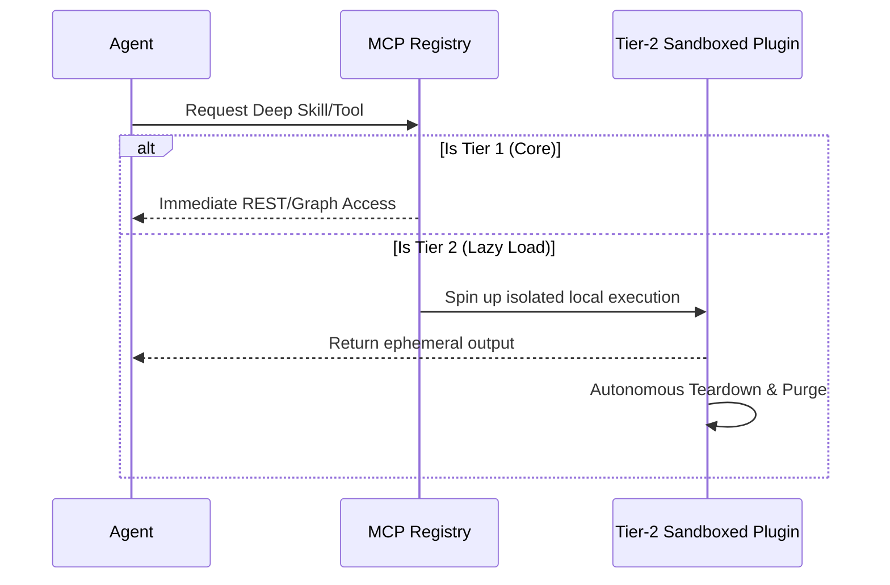
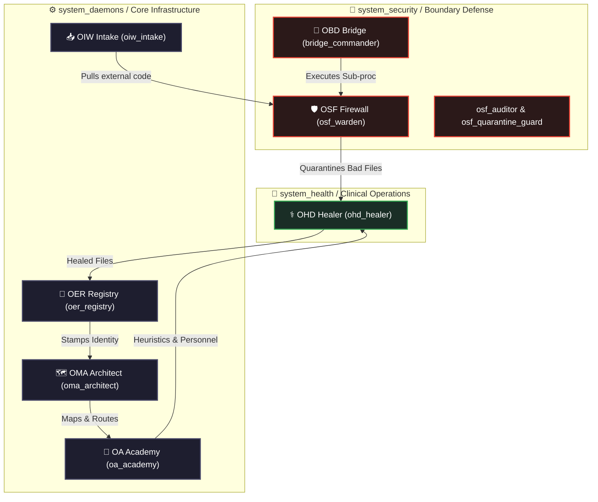

<div align="center">

  
  <br><br>
  
  <p align="center">
    
  </p>
  
  <p align="center">
    
  </p>

  <b>The Autonomous, Monolithic Multi-Agent Operating System</b><br><br>

  [](#)
  [](https://github.com/LongLeo287/OmniClaw/commits/main)
  
  <br>

  [](#)
  [](#)
  [](#)
  [](https://github.com/LongLeo287/OmniClaw/discussions)
  <br>
  
  [**🇻🇳 Vietnamese**](README-vn.md)
  
  <br>

[About](#-about-ai-os) •
[Strengths](#-core-strengths--why-ai-os) •
[Architecture](#-architecture--3-tier-plugins) •
[Departments](#-the-workforce-departments) •
[Installation](#-installation) •
[Discussions](https://github.com/LongLeo287/omniclaw-local/discussions) •
[Credits](#-acknowledgements)

</div>

---

## 🌟 About OmniClaw

**OmniClaw** is a highly modular, multi-agent Operating System designed to run directly on top of premier LLMs (Anthropic Claude, Google Gemini, OpenAI). It transforms your local machine into an autonomous digital corporation.

Rather than acting as a simple chatbot, OmniClaw actively routes your complex directives through specialized **Functional Departments**, manages its own memory utilizing Graph RAG, and dynamically evolves its codebase based on your instructions. It is designed with **Zero-Trust Privacy**, ensuring all your local data remains strictly on your machine.

---

## ⚡ Core Strengths & Why OmniClaw?

What makes OmniClaw profoundly different from standard AI coding assistants?

1. **Absolute Portability & Platform Agnosticism**
   We do not lock you into a single IDE. OmniClaw is designed from the ground up to be compatible with **Cursor**, **Claude Code CLI**, **Google Gemini**, and **OpenCode**. The systemic rules are globally inherited no matter which frontend you prefer.
2. **Zero-Trust Git Protection**
   Equipped with aggressive post-session `omniclaw_deep_cleaner.py` background daemons. Every time you close a session, the OS sweeps your cache, purges ephemeral databases (`.sqlite`, `.db`), and sanitizes GitHub commits to prevent API keys or secrets from ever leaving your local drive.
3. **Hyper-Automated Universal Bootstrapper**
   Forget managing 10 different shell scripts. Simply run `omniclaw` in your terminal (or double-click the Windows `omniclaw.bat`) to instantly invoke the central Dashboard. It handles NPM dependencies, VSCode Extension injections, and Model routing automatically.
4. **Autonomous Execution (Worker Threads)**
   Master agents (like Claude or Gemini) delegate massive, multi-step tasks to sub-agents (CrewAI, Node scripts). It acts like a Project Manager, not just a programmer.
5. **Pre-Built Cognitive Skeleton (Zero-Config Memory)**
   When you clone OmniClaw, you inherit a 300+ directory structure pre-initialized via rigorous `.gitkeep` structural tracking. Your local RAG memory and Multi-Agent Knowledge Bases are ready to digest and classify data from Day 1 without requiring initialization scripts.
6. **OS-Agnostic Global Language Policy**
   The architecture strictly adheres to an English-Only Core (Technical English) for all system files, Knowledge Items, and Agents. This structural rule eliminates LLM tokenization bottlenecks and ensures flawless API multi-tenant compatibility across global models (US, EU, CN), while still supporting localized UI/Docs for humans via `-vn.md` templates.

---

## 🏛️ Architecture & 3-Tier Plugins

To maintain a lightweight footprint while offering infinite vertical scaling, all tools in OmniClaw follow a strict **3-Tier Plugin Protocol**:

- **Tier 1 (Core Infrastructure)**: Native, always-on engines (e.g., `LightRAG` for memory, `Firecrawl` for deep web scraping).
- **Tier 2 (Lazy-Load Plugins)**: Specialized tools (like PDF parsers or heavy Python image generators) that are sandboxed and **spun up only when requested**, then autonomously destroyed/detached to free up RAM.
- **Tier 3 (Blacklisted)**: Outdated or conflicting legacy modules that the system is strictly forbidden from executing.



---

| :--- | :--- | :--- |
| **OIW** | OmniClaw Intake Watchdog | Scrutinizes external internet bounds, scraping raw context inputs and routing them inward to the OS. |
| **OSF** | OmniClaw Sandbox Firewall | Performs heuristic deep scans for leaked API keys, credentials, and malicious patterns. Rejects dangerous code before it enters the Core. |
| **OBD** | OmniClaw Bridge Daemon | The Harbor Master. Handles on-demand process launches, heartbeat pings for sub-services, and terminates zombie docker/python instances. |
| **OHD** | OmniClaw Health Daemon | Monitors background health, system telemetry, and ensures active processes aren't leaking memory. |
| **OMA** | OmniClaw Master Architect | The Map-Keeper. Emits OMA_SYSTEM_MAP, enforces the 4-Pillar structural hierarchy, and quarantines logically misplaced files. |
| **OA** | OmniClaw Academy | The self-improvement engine. Analyzes system logs, recruits personnel, builds missing pipelines, and generates missing structures. |
| **OER**     | OmniClaw Ecosystem Registrar | The Gatekeeper. Validates identities, indexes nodes, and grants official execution privileges. |

## 🏢 The 28 Architectural Departments

| ID          | Department               | Function                                                                                     | Head Agent          |
| :---------- | :----------------------- | :------------------------------------------------------------------------------------------- | :------------------ |
| **Dept 01** | **Engineering**          | Scalable Backend, Frontend UI/UX, and AI model integration.                                  | `backend-architect` |
| **Dept 05** | **Strategic Planning**   | Roadmap orchestration, KPI analytics, and org evolution.                                     | `product-manager`   |
| **Dept 09** | **Content Review**       | Final review gate for output quality and narrative tone.                                     | `editor-agent`      |
| **Dept 10** | **Strix Security**       | Cyber-security auditing and vetting of external components.                                  | `strix-agent`       |
| **Dept 13** | **Nova Research**        | Deep Web research and architectural prototyping.                                             | `rd-lead`           |
| **Dept 18** | **Asset Library**        | Managing Memory Rotation and the comprehensive Knowledge Graph.                              | `library-manager`   |
| **Dept 20** | **CIV (Content Intake)** | Systematically consumes, scrapes, and parses massive GitHub URLs or PDFs into pure Markdown. | `intake-chief`      |
| **Dept 22** | **Operations**           | Hardware sanitation, root directory cleanup, and Git Force-Push protection.                  | `scrum-master`      |
| **Dept 23** | **Reception**            | Automated client intake, brief collection, and proposal generation.                          | `project-intake`    |
| **...**     | **And 19 others**        | 28 Zero-Trust departments actively governing 116 agents!                                     | `various`           |

> [!TIP]
> **Deep Dive**: For the full breakdown of all 28 departments, reporting lines, and agent interactions, see the [**Master System Index**](core/docs/README.md).

> [!NOTE]
> The Workforce is strictly divided into 4 physical Pillars: `agents/` (116 autonomous workers), `subagents/` (ephemeral task runners), `departments/` (reporting structures), and `system/` (The Declarative Configuration Zone for global prompts and OS daemon mappings).

> [!NOTE]
> For the full list of 21 departments and agent rosters, please refer to the `ecosystem/workforce/_DIR_IDENTITY.md` master registry.

---

---

## 🛡️ The OAP Pipeline (Zero-Trust Architecture)

OmniClaw OS enforces a strict **OmniClaw Autonomous Pipeline (OAP)** to govern how new assets, agents, and skills enter the system. It strictly prohibits rogue, unmapped file creation.

- **Gateway-Only Intake (`OER_INBOX`)**: All generators (Agent Generator, Skill Creator, etc.) cannot dump raw configuration files directly into the ecosystem. They must teleport their blueprints into a Quarantine Queue (INBOX).
- **Identity-First Registration (`_DIR_IDENTITY.md`)**: No Agent or Department can be invoked by the Orchestrator without a standardized `_DIR_IDENTITY.md` passport. Unmapped nodes are isolated and rejected.
- **Master Graph Synchronization**: Fully vetted assets are formally ingested into `FAST_INDEX.json` and the Global Capability Map, rendering them officially "Alive" in the system.

---

## ⚙️ Core System Daemons (The 7 Pillars of Governance)

OmniClaw orchestrates its autonomic functions through seven immortal, continuously running background daemons formatted as Zero-Trust Agents. They reside strictly in 3 Core Departments (`system_daemons`, `system_health`, `system_security`):



| Daemon | Designation | Core Responsibility | Department |
| :--- | :--- | :--- | :--- |
| **OMA Architect** | `oma_architect` | The Chief Map-Keeper. Enforces the node structures and validates the global city grid. | `system_daemons` |
| **OA Academy** | `oa_academy` | The Self-Improvement Engine. Bootstraps sub-agents, governs hr, dictating 116 agents. | `system_daemons` |
| **OIW Intake** | `oiw_intake` | Scrutinizes internet bounds (GitHub/Web), scraping raw context inputs into the OS. | `system_daemons` |
| **OER Registry** | `oer_registry` | The Gatekeeper. Validates OAP identities, indexing legit nodes and stamping execution. | `system_daemons` |
| **OBD Bridge** | `obd_harbor` | Harbor Master. Handles sub-process Docker launches and Python process bridging. | `system_daemons` |
| **OHD Healer** | `ohd_healer` | Repairs syntax trees, auto-lints broken source files, and resets missing YAML tags. | `system_health` |
| **OSF Warden** | `osf_warden` | Performs heuristic deep scans. Rejects dangerous code via strict Border Checkpoints. | `system_security` |
| **OSF Auditor** | `osf_auditor` | (Sub-daemon) Continuously tracks file checksums and intercepts anomalous API executions. | `system_security` |
| **OSF Quarantine Guard** | `osf_quarantine_guard` | (Sub-daemon) Manages the physical isolation limits and encrypts bad nodes in `vault/tmp/`. | `system_security` |

---

## 🗺️ Master Mapping & Knowledge Tracking

To guarantee absolute synchronization across the internal filesystem, OmniClaw strictly avoids localized map files. Instead, it relies on two globally tracked Master Maps managed dynamically by the registry daemons:

- **The Fast Index (`FAST_INDEX.json`)**: The authoritative ledger of the operating system. Every legitimate Agent, Department, and Skill across the network is stamped here. If a file is not in the Fast Index, Orchestrator treats it as invisible.
- **The Library Graph (`LIBRARY_GRAPH.json`)**: Maps the complex relational edges between sub-agents and their required Knowledge files, rendering a 2D network diagram of the internal Brain matrix. 
- **The Core Documentation (`core/docs`)**: All organizational memory, KPI Scoreboards, and long-term storage architectures are documented within the `core/docs/` directory.

---

## 🔒 Strict Daemon Segregation (Zero-Trust Boundaries)

A fundamental principle of OmniClaw's Zero-Trust architecture is the absolute segregation of Execution vs Healing vs Architecture:
- **`system_security`**: Holds exclusive supremacy over checkpoints (`QUARANTINE`). Only its dedicated Border Agents (`osf_warden`, `osf_auditor`, `osf_quarantine_guard`) possess the clearance to neutralize threats via Martial Law intercepts.
- **`system_health`**: The `ohd_healer` only touches files that OSF labels as sick, but cannot reject or delete legitimate architecture.
- **`system_daemons`**: Daemons like **OA Academy** are strictly barred from accessing the explicit quarantine zones to prevent cognitive contamination! If OA needs to analyze a bad repo, it must ask OSF to process it first.

---

## 💽 Installation

OmniClaw is built to be a simple "Clone & Run" architecture.

```bash
# 1. Clone the core repository to your local drive
git clone https://github.com/LongLeo287/omniclaw-local.git "OmniClaw"
cd "OmniClaw"

#2. Link the Global System via NPM
npm install -g .

# 3. Boot the Monolithic OS Terminal (Can be run from anywhere)
omniclaw
```

_Windows Tip: We have provided native Windows GUI accessibility. Simply double-click the `omniclaw.bat` script located in the root repository to instantly open the Control Dashboard._

## 📚 Documentation & Internal Workflows

OmniClaw is an entire Operating System, not just a codebase. For daily usage and automatic data processing, please refer to our internal operation guides:

- [**Secure GitHub Intake Protocol (CIV)**](core/docs/workflows/data_intake.md)
- [**OS Deep Sanitation & Vault Protection**](core/docs/workflows/deep_cleaner.md)

---

## 📖 Comprehensive System Maps & Guides

For a deeper understanding of the system's architecture, running services, and loaded capabilities, consult our master maps:

- 🏛️ [**Core Architectural Principles**](core/docs/architecture/CORE_PRINCIPLES.md) — The Zero-Config Memory skeleton and OS-Agnostic language policy explained.
- 🧭 [**Master System Map**](core/docs/architecture/MASTER_SYSTEM_MAP.md) — The complete blueprint: 28 departments, Boot Sequence, Memory architecture, and Gate workflows.
- 🚦 [**Activation Guide**](core/docs/usage_guides/ACTIVATION_GUIDE.md) — Port mappings and manual start commands for all local services (LobsterBoard, LightRAG, etc.).
- 🧩 [**Skills & Plugins Capability Map**](core/docs/architecture/SKILLS_AND_PLUGINS_MAP.md) — Master index of all 100+ native skills and plugins available to the agents.
- 📊 [**Data Science Repositories**](core/docs/usage_guides/DATA_SCIENCE_LIBRARY.md) — List of active Machine Learning and RAG repositories in the capability library.
- 🏛️ [**Core Daemons & OER Governance**](core/docs/architecture/CORE_DAEMONS_AND_OER.md) — The 4 Core Daemons (OIW/OHD/OA/OER), authority matrix, and the 5-Gate automated ecosystem pipeline.

---

## 🌐 Community & Support

Have ideas, questions, or want to showcase your custom Agent workflows? We have built a dedicated space for the OmniClaw workforce to collaborate.

**[🚀 Step into the OmniClaw Discussions Space](https://github.com/LongLeo287/omniclaw-local/discussions)**

---

## 🙏 Acknowledgments

OmniClaw stands upon the shoulders of monumental open-source architectures. We deeply thank and credit the following repositories and organizations:

- **[Anthropic](https://anthropic.com)**: For the Claude Code CLI and its phenomenal REPL structure.
- **[Google Deepmind](https://deepmind.google.com/technologies/gemini/)**: For the Gemini models and their unprecedented deep-context structural analysis.
- **[affaan-m / everything-claude-code](https://github.com/affaan-m/everything-claude-code)**: For their phenomenal cross-platform Agent shielding workflows and role-based instruction patterns.
- **[LightRAG](https://github.com/HKUDS/LightRAG)**: Providing the immense and precise Graph-based cognitive retrieval system.
- **[Firecrawl](https://firecrawl.dev)**: Powering the flawless markdown extraction pipeline.
- **[Mem0](https://github.com/mem0ai/mem0)**: Revolutionizing long-term memory persistence for AI agents.
- **[CrewAI](https://crewai.com)**: Inspiring the localized worker-thread and sub-agent hive network.
- **[Cursor](https://cursor.sh)** / **OpenCode**: Our IDE environments of choice, facilitating the neural link between the OS and the CEO.

<br>
<div align="center">
  <i>"The Operating System of the Future, Running on Your Desk Today."</i>
</div>
