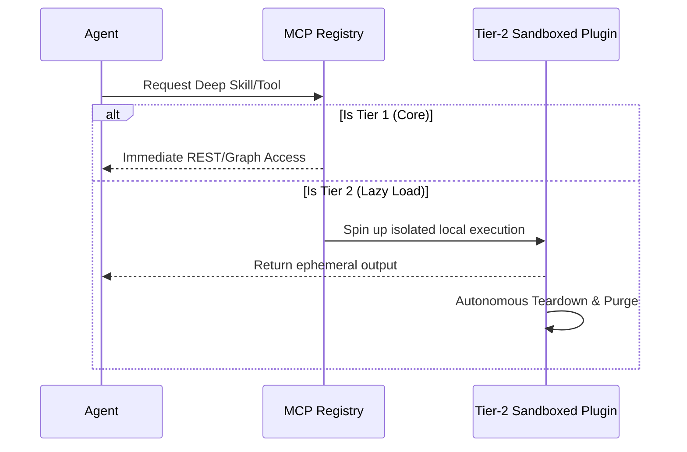
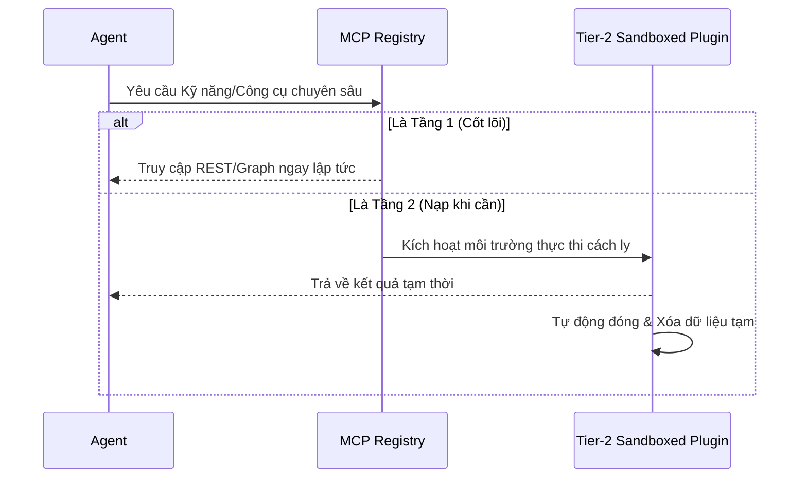

<div align="center">
  
  <h1>🌌 AI OS CORP</h1>
  <b>The Autonomous, Monolithic Multi-Agent Operating System</b><br>
  <br>

  [](#)
  [](#)
  [](#)
  [](https://github.com/LongLeo287/aios-local/discussions)
  
  <br>
  
  [**🇻🇳 Xem Phiên Bản Tiếng Việt (Vietnamese)**](README-vn.md)
  
  <br>

  [About](#-about-ai-os) •
  [Strengths](#-core-strengths--why-ai-os) •
  [Architecture](#-architecture--3-tier-plugins) •
  [Departments](#-the-workforce-departments) •
  [Installation](#-installation) •
  [Discussions](https://github.com/LongLeo287/aios-local/discussions) •
  [Credits](#-acknowledgements)

</div>

---

## 🌟 About AI OS
**AI OS CORP** is a highly modular, multi-agent Operating System designed to run directly on top of premier LLMs (Anthropic Claude, Google Gemini, OpenAI). It transforms your local machine into an autonomous digital corporation. 

Rather than acting as a simple chatbot, AI OS actively routes your complex directives through specialized **Functional Departments**, manages its own memory utilizing Graph RAG, and dynamically evolves its codebase based on your instructions. It is designed with **Zero-Trust Privacy**, ensuring all your local data remains strictly on your machine.

---

## ⚡ Core Strengths & Why AI OS?

What makes AI OS profoundly different from standard AI coding assistants?

1. **Absolute Portability & Platform Agnosticism**
   We do not lock you into a single IDE. AI OS is designed from the ground up to be compatible with **Cursor**, **Claude Code CLI**, **Google Gemini**, and **OpenCode**. The systemic rules are globally inherited no matter which frontend you prefer.
2. **Zero-Trust Git Protection**
   Equipped with aggressive post-session `aios_deep_cleaner.py` background daemons. Every time you close a session, the OS sweeps your cache, purges ephemeral databases (`.sqlite`, `.db`), and sanitizes GitHub commits to prevent API keys or secrets from ever leaving your local drive.
3. **Hyper-Automated Universal Bootstrapper**
   Forget managing 10 different shell scripts. Simply run `aios` in your terminal (or double-click the Windows `aios.bat`) to instantly invoke the central Dashboard. It handles NPM dependencies, VSCode Extension injections, and Model routing automatically.
4. **Autonomous Execution (Worker Threads)**
   Master agents (like Claude or Gemini) delegate massive, multi-step tasks to sub-agents (CrewAI, Node scripts). It acts as a Project Manager, not just a programmer.

---

## 🗺️ Architecture & 3-Tier Plugins

To maintain a lightweight footprint while offering infinite vertical scaling, all tools in AI OS follow a strict **3-Tier Plugin Protocol**:

*   **Tier 1 (Core Infrastructure)**: Native, always-on engines (e.g., `LightRAG` for memory, `Firecrawl` for deep web scraping).
*   **Tier 2 (Lazy-Load Plugins)**: Specialized tools (like PDF parsers or heavy Python image generators) that are sandboxed and **spun up only when requested**, then autonomously destroyed/detached to free up RAM.
*   **Tier 3 (Blacklisted)**: Outdated or conflicting legacy modules that the system is strictly forbidden from executing.



---

## 🏢 The Workforce (Core Departments)

Directives from the CEO (You) are routed through specialized departments. The OS contains **21 total departments** organized across 5 functional clusters.

| ID | Department | Function | Head Agent |
| :--- | :--- | :--- | :--- |
| **Dept 01** | **Engineering** | Scalable Backend, Frontend UI/UX, and AI model integration. | `backend-architect` |
| **Dept 05** | **Strategic Planning** | Roadmap orchestration, KPI analytics, and org evolution. | `product-manager` |
| **Dept 09** | **Content Review** | Final review gate for output quality and narrative tone. | `editor-agent` |
| **Dept 10** | **Strix Security** | Cyber-security auditing and vetting of external components. | `strix-agent` |
| **Dept 13** | **Nova Research** | Deep Web research and architectural prototyping. | `rd-lead` |
| **Dept 18** | **Asset Library** | Managing Memory Rotation and the comprehensive Knowledge Graph. | `library-manager` |
| **Dept 20** | **CIV (Content Intake)** | Systematically consumes, scrapes, and parses massive GitHub URLs or PDFs into pure Markdown. | `intake-chief` |
| **Dept 22** | **Operations** | Hardware sanitation, root directory cleanup, and Git Force-Push protection. | `scrum-master` |
| **Dept 23** | **Reception** | Automated client intake, brief collection, and proposal generation. | `project-intake` |

> [!TIP]
> **Deep Dive**: For the full breakdown of all 21 departments, reporting lines, and agent interactions, see the [**Master System Index**](brain/corp/MASTER_INDEX.md).

> [!NOTE]
> For the full list of 21 departments and agent rosters, please refer to the `brain/corp/org_chart.yaml` master registry.

---

## 💽 Installation

AI OS is built to be a simple "Clone & Run" architecture.

```bash
# 1. Clone the core repository to your local drive
git clone https://github.com/LongLeo287/aios-local.git "AI OS"
cd "AI OS"

# 2. Link the Global System via NPM
npm install -g .

# 3. Boot the Monolithic OS Terminal (Can be run from anywhere)
aios
```

*Windows Tip: We have provided native Windows GUI accessibility. Simply double-click the `aios.bat` script located in the root repository to instantaneously open the Control Dashboard.*

---

## 🌐 Community & Support

Have ideas, questions, or want to showcase your custom Agent workflows? We have built a dedicated space for the AI OS workforce to collaborate.

**[🚀 Step into the AI OS CORP Discussions Space](https://github.com/LongLeo287/aios-local/discussions)**

---

## 🙏 Acknowledgements

AI OS CORP stands upon the shoulders of monumental open-source architectures. We deeply thank and credit the following repositories and organizations:

*   **[Anthropic](https://anthropic.com)**: For the Claude Code CLI and its phenomenal REPL structure.
*   **[Google Deepmind](https://deepmind.google.com/technologies/gemini/)**: For the Gemini models and their unprecedented deep-context structural analysis.
*   **[affaan-m / everything-claude-code](https://github.com/affaan-m/everything-claude-code)**: For their phenomenal cross-platform Agent shielding workflows and role-based instruction patterns.
*   **[LightRAG](https://github.com/HKUDS/LightRAG)**: Supplying the immense and precise Graph-based cognitive retrieval system.
*   **[Firecrawl](https://firecrawl.dev)**: Powering the flawless markdown extraction pipeline.
*   **[Mem0](https://github.com/mem0ai/mem0)**: Revolutionizing long-term memory persistence for AI agents.
*   **[CrewAI](https://crewai.com)**: Inspiring the localized worker-thread and sub-agent hive network.
*   **[Cursor](https://cursor.sh)** / **OpenCode**: Our IDE environments of choice, facilitating the neural link between the OS and the CEO.

<br>
<div align="center">
  <i>"The Operating System of the Future, Running on Your Desk Today."</i>
</div>


---

# Bản Tiếng Việt (Vietnamese version)

<div align="center">
  
  <h1>🌌 AI OS CORP</h1>
  <b>Hệ điều hành Multi-Agent Tự trị và Nguyên khối</b><br>
  <br>

  [](#)
  [](#)
  [](#)
  [](https://github.com/LongLeo287/aios-local/discussions)
  
  <br>
  
  [**🇺🇸 English Version**](README.md)
  
  <br>

  [Giới thiệu](#-giới-thiệu-về-ai-os) •
  [Điểm mạnh](#-điểm-mạnh-cốt-lõi--tại-sao-chọn-ai-os) •
  [Kiến trúc](#-kiến-trúc--giao-thức-plugin-3-tầng) •
  [Phòng ban](#-đội-ngũ-nhân- sự-của-ai-os) •
  [Cài đặt](#-cài-đặt) •
  [Thảo luận](https://github.com/LongLeo287/aios-local/discussions) •
  [Tri ân](#-lời-cảm-ơn--tri-ân)

</div>

---

## 🌟 Giới thiệu về AI OS
**AI OS CORP** là một hệ điều hành Multi-Agent có tính mô-đun cao, được thiết kế để chạy trực tiếp trên các mô hình LLM hàng đầu (Anthropic Claude, Google Gemini, OpenAI). Nó biến máy tính cá nhân của bạn thành một tập đoàn kỹ thuật số tự trị.

Thay vì chỉ hoạt động như một chatbot đơn giản, AI OS chủ động điều phối các chỉ thị phức tạp của bạn thông qua các **Phòng ban Chức năng** chuyên biệt, quản lý bộ nhớ bằng công nghệ Graph RAG và tự động tiến hóa mã nguồn dựa trên hướng dẫn của bạn. Hệ thống được thiết kế với triết lý **An ninh Zero-Trust**, đảm bảo toàn bộ dữ liệu chỉ nằm trên máy cục bộ của bạn.

---

## ⚡ Điểm mạnh cốt lõi & Tại sao chọn AI OS?

Điều gì làm nên sự khác biệt hoàn toàn giữa AI OS và các trợ lý lập trình AI thông thường?

1. **Tính linh hoạt tuyệt đối & Không phụ thuộc nền tảng**
   Chúng tôi không khóa bạn vào một IDE duy nhất. AI OS được thiết kế từ gốc để tương thích với **Cursor**, **Claude Code CLI**, **Google Gemini** và **OpenCode**. Các quy tắc hệ thống được kế thừa toàn cầu bất kể bạn sử dụng giao diện nào.
2. **Bảo vệ Git Zero-Trust**
   Được trang bị các daemon chạy ngầm `aios_deep_cleaner.py` cực kỳ quyết liệt sau mỗi phiên làm việc. Mỗi khi bạn đóng phiên, OS sẽ quét bộ nhớ đệm, xóa các DB tạm thời (`.sqlite`, `.db`) và vệ sinh các commit GitHub để ngăn chặn việc lộ API key hay bí mật ra khỏi ổ đĩa cục bộ.
3. **Trình khởi tạo vạn năng siêu tự động**
   Quên việc phải quản lý hàng chục file shell script. Chỉ cần chạy lệnh `aios` trong terminal (hoặc nhấp đúp vào `aios.bat` trên Windows) để gọi Dashboard trung tâm. Nó tự động xử lý các dependencies NPM, cài đặt VSCode Extension và điều phối Model.
4. **Thực thi tự trị (Worker Threads)**
   Các Agent bậc thầy (như Claude hoặc Gemini) ủy quyền các nhiệm vụ đa bước khổng lồ cho các sub-agent (CrewAI, Node scripts). AI OS đóng vai trò như một Giám đốc dự án, không chỉ là một lập trình viên.

---

## 🗺️ Kiến trúc & Giao thức Plugin 3 tầng

Để duy trì sự gọn nhẹ trong khi vẫn cho phép mở rộng vô hạn, tất cả các công cụ trong AI OS đều tuân thủ **Giao thức Plugin 3 tầng**:

*   **Tầng 1 (Hạ tầng cốt lõi)**: Các engine luôn bật, tích hợp sẵn (ví dụ: `LightRAG` cho bộ nhớ, `Firecrawl` để trích xuất dữ liệu web sâu).
*   **Tầng 2 (Plugin nạp khi cần)**: Các công cụ chuyên biệt (như trình phân tích PDF hoặc trình tạo ảnh Python nặng) được chạy trong sandbox và **chỉ kích hoạt khi có yêu cầu**, sau đó tự động hủy/ngắt kết nối để giải phóng RAM.
*   **Tầng 3 (Danh sách đen)**: Các mô-đun cũ hoặc gây xung đột mà hệ thống bị cấm thực thi nghiêm ngặt.



---

## 🏢 Đội ngũ nhân sự của AI OS

Các lệnh từ CEO (Bạn) được điều phối thông qua các phòng ban chuyên môn. Hệ thống bao gồm tổng cộng **21 phòng ban** được tổ chức thành 5 khối chức năng.

| ID | Phòng Ban | Chức Năng | Agent Phụ Trách |
| :--- | :--- | :--- | :--- |
| **Dept 01** | **Kỹ Thuật** | Phát triển Backend, giao diện UI/UX và tích hợp AI. | `backend-architect` |
| **Dept 05** | **Chiến Lược** | Điều phối lộ trình, phân tích KPI và phát triển hệ thống. | `product-manager` |
| **Dept 09** | **Kiểm Duyệt** | Chốt chặn kiểm duyệt chất lượng nội dung và văn phong. | `editor-agent` |
| **Dept 10** | **An Ninh Strix** | Kiểm duyệt mã nguồn và thẩm định an ninh các thành phần bên ngoài. | `strix-agent` |
| **Dept 13** | **Nghiên Cứu Nova** | Nghiên cứu Deep Web và phát triển các thiết kế kiến trúc nền tảng. | `rd-lead` |
| **Dept 18** | **Thư Viện Tài Sản** | Quản lý vòng lặp bộ nhớ và Đồ thị Tri thức (Knowledge Graph). | `library-manager` |
| **Dept 20** | **Tiếp Nhận CIV** | Thu thập, phân tích và thẩm định các tài liệu/mã nguồn khẩn cấp. | `intake-chief` |
| **Dept 22** | **Vận Hành** | Vệ sinh phần cứng, dọn dẹp thư mục gốc và bảo vệ Git. | `scrum-master` |
| **Dept 23** | **Lễ Tân** | Tiếp nhận dự án tự động, thu thập brief và soạn thảo đề xuất. | `project-intake` |

> [!TIP]
> **Tìm hiểu sâu**: Để xem chi tiết 21 phòng ban, sơ đồ báo cáo và cách các agent tương tác, hãy xem bản [**Sơ đồ Tổng thể Hệ thống**](brain/corp/MASTER_INDEX_vi.md).

> [!NOTE]
> Để xem danh sách đầy đủ 21 phòng ban và danh sách agent, vui lòng tham khảo file đăng ký `brain/corp/org_chart.yaml`.

---

## 💽 Cài đặt

AI OS được xây dựng theo kiến trúc "Clone & Chạy" đơn giản.

```bash
# 1. Clone repository về máy cục bộ
git clone https://github.com/LongLeo287/aios-local.git "AI OS"
cd "AI OS"

# 2. Liên kết hệ thống toàn cầu qua NPM
npm install -g .

# 3. Khởi chạy Monolithic OS Terminal (Có thể chạy từ bất cứ đâu)
aios
```

*Mẹo cho Windows: Chúng tôi đã cung cấp khả năng truy cập GUI bản địa. Chỉ cần nhấp đúp vào script `aios.bat` nằm trong thư mục gốc để mở ngay Bảng Điều khiển (Dashboard).*

---

## 🌐 Cộng đồng & Hỗ trợ

Bạn có ý tưởng, câu hỏi hoặc muốn giới thiệu các quy trình Agent tùy chỉnh của mình? Chúng tôi đã xây dựng một không gian riêng để đội ngũ AI OS cùng nhau thảo luận.

**[🚀 Tham gia không gian Thảo luận của AI OS CORP](https://github.com/LongLeo287/aios-local/discussions)**

---

## 🙏 Lời cảm ơn & Tri ân

AI OS CORP được xây dựng dựa trên nền tảng của các kiến trúc mã nguồn mở vĩ đại. Chúng tôi chân thành cảm ơn các tổ chức và dự án sau:

*   **[Anthropic](https://anthropic.com)**: Cho Claude Code CLI và cấu trúc REPL tuyệt vời.
*   **[Google Deepmind](https://deepmind.google.com/technologies/gemini/)**: Cho các mô hình Gemini và khả năng phân tích cấu trúc ngữ cảnh sâu sắc chưa từng có.
*   **[affaan-m / everything-claude-code](https://github.com/affaan-m/everything-claude-code)**: Cho các quy trình bảo vệ Agent đa nền tảng và các mẫu chỉ dẫn dựa trên vai trò.
*   **[LightRAG](https://github.com/HKUDS/LightRAG)**: Cung cấp hệ thống truy xuất tri thức dựa trên đồ thị chính xác và mạnh mẽ.
*   **[Firecrawl](https://firecrawl.dev)**: Vận hành quy trình trích xuất markdown hoàn hảo.
*   **[Mem0](https://github.com/mem0ai/mem0)**: Cách mạng hóa việc lưu giữ bộ nhớ dài hạn cho các AI agent.
*   **[CrewAI](https://crewai.com)**: Cảm hứng cho mạng lưới worker-thread và sub-agent cục bộ.
*   **[Cursor](https://cursor.sh)** / **OpenCode**: Các môi trường IDE được lựa chọn, tạo điều kiện cho liên kết thần kinh giữa OS và CEO.

<br>
<div align="center">
  <i>"Hệ Điều Hành Của Tương Lai, Đang Chạy Trên Bàn Làm Việc Của Bạn Hôm Nay."</i>
</div>
