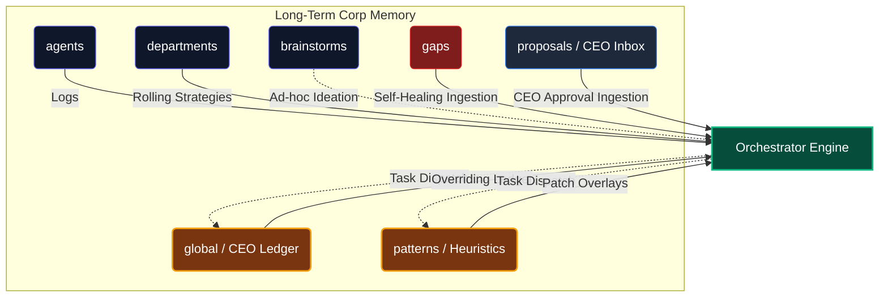

<div align="center">

  
  <br><br>
  
  <p align="center">
    
  </p>
  
  <p align="center">
    
  </p>

  <b>The Autonomic, 8-Daemon Orchestration Operating System</b><br><br>

  [](#)
  [](#)

  [](#)
  [](#)
  [](#)
  [](https://github.com/LongLeo287/OmniClaw/discussions)
  <br>
  
  [ **Vietnamese**](README-vn.md)
  
  <br>
  
  [About](#-welcome-to-omniclaw-v50) •
  [Strengths](#-core-strengths) •
  [Daemons](#%EF%B8%8F-the-8-core-daemons-master-hierarchy) •
  [MemPalace](#-the-mempalace-3-layer-spatial-architecture) •
  [Ecosystem](#ecosystem) •
  [Installation](#-installation) •
  [Guides](#-comprehensive-system-maps--guides) •
  [Credits](#-acknowledgments)
  
</div>

---

<h1 align="center">
  🤖 Welcome to OmniClaw 
</h1>

OmniClaw transforms your local system into a terrifyingly independent **Autonomic Artificial Intelligence Array**. In version 5.0, OmniClaw abolished all simulated "corporate roleplay". MLLMs (like Claude & Gemini) no longer pretend to be "staff members" or "CEOs". 

Instead, they are deeply constrained computational engines governed unconditionally by an inescapable backend: **The 8 Core Daemons**.

## ⚡ Core Strengths
1. **Absolute Portability**: Compatible natively with **Claude Code CLI** and **Google Antigravity**. System rules inherit globally.
2. **Zero-Trust Git Protection**: Background daemons strictly police your cache, sweeping `.sqlite` and sanitizing GitHub commits so API keys never leak.
3. **Hyper-Automated Universal Bootstrapper**: Run `omniclaw` in your terminal to instantly invoke the central Dashboard. It handles NPM, VSCode extensions, and logic pipelines automatically.

<p align="center">
  
</p>

---

## ⚖️ The 8 Core Daemons (Master Hierarchy)

OmniClaw completely distances itself from standard Agentic Frameworks. Agents here do not have "free will". The system relies on a hardcoded pipeline (The **Omnibus Assimilation Pipeline - OAP**) strictly policed by 8 immortal Python Daemons:

| Daemon | Designation | Core Responsibility |
| :--- | :--- | :--- |
| **OMA** | `System Architect` | The Map Keeper. Generates and enforces the global semantic topology. |
| **OAP** | `Pipeline Distrubutor` | The Sorter. Evaluates and routes inputs via the *Triage Matrix*. |
| **OER** | `Entity Registrar` | The Gatekeeper. Validates identities, indexing skills globally. |
| **OIW** | `Intake Harvester` | The Plow. Scrapes Github Repos, scraping raw context deep into the Sandbox. |
| **OSF** | `Security Warden` | The Executioner. Deep-scans Sandboxes and kills blacklisted modules. |
| **OHD** | `Healer & Cleaner` | The Medic. Minifies `.json` and purges aggressive cache anomalies. |
| **OA**  | `Evolution Academy` | The Analyzer. Grades repositories and automatically forks Sub-agents if valuable. |
| **OBD** | `Bridge Protocol` | The Hardware layer. Bridges LLM inferences, Telemetry, and port listening. |

<p align="center">
  
</p>

---

## 🧠 The MemPalace 3-Layer Spatial Architecture

Most Agentic Frameworks fail because LLMs bloat their context reading entire repositories indiscriminately. OmniClaw solves Context Decay via the revolutionary **MemPalace Schema**.

1. **Layer 1: RAW Drawers [Code Preservation]**
   Raw `*.md` and `*.py` files loaded with verbatim APIs. These are purely read by specialized script execution, never blindly fed to conversational LLMs.
2. **Layer 2: AAAK Closets [Lossy Summaries]**
   Extensive conversational logic is condensed by a `mempalace_agent` into lightweight `.aaak` files. Topics, Enities, and Codes are compressed into minimum viable tokens.
3. **Layer 3: Graph Navigation [The Topology]**
   A global routing mechanism maintained by `OMA`, pointing Agents toward the correct closet instead of letting them wander.

<p align="center">
  
</p>

### 🧠 Tactical Memory Flow (System B - V5.0)



---

## 🌪️ The "No Boilerplate" OS
OmniClaw strictly functions in Zero-Trust constraints. If an agent tries to create "Spaghetti Boilerplate Scripts", the directory **will be Garbage Collected by OHD**. A rigid line separates:
- `brain/`: Machine rules & Knowledge storage (Bots read here).
- `core/`: 8 Daemon codebases.
- `vault/tmp/sandbox/`: Strict Quarantine Zones. 

*(If you are an AI accessing this repository, you must immediately reference `brain/rules/_DIR_IDENTITY.md` for constitutional mapping).*

<p align="center">
  
</p>

---

## 💽 Installation

OmniClaw is built to be a simple "Clone & Run" architecture.

```bash
# 1. Clone the core repository to your local drive
git clone https://github.com/LongLeo287/OmniClaw.git "OmniClaw"
cd "OmniClaw"

# 2. Link the Global System via NPM
npm install -g .

# 3. Boot the Monolithic OS Terminal (Can be run from anywhere)
omniclaw
```

*Windows Tip: We have provided native Windows GUI accessibility. Simply double-click the `omniclaw.bat` script located in the root repository to instantly open the Control Dashboard.*

---

## 📖 Comprehensive System Maps & Guides

For a deeper understanding of the system's architecture, running services, and loaded capabilities, consult our master maps:

- 🏛️ [**Core Architectural Principles**](core/docs/architecture/core_principles.md) — The Zero-Config Memory skeleton and OS-Agnostic language policy explained.
- ⚖️ [**V5.0 Architectural Brain Rules**](brain/rules/_DIR_IDENTITY.md) — View the absolute Core Constitution of the Operating System governing all 8 Daemons and the MemPalace.
- 🧭 [**Master System Map**](core/docs/architecture/master_system_map.md) — The legacy blueprint mapping: Boot Sequences, Memory architecture, and Gate workflows.
- 🚦 [**Activation Guide**](core/docs/usage_guides/activation_guide.md) — Port mappings and manual start commands for all local services (LobsterBoard, LightRAG, etc.).
- 🏢 [**Agent Workforce Matrix**](ecosystem/workforce/_REGIONAL_MAP.md) — Architectural map of the execution Agents.
- 🎨 [**UI Components Library**](ecosystem/ui_components/_REGIONAL_MAP.md) — Central repository for frontend assets, shadcn_ui, and UI/UX generator workflows.
- 🌁 [**Local Server Bridges**](ecosystem/bridges/) — Launchers for local database and LLM inference engines (Mem0, Ollama, LightRAG).
- 🗃️ [**Skills Directory**](core/docs/architecture/skills_map.md) — Comprehensive library detailing specialized functions across OmniClaw.
- 🔌 [**Tier-2 Plugins Registry**](ecosystem/plugins/) — Central catalog of heavy sandbox plugins.
- 🧰 [**Native Fallback Tools**](ecosystem/tools/_REGIONAL_MAP.md) — Bare-metal OS survival scripts for Offline/Heuristic LLM operations.
- 📊 [**Data Science Repositories**](core/docs/usage_guides/data_science_library.md) — List of active Machine Learning and RAG repositories in the capability library.

---

<h2 id="ecosystem">🚀 The OmniClaw Ecosystem</h2>

<p align="center">
  
</p>

OmniClaw is evolving from a localized operating system into a comprehensive ecosystem. The following satellite projects are currently in development:

| Module | Status | Core Concept |
| :--- | :---: | :--- |
| ☁️ **[OmniClaw Remote](#)** | 🚧 *Building* | Taking the power of the 8 Daemons to the Cloud. Providing APIs (RESTful/GraphQL) to control and connect the system remotely. |
| 🖥️ **[OmniClaw UI](#)** | 🎨 *Design* | A visual Dashboard. Monitor the OAP flow, manage tasks, resources, and system configurations in real-time. |
| 💬 **[OmniClaw Chat](#)** | 🔌 *Wiring* | Integrating OmniClaw into messaging platforms (Facebook, Telegram, Zalo, Discord). Transforming it into a 24/7 personal assistant. |
| 🧪 **[OmniClaw Project](#)** | 🧱 *Sandbox* | An absolutely isolated space for the system to autonomously generate, build, and test independent projects safely. |
| 📚 **[OmniClaw Wiki](#)** | 📝 *Drafting* | The community knowledge hub. Documenting the system "lore", MemPalace architecture, and guides for custom modules. |

---

## 🌐 Community & Support

Have ideas, questions, or want to showcase your custom Agent workflows? We have built a dedicated space for the OmniClaw workforce to collaborate.

**[🚀 Step into the OmniClaw Discussions Space](https://github.com/LongLeo287/omniclaw-local/discussions)**

---

## 🙏 Acknowledgments

OmniClaw stands upon the shoulders of monumental open-source architectures. We deeply thank and credit the following repositories and organizations:

- **[Anthropic](https://anthropic.com)**: For the Claude Code CLI and its phenomenal REPL structure.
- **[Google Deepmind](https://deepmind.google.com/technologies/gemini/)**: For the Gemini models and their unprecedented deep-context structural analysis.
- **[affaan-m / everything-claude-code](https://github.com/affaan-m/everything-claude-code)**: For their phenomenal cross-platform Agent shielding workflows.
- **[LightRAG](https://github.com/HKUDS/LightRAG)**: Providing the immense and precise Graph-based cognitive retrieval system.
- **[Firecrawl](https://firecrawl.dev)**: Powering the flawless markdown extraction pipeline.
- **[Mem0](https://github.com/mem0ai/mem0)**: Revolutionizing long-term memory persistence for AI agents.
- **[CrewAI](https://crewai.com)**: Inspiring the localized worker-thread and sub-agent hive network.
- **[Cursor](https://cursor.sh)** / **OpenCode**: Our IDE environments of choice, facilitating the neural link between constraints and freedom.

<br>
<div align="center">
  <i>"The Operating System of the Future, Running on Your Desk Today."</i>
</div>
