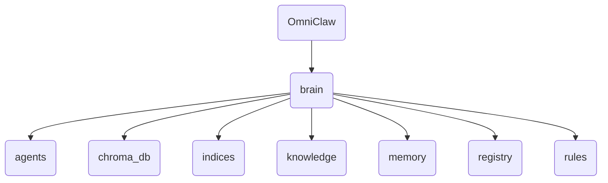

# Brain Identity

The 'brain' directory in OmniClaw v5.0 serves as the central hub for cognitive processing and decision-making components, including agents, memory storage, and rule-based systems.

---

## Topological View

---
*OmniClaw V5.0 | Forged by OMA AI Architect | brain | 2026-04-10*
