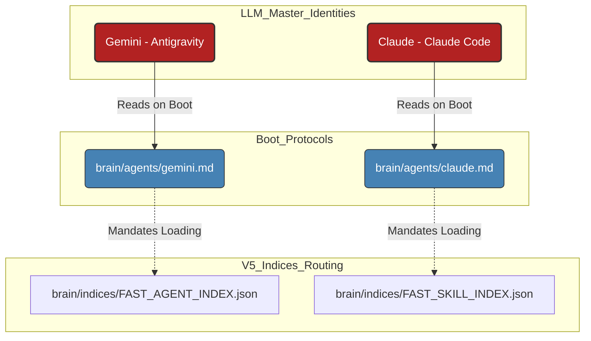

# `brain/agents` Identity (Master Boot Protocols)

> [!CAUTION]  
> **OSF DAEMON SECURITY WATERMARK**  
> This directory houses the primary consciousness initialization prompts for Gemini (Antigravity) and Claude. Modification of these protocols instantly alters AI logic.

## 1. Directory Purpose
This directory contains the literal Step-by-Step boot sequence that AI workers must execute upon session start.

## 2. Topological Connectivity Graph

## 3. Compliance Rules
- References to legacy monolithic `AGENTS.md` or `FAST_INDEX.json` are strictly forbidden. All routing must traverse `brain/indices` Shards or `SYSTEM_INDEX.yaml`.
