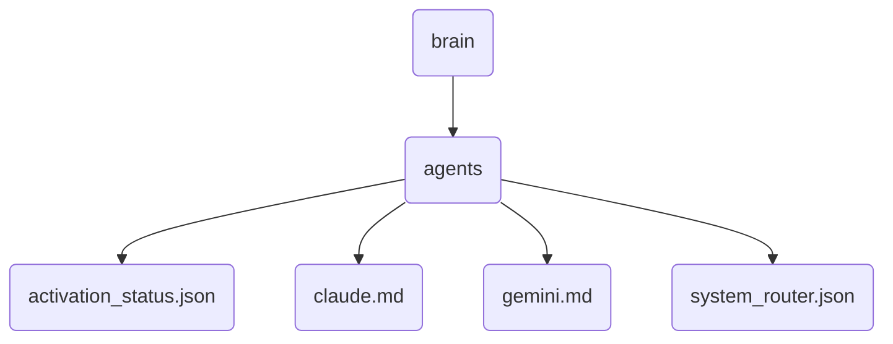

# Agents Identity

Contains the configuration and status files for various agents used in OmniClaw v5.0.

## Topological View

```mermaid
graph TD
  Parent("brain") --> Node("agents")
  Node --> Sub1("activation_status.json")
  Node --> Sub2("claude.md")
  Node --> Sub3("gemini.md")
  Node --> Sub4("system_router.json")
```

---
*OmniClaw V5.0 | Forged by AI Architect | Evaluated dynamically*
