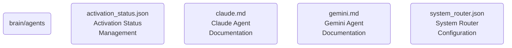

# Agents Identity

This directory manages the core agents that form the backbone of OmniClaw v5.0, responsible for various functionalities and interactions within the AI OS.

## Topological View

---
*OmniClaw V5.0 | Forged by AI Architect | Evaluated dynamically*
