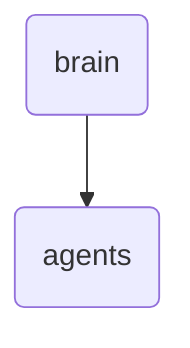

# Agents Identity

This directory contains the agents responsible for processing and managing various tasks within OmniClaw. It includes configuration files, documentation, and status reports.

---

## Topological View

---
*OmniClaw V5.0 | Forged by OMA AI Architect | brain.agents | 2026-04-10*
