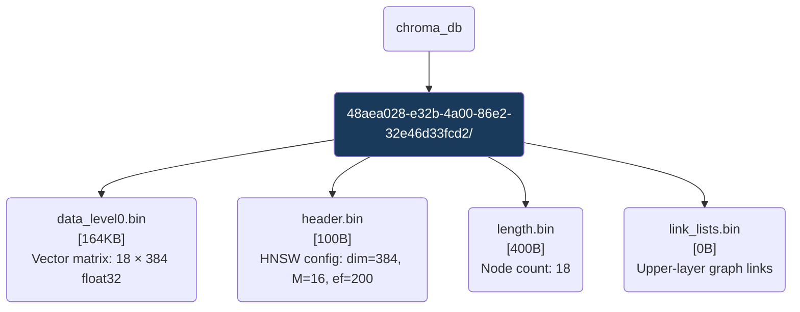

# HNSW Segment — synapse_nodes Vector Index

> [!CAUTION]
> Thư mục này do **ChromaDB Engine tự quản lý**. KHÔNG chỉnh sửa, đổi tên, hay xóa thủ công bất kỳ file nào. Mọi thao tác phải qua ChromaDB Python client.

Đây là segment lưu trữ **index vector HNSW** (Hierarchical Navigable Small World) cho collection `synapse_nodes`. Khi query semantic search được gửi tới ChromaDB, engine đọc trực tiếp từ các file trong thư mục này để tìm vector gần nhất.

## Topological View

## HNSW Parameters

| Parameter | Value | Ý nghĩa |
|---|---|---|
| `dimension` | 384 | Số chiều mỗi vector (all-MiniLM-L6-v2) |
| `M` | 16 | Số kết nối tối đa mỗi node ở tầng 0 |
| `ef_construction` | 200 | Độ chính xác khi xây index |
| `space` | cosine | Hàm đo khoảng cách |

---
*OmniClaw V5.0 | ChromaDB Segment Identity | System-managed | 2026-04-10*
