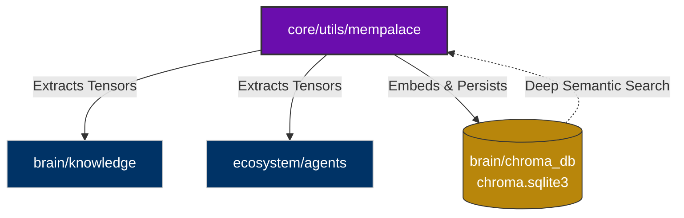

# `brain/chroma_db` Identity (Vector Database)

> [!CAUTION]  
> **OSF DAEMON SECURITY WATERMARK**  
> This directory contains generated `chroma.sqlite3` and binary vector tensors.
> **STRICT GIT RULE:** Under NO CIRCUMSTANCES should `.sqlite3` or tensor UUID folders inside here be pushed to a Git Repository. Only this identity file is tracked.

## 1. Directory Purpose
Serves as the physical Long-Term Memory (LTM) persistent layer for the OmniClaw system. It powers the `MemPalace` core utility, actively indexing and retrieving conversational insights, rules, and ecosystem code via Deep Search (Layer 3).

## 2. Topological Connectivity Graph

## 3. Compliance Rules
- Manual edits of binary items within this directory will corrupt the AI's semantic retrieval system.
- The `mempalace` MCP server dynamically writes and reads from this SQLite storage.
