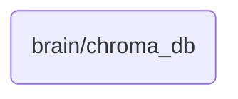

# Chroma Db Identity

Manages the core database for OmniClaw v5.0, storing and retrieving structured knowledge essential for the AI's operations.

## Topological View

---
*OmniClaw V5.0 | Forged by AI Architect | Evaluated dynamically*
