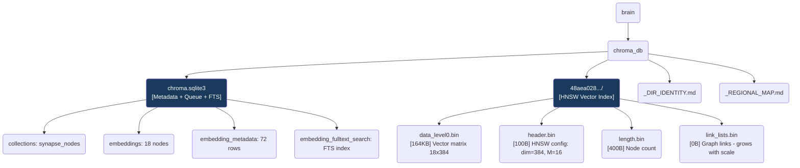

# ChromaDB — Semantic Vector Database
*Persistent Semantic Vector Database*

This directory houses the entire vector storage infrastructure of OmniClaw. All knowledge ingested via the CIV intake or ORPHAN_SWEEP pipeline is embedded and stored here as **`aaak_memory`** nodes, serving semantic similarity search queries for OA_Academy and related agents.

## Core Functions

| Function | Details |
|---|---|
| **Semantic Search** | Meaning-based search, not keyword-based (ANN via HNSW) |
| **Embedding Storage** | 18 nodes × 384 dimensions (float32) |
| **Metadata Index** | Full-text search + structured metadata per node |
| **Collection** | `synapse_nodes` — unified memory namespace |

## Topological View



## Data Flow

```
CIV Intake / ORPHAN_SWEEP
        │
        ▼
  OA_Academy Daemon
  (encode → all-MiniLM-L6-v2)
        │
        ▼
  chroma.sqlite3 ──► embeddings_queue
        │
        ▼ (flush on PersistentClient open)
  48aea028.../
  data_level0.bin  ──► HNSW Graph index
        │
        ▼
  semantic search queries
  (OA_Synapse / Knowledge Router)
```

## Node Naming Convention

```
node_{SOURCE}_{repo_name}_{HHMMSS}_{hash8}
  │       │         │          │        │
  │       │         │          │        └─ MD5 hash (8 chars)
  │       │         │          └─ ingestion timestamp
  │       │         └─ repository name
  │       └─ CIV_FETCHED | ORPHAN_SWEEP | mempalace | ...
  └─ fixed prefix
```

> [!CAUTION]
> The `48aea028-e32b-4a00-86e2-32e46d33fcd2/` directory is auto-generated by ChromaDB representing the segment UUID. **DO NOT RENAME, DO NOT DELETE MANUALLY.** All operations must be executed via the ChromaDB Python client.

> [!NOTE]
> `link_lists.bin` = 0 bytes is **normal** when node count < M_threshold (~100). This file grows naturally as the collection scales.

---
*OmniClaw V5.0 | Forged by AI Architect | brain.chroma_db | 2026-04-11*
