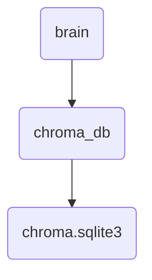

# Chroma Db Identity

This directory contains the database used by OmniClaw for storing vectorized data and metadata.

## Topological View

---
*OmniClaw V5.0 | Forged by AI Architect | Evaluated dynamically*
