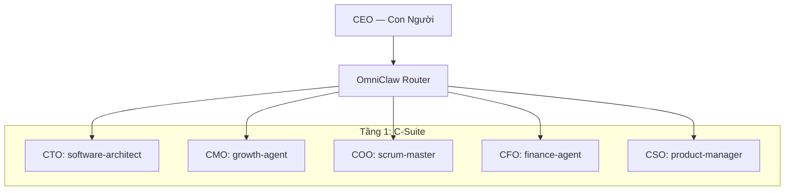

# 🏛️ Tập đoàn OmniClaw — Sơ đồ Tổng thể Hệ thống

> **Danh bạ chính thức các Phòng ban, Đặc vụ và Quy trình (Sắp xếp theo ID)**
> 
> [**English**](MASTER_INDEX.md)

Tài liệu này đóng vai trò là hướng dẫn chính thức về **cấu trúc tổ chức 21 phòng ban** của Tập đoàn OmniClaw. Nó xác định ai (Agent) làm gì (Chức năng) và cách họ liên kết với nhau (Quy trình).

---

## 🏛️ 1. Cơ cấu Lãnh đạo (Tầng 0 & 1)

Hệ thống được quản trị theo mô hình lấy con người làm trung tâm, hỗ trợ bởi các giám đốc điều hành chuyên trách.

---

## 🏢 2. Danh bạ Đội ngũ Nhân sự (Sắp xếp theo ID)

| ID | Phòng Ban | Agent Trưởng | Nhân viên / Subagents | Chức năng Chính |
| :--- | :--- | :--- | :--- | :--- |
| **Dept 01** | **Kỹ Thuật** | `backend-architect` | `frontend-agent`, `ai-ml-agent` | Phát triển Backend, giao diện UI/UX và tích hợp AI. |
| **Dept 02** | **QA & Kiểm Thử** | `test-manager` | `code-reviewer`, `api-tester` | Chốt chặn chất lượng code qua TDD và quy trình xác thực tự động. |
| **Dept 03** | **Hạ Tầng IT** | `it-manager` | `devops-ops`, `nginx-commander` | Quản lý DB cục bộ, DNS và môi trường Docker. |
| **Dept 04** | **Quản Lý Skill** | `registry-manager` | `attribute-manager` | Quản lý trung tâm hệ thống SKILL_REGISTRY và năng lực agent. |
| **Dept 05** | **Hoạch Định Chiến Lược** | `product-manager` | `roadmap-architect` | Điều phối lộ trình, phân tích KPI và phát triển tổ chức. |
| **Dept 06** | **Tài Chính (CFO)** | `finance-agent` | `data-analyst`, `cost-auditor` | Ngân sách token, báo cáo tài chính và quản lý chi phí. |
| **Dept 07** | **Marketing** | `growth-agent` | `growth-hacker`, `paid-media-lead` | SEO/AEO, thu hút doanh thu và phát triển thương hiệu. |
| **Dept 08** | **Hỗ Trợ** | `channel-agent` | `support-analyst`, `faq-synth` | Tổng hợp tri thức hướng tới người dùng và xử lý yêu cầu hỗ trợ. |
| **Dept 09** | **Kiểm Duyệt Nội Dung** | `editor-agent` | `narrative-designer`, `copy-writer` | Chốt chặn cuối cùng cho chất lượng nội dung và văn phong. |
| **Dept 10** | **An Ninh Strix** | `strix-agent` | `security-engineer`, `security-auditor` | Kiểm duyệt an ninh mạng và thẩm định các thành phần bên ngoài. |
| **Dept 11** | **Pháp Lý & GRC** | `legal-agent` | `compliance-auditor` | Tuân thủ GDPR, cấp phép và bảo vệ sở hữu trí tuệ. |
| **Dept 12** | **Nhân Sự** | `hr-manager` | `org-architect`, `onboarding-lead` | Quản lý danh sách agent và tuyển dụng/đào tạo nhân sự. |
| **Dept 13** | **Nghiên Cứu Nova** | `rd-lead` | `web-researcher`, `academic-lead` | Nghiên cứu Deep Web và thử nghiệm các kiến trúc mới. |
| **Dept 14** | **Giám Sát (SRE)** | `monitor-chief` | `sre-agent`, `incident-commander` | Theo dõi sức khỏe hệ thống, uptime và ứng phó sự cố. |
| **Dept 15** | **Phát Triển Tổ Chức** | `org-architect` | `learning-agent` | Tự hoàn thiện hệ thống, đào tạo và tiến hóa tổ chức. |
| **Dept 17** | **Kế Hoạch (PMO)** | `pmo-agent` | `project-shepherd`, `velocity-lead` | Theo dõi tiến độ dự án và quản lý các cột mốc quan trọng. |
| **Dept 18** | **Thư Viện Tài Sản** | `library-manager` | `archivist`, `knowledge-navigator` | Quản lý vòng lặp bộ nhớ dài hạn và Đồ thị Tri thức. |
| **Dept 20** | **Tiếp Nhận CIV** | `intake-chief` | `repo-ingest-agent`, `doc-parser` | Thu thập và thẩm định hệ thống các nội dung từ bên ngoài. |
| **Dept 21** | **Dữ Liệu & Phân Tích** | `data-agent` | `analytics-pro`, `kpi-reporter` | Trung tâm phân tích thông minh và quản lý luồng dữ liệu. |
| **Dept 22** | **Vận Hành** | `scrum-master` | `cleanup-daemon`, `git-protector` | Vệ sinh phần cứng/thư mục gốc hàng ngày và bảo vệ Git. |
| **Dept 23** | **Lễ Tân** | `project-intake` | `proposal-writer`, `brief-gatherer` | Tiếp nhận dự án tự động và phân tích yêu cầu khách hàng. |
| **Dept 24** | **Cơ Sở Vật Chất** | `facility-agent` | `sanitation-bot` | Bảo trì thư mục gốc và vệ sinh không gian làm việc số. |

---

## 🔗 3. Liên kết Giữa các Phòng ban (Workflows)

### 📥 1. Quy trình Tiếp nhận (CIV Gate)
`URL bên ngoài -> [Tiếp nhận CIV] -> [An ninh Strix] -> [Chỉ mục Tri thức]`

### 🧪 2. Quy trình Phát triển (QA Gate)
`Kỹ thuật -> [Kiểm thử QA] -> [Kiểm duyệt Nội dung] -> [Sản xuất]`

### 💰 3. Quy trình Tài chính (Cost Gate)
`Yêu cầu Nhiệm vụ -> [Agent Tài chính] -> [Kích hoạt Agent] -> [Báo cáo Chi phí]`

---

## 📂 Tài nguyên Liên quan
*   **Dữ liệu Org Chart:** `/.omniclaw/brain/corp/org_chart.yaml`
*   **Định nghĩa Đặc vụ:** `/.omniclaw/brain/shared-context/AGENTS.md`
