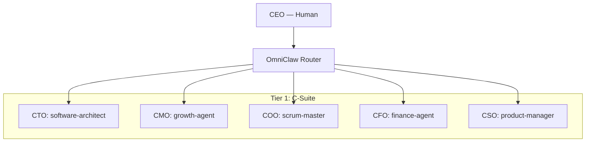

# 🏛️ OmniClaw Syndicate — Master System Architecture

> **Official Directory of Departments, Agents, and Workflows (Sorted by ID)**
> 
> [**Tiếng Việt**](MASTER_INDEX-vn.md)

This document serves as the official guide to the **21-department organizational structure** of the OmniClaw Syndicate. It defines who (Agent) does what (Function) and how they interconnect (Workflows).

---

## 🏛️ 1. Leadership Structure (Tier 0 & 1)

The system is governed by a human-centric model, supported by highly specialized executive agents.

---

## 🏢 2. Personnel Directory (Sorted by ID)

| ID | Department | Lead Agent | Subagents | Core Function |
| :--- | :--- | :--- | :--- | :--- |
| **Dept 01** | **Engineering** | `backend-architect` | `frontend-agent`, `ai-ml-agent` | Backend development, UI/UX, and AI integration. |
| **Dept 02** | **QA & Testing** | `test-manager` | `code-reviewer`, `api-tester` | Code quality gate via TDD and automated validation. |
| **Dept 03** | **IT Infrastructure** | `it-manager` | `devops-ops`, `nginx-commander` | Local DB, DNS, and Docker environment management. |
| **Dept 04** | **Skill Registry** | `registry-manager` | `attribute-manager` | Central SKILL_REGISTRY and agent capability management. |
| **Dept 05** | **Strategic Planning** | `product-manager` | `roadmap-architect` | Roadmap coordination, KPI analysis, and org development. |
| **Dept 06** | **Finance (CFO)** | `finance-agent` | `data-analyst`, `cost-auditor` | Token budgeting, financial reporting, and cost management. |
| **Dept 07** | **Marketing** | `growth-agent` | `growth-hacker`, `paid-media-lead` | SEO/AEO, revenue generation, and brand development. |
| **Dept 08** | **Support** | `channel-agent` | `support-analyst`, `faq-synth` | User-facing knowledge synthesis and request handling. |
| **Dept 09** | **Content Moderation** | `editor-agent` | `narrative-designer`, `copy-writer` | Final checkpoint for content quality and tone. |
| **Dept 10** | **Strix Security** | `strix-agent` | `security-engineer`, `security-auditor` | Cyber security vetting and external component auditing. |
| **Dept 11** | **Legal & GRC** | `legal-agent` | `compliance-auditor` | GDPR compliance, licensing, and IP protection. |
| **Dept 12** | **Human Resources** | `hr-manager` | `org-architect`, `onboarding-lead` | Agent roster management and personnel training/recruiting. |
| **Dept 13** | **Nova Research** | `rd-lead` | `web-researcher`, `academic-lead` | Deep Web research and experimental architecture testing. |
| **Dept 14** | **Monitoring (SRE)** | `monitor-chief` | `sre-agent`, `incident-commander` | System health tracking, uptime, and incident response. |
| **Dept 15** | **Org Development** | `org-architect` | `learning-agent` | System self-improvement, training, and organizational evolution. |
| **Dept 17** | **Planning (PMO)** | `pmo-agent` | `project-shepherd`, `velocity-lead` | Project tracking and milestone management. |
| **Dept 18** | **Asset Library** | `library-manager` | `archivist`, `knowledge-navigator` | Long-term memory loops and Knowledge Graph management. |
| **Dept 20** | **CIV Intake** | `intake-chief` | `repo-ingest-agent`, `doc-parser` | Collection and validation of external content systems. |
| **Dept 21** | **Data & Analytics** | `data-agent` | `analytics-pro`, `kpi-reporter` | Intelligence hub and data pipeline management. |
| **Dept 22** | **Operations** | `scrum-master` | `cleanup-daemon`, `git-protector` | Daily hardware/root cleaning and Git protection. |
| **Dept 23** | **Reception** | `project-intake` | `proposal-writer`, `brief-gatherer` | Automated project intake and client requirement analysis. |
| **Dept 24** | **Facilities** | `facility-agent` | `sanitation-bot` | Root directory maintenance and digital workspace cleaning. |

---

## 🔗 3. Inter-Departmental Workflows

### 📥 1. Intake Protocol (CIV Gate)
`External URL -> [CIV Intake] -> [Strix Security] -> [Knowledge Indexing]`

### 🧪 2. Development Protocol (QA Gate)
`Engineering -> [QA Testing] -> [Content Moderation] -> [Production]`

### 💰 3. Financial Protocol (Cost Gate)
`Task Request -> [Finance Agent] -> [Agent Activation] -> [Cost Report]`

---

## 📂 Related Resources
*   **Org Chart Data:** `/.omniclaw/brain/corp/org_chart.yaml`
*   **Agent Definitions:** `/.omniclaw/brain/shared-context/AGENTS.md`
