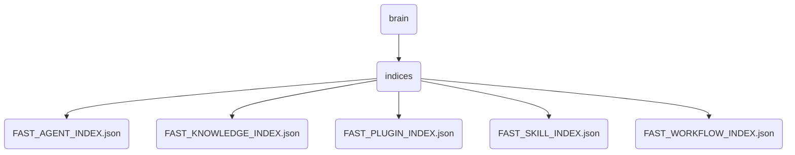

# Indices Identity

The 'indices' directory contains essential files for managing various types of indices used in OmniClaw v5.0, including agent, knowledge, plugin, skill, and workflow indices.

## Topological View

---
*OmniClaw V5.0 | Forged by AI Architect | Evaluated dynamically*
