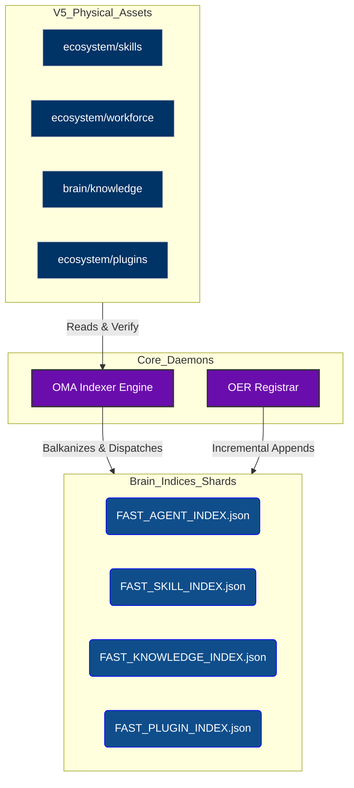

# Brain Map Indices (Sharded Database)

> [!CAUTION]  
> **OSF DAEMON SECURITY WATERMARK**  
> This directory is dynamically managed by the Core Daemons. Manual editing of JSON files in this directory will trigger anti-tamper quarantines.

## 1. Overview & Competency
The `brain/indices` domain implements OmniClaw's V5.0 **Sharded Architecture**. Instead of loading a monolithic registry map into daemon memory, the registry is mathematically fractioned into specific topological categories. This provides O(1) instantaneous lookup capabilities for routing agents, validating skills, and discovering plugins without ram ballooning.

## 2. Topological Graph

## 3. Data Integrity Certifications
- **Ghost Entries**: 0% (Fully Purged & Synchronized with local disk).
- **Rogue Identifiers**: `.`, `unknown`, and unclassified entities strictly prohibited.
- **Encoding Status**: UTF-8 Strict Compliance (Mojibake eradicated).
