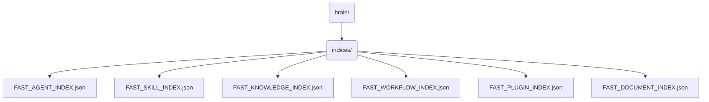

# Indices Identity ⚡

This directory is the **High-Speed Cache Layer** of the OmniClaw OS. It contains serialized JSON index tables built by parsing physical namespaces rather than metadata. It completely strips out `fake signals` and `shared-context` noise from earlier legacy system versions.

## 📍 Core Declarations:
*   **AGENT:** Strictly maps exactly 30 true agents (28 Departments + 2 Daemons).
*   **SKILL:** Maps operational payload scripts across `ecosystem/skills/`.
*   **KNOWLEDGE:** Maps heavily isolated datasets inside `vault/knowledge/`.
*   **WORKFLOW/PLUGIN/DOCUMENT:** Maps corresponding namespaces deterministically.

---

## 🗺️ Topological View

---
*OmniClaw V5.0 Blueprint | Forged by Antigravity OS Architect | brain.indices | 2026-04-11*
