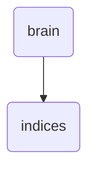

# Indices Identity

This directory contains the configuration files for various indices used in OmniClaw v5.0, including agent, document, knowledge, plugin, skill, and workflow indices.

---

## Topological View

---
*OmniClaw V5.0 | Forged by OMA AI Architect | brain.indices | 2026-04-10*
