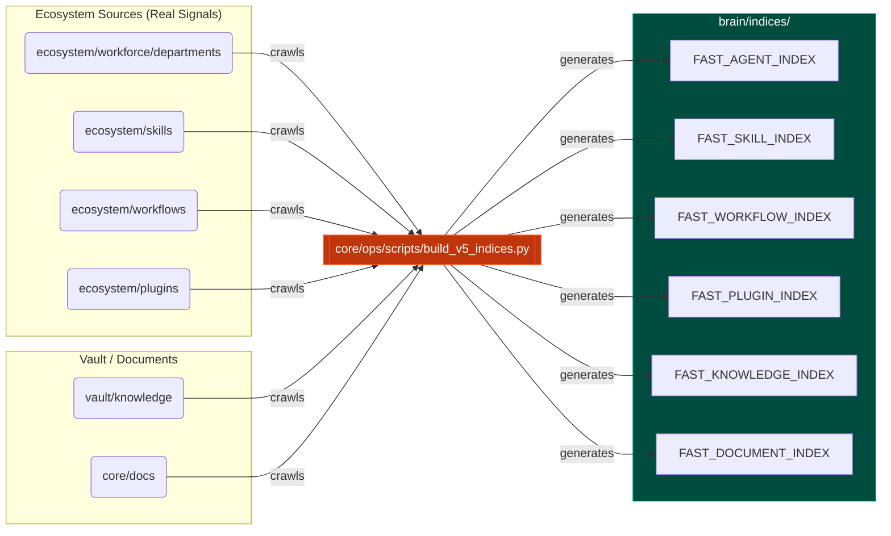

# 🗺️ Regional Map: brain/indices

The `brain/indices/` folder serves as the central circulatory system for memory retrieval. Daemons read these artifacts to jump instantly to resources anywhere in the repository.

## 🔗 Determistic Mapping Flow

This map visualizes how the V5 index builder scripts sweep physical namespaces to compile these 6 core registry files.

---
*OmniClaw V5.0 Blueprint | Forged by Antigravity OS Architect | brain.indices | 2026-04-11*
