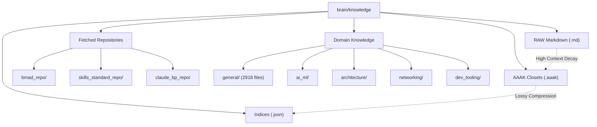

# OmniClaw Knowledge Repository

The `brain/knowledge` directory is OmniClaw's primary datastore for assimilated information, fetched repositories, and global context. Unlike structured operational memory (`brain/memory`), this node aggregates diverse domain data, structural rules, and external capabilities.

## Topological Graph (MemPalace Arc)



## Global Distribution Map
*Total Scope: ~5091 files, compressed aggressively via AAAK Closets.*

```text
knowledge/
    LIBRARY_GRAPH.json
    OSF_THREAT_INTELLIGENCE.json
    OS_CODE_RULES.md
    _DIR_IDENTITY.md
    activation_board.md
    ai_os_system_map.md
    capability_map.md
    civ_stats.md
    en_retrieval_protocol.md
    graph_index.json
    hash_registry.json
    index.md
    knowledge_index.md
    learning_log.md
    library_index.md
    litellm_knowledge.md
    retrieval_protocol.md
    
    [--- Subsystem Clusters ---]
    agent_architecture/ [15 files]
    ai_ml/ [131 files]
    api/ [6 files]
    architecture/ [35 files]
    automation/ [23 files]
    bmad_repo/ [397 files]
    catalog/ [9 files]
    claude_bp_repo/ [149 files]
    corp_feeds/ [7 files]
    cybersecurity/ [4 files]
    data/ [15 files]
    design/ [7 files]
    dev_tooling/ [31 files]
    devops/ [7 files]
    distilled/ [7 files]
    docker_swag/ [4 files]
    frameworks/ [24 files]
    general/ [2918 files]
    iot/ [7 files]
    it_infra/ [7 files]
    media/ [19 files]
    mq/ [15 files]
    networking/ [15 files]
    notes/ [97 files]
    orphan_sweep_web3/ [5 files]
    performance/ [7 files]
    project_learnings/ [11 files]
    rd_ingest/ [11 files]
    references/ [29 files]
    repo_gh_supabase_agent_skills/ [14 files]
    repo_hermes_agent/ [26 files]
    repo_hyperspace_db/ [25 files]
    repo_mempalace/ [9 files]
    repositories/ [520 files]
    security/ [13 files]
    skills_standard_repo/ [309 files]
    staging/ [7 files]
    strategy/ [9 files]
    system_health/ [5 files]
    updates/ [7 files]
```
