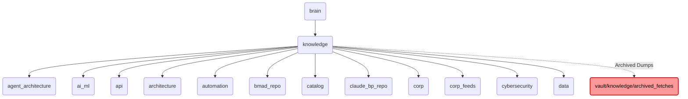

# Knowledge Identity

The 'knowledge' directory within OmniClaw v5.0 serves as the central repository for all knowledge-related assets, including architecture diagrams, AI/ML models, and data retrieval protocols.

---

## Topological View

---
*OmniClaw V5.0 | Forged by OMA AI Architect | brain.knowledge | 2026-04-10*
