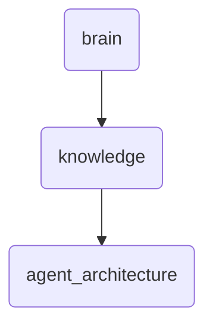

# Agent Architecture Identity

This directory contains foundational and advanced documentation related to the agent architecture of OmniClaw v5.0, including patterns, workflows, and orchestration strategies.

---

## Topological View

---
*OmniClaw V5.0 | Forged by OMA AI Architect | brain.knowledge.agent_architecture | 2026-04-10*
