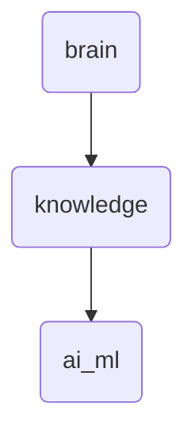

# Ai Ml Identity

The 'ai_ml' directory houses AI and machine learning related documents, tools, and methodologies essential for the development and deployment of intelligent systems within OmniClaw.

---

## Topological View

---
*OmniClaw V5.0 | Forged by OMA AI Architect | brain.knowledge.ai_ml | 2026-04-10*
