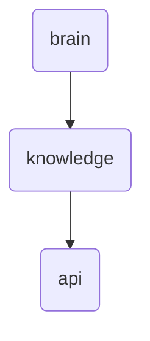

# Api Identity

This directory holds the API specifications and documentation for OmniClaw v5.0, ensuring seamless integration between different components of the system.

---

## Topological View

---
*OmniClaw V5.0 | Forged by OMA AI Architect | brain.knowledge.api | 2026-04-10*
