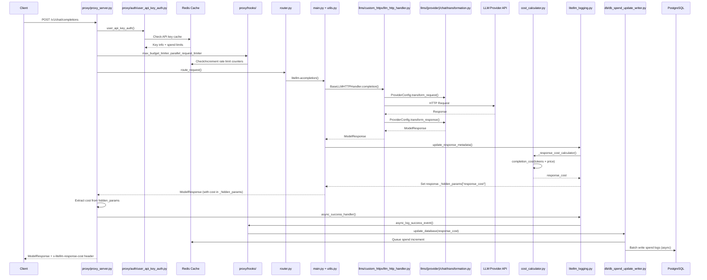
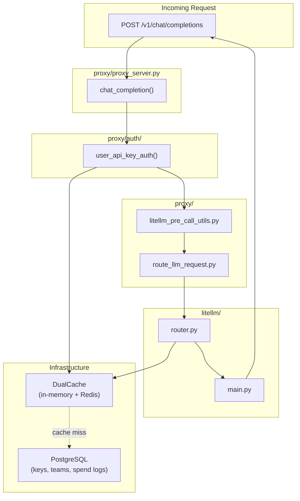
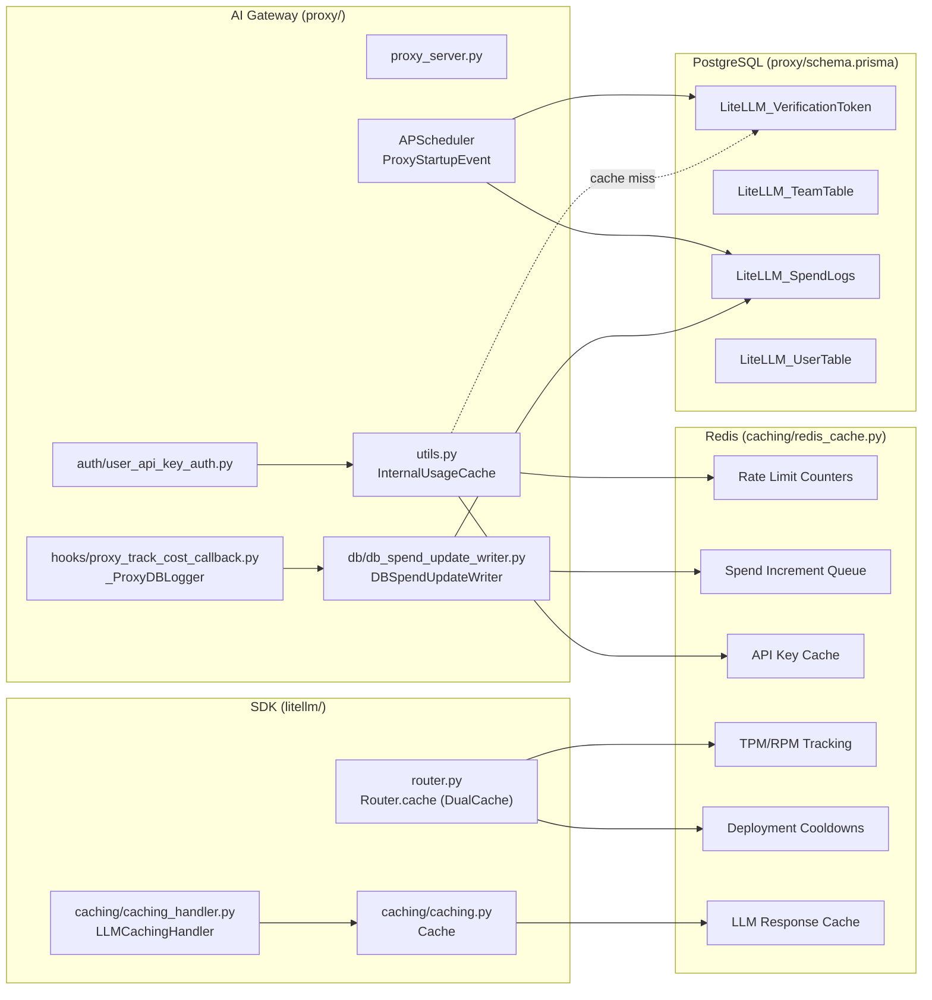
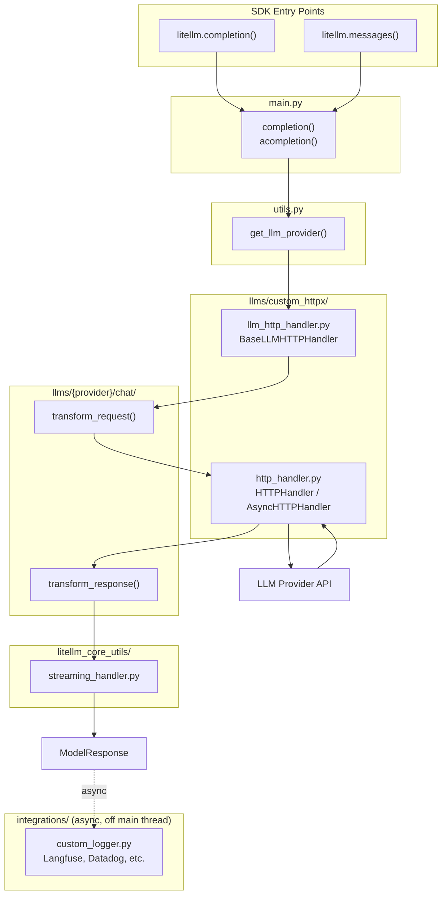

# litellm

## Assimilation Report
LiteLLM is a comprehensive library and proxy server that unifies access to over 100 Large Language Models (LLMs) under a single, standardized OpenAI-compatible API format. It allows developers to easily switch between various providers (Anthropic, Azure, Groq, etc.) without changing their core application logic.

## Application for OmniClaw
OmniClaw can integrate LiteLLM as its primary LLM routing and abstraction layer. Instead of calling specific provider SDKs (e.g., `anthropic.client`), OmniClaw will route all internal LLM calls through the LiteLLM proxy endpoint. This allows OmniClaw to dynamically select the optimal model based on cost, latency, or capability (e.g., using Groq for fast chat responses and GPT-4o for complex reasoning), abstracting the provider complexity from the core agent logic and enabling seamless integration of new, niche LLMs without code changes.

## SWALLOW ENGINE DISTILLATION

### File: package.json
```json
{
  "dependencies": {
    "prism-react-renderer": "^2.4.1",
    "prisma": "^5.17.0",
    "react-copy-to-clipboard": "^5.1.0"
  },
  "devDependencies": {
    "@testing-library/jest-dom": "^6.8.0",
    "@testing-library/react": "^14.3.1",
    "@types/react-copy-to-clipboard": "^5.0.7",
    "jest": "^29.7.0"
  },
  "overrides": {
    "glob": ">=11.1.0",
    "tar": ">=7.5.11",
    "minimatch": ">=10.2.4",
    "diff": ">=8.0.3",
    "@isaacs/brace-expansion": ">=5.0.1",
    "@babel/traverse": ">=7.23.2",
    "ws": ">=7.5.10",
    "http-proxy-middleware": ">=2.0.9",
    "tar-fs": ">=2.1.4",
    "webpack-dev-middleware": ">=5.3.4",
    "braces": ">=3.0.3",
    "axios": ">=0.30.2",
    "webpack": ">=5.94.0",
    "serve-static": ">=1.16.0",
    "path-to-regexp": ">=0.1.12"
  }
}

```

### File: README.md
```md
<h1 align="center">
        🚅 LiteLLM
    </h1>
    <p align="center">
        <p align="center">Call 100+ LLMs in OpenAI format. [Bedrock, Azure, OpenAI, VertexAI, Anthropic, Groq, etc.]
        </p>
        <p align="center">
        <a href="https://render.com/deploy?repo=https://github.com/BerriAI/litellm" target="_blank" rel="nofollow"></a>
        <a href="https://railway.app/template/HLP0Ub?referralCode=jch2ME">
          
        </a>
        </p>
    </p>
<h4 align="center"><a href="https://docs.litellm.ai/docs/simple_proxy" target="_blank">LiteLLM Proxy Server (AI Gateway)</a> | <a href="https://docs.litellm.ai/docs/enterprise#hosted-litellm-proxy" target="_blank"> Hosted Proxy</a> | <a href="https://docs.litellm.ai/docs/enterprise"target="_blank">Enterprise Tier</a></h4>
<h4 align="center">
    <a href="https://pypi.org/project/litellm/" target="_blank">
        
    </a>
    <a href="https://www.ycombinator.com/companies/berriai">
        
    </a>
    <a href="https://wa.link/huol9n">
        
    </a>
    <a href="https://discord.gg/wuPM9dRgDw">
        
    </a>
    <a href="https://www.litellm.ai/support">
        
    </a>
    <a href="https://codspeed.io/BerriAI/litellm?utm_source=badge">
        
    </a>
</h4>


## Use LiteLLM for

<details open>
<summary><b>LLMs</b> - Call 100+ LLMs (Python SDK + AI Gateway)</summary>

[**All Supported Endpoints**](https://docs.litellm.ai/docs/supported_endpoints) - `/chat/completions`, `/responses`, `/embeddings`, `/images`, `/audio`, `/batches`, `/rerank`, `/a2a`, `/messages` and more.

### Python SDK

```shell
pip install litellm
```

```python
from litellm import completion
import os

os.environ["OPENAI_API_KEY"] = "your-openai-key"
os.environ["ANTHROPIC_API_KEY"] = "your-anthropic-key"

# OpenAI
response = completion(model="openai/gpt-4o", messages=[{"role": "user", "content": "Hello!"}])

# Anthropic  
response = completion(model="anthropic/claude-sonnet-4-20250514", messages=[{"role": "user", "content": "Hello!"}])
```

### AI Gateway (Proxy Server)

[**Getting Started - E2E Tutorial**](https://docs.litellm.ai/docs/proxy/docker_quick_start) - Setup virtual keys, make your first request

```shell
pip install 'litellm[proxy]'
litellm --model gpt-4o
```

```python
import openai

client = openai.OpenAI(api_key="anything", base_url="http://0.0.0.0:4000")
response = client.chat.completions.create(
    model="gpt-4o",
    messages=[{"role": "user", "content": "Hello!"}]
)
```

[**Docs: LLM Providers**](https://docs.litellm.ai/docs/providers)

</details>

<details>
<summary><b>Agents</b> - Invoke A2A Agents (Python SDK + AI Gateway)</summary>

[**Supported Providers**](https://docs.litellm.ai/docs/a2a#add-a2a-agents) - LangGraph, Vertex AI Agent Engine, Azure AI Foundry, Bedrock AgentCore, Pydantic AI

### Python SDK - A2A Protocol

```python
from litellm.a2a_protocol import A2AClient
from a2a.types import SendMessageRequest, MessageSendParams
from uuid import uuid4

client = A2AClient(base_url="http://localhost:10001")

request = SendMessageRequest(
    id=str(uuid4()),
    params=MessageSendParams(
        message={
            "role": "user",
            "parts": [{"kind": "text", "text": "Hello!"}],
            "messageId": uuid4().hex,
        }
    )
)
response = await client.send_message(request)
```

### AI Gateway (Proxy Server)

**Step 1.** [Add your Agent to the AI Gateway](https://docs.litellm.ai/docs/a2a#adding-your-agent)

**Step 2.** Call Agent via A2A SDK

```python
from a2a.client import A2ACardResolver, A2AClient
from a2a.types import MessageSendParams, SendMessageRequest
from uuid import uuid4
import httpx

base_url = "http://localhost:4000/a2a/my-agent"  # LiteLLM proxy + agent name
headers = {"Authorization": "Bearer sk-1234"}    # LiteLLM Virtual Key

async with httpx.AsyncClient(headers=headers) as httpx_client:
    resolver = A2ACardResolver(httpx_client=httpx_client, base_url=base_url)
    agent_card = await resolver.get_agent_card()
    client = A2AClient(httpx_client=httpx_client, agent_card=agent_card)

    request = SendMessageRequest(
        id=str(uuid4()),
        params=MessageSendParams(
            message={
                "role": "user",
                "parts": [{"kind": "text", "text": "Hello!"}],
                "messageId": uuid4().hex,
            }
        )
    )
    response = await client.send_message(request)
```

[**Docs: A2A Agent Gateway**](https://docs.litellm.ai/docs/a2a)

</details>

<details>
<summary><b>MCP Tools</b> - Connect MCP servers to any LLM (Python SDK + AI Gateway)</summary>

### Python SDK - MCP Bridge

```python
from mcp import ClientSession, StdioServerParameters
from mcp.client.stdio import stdio_client
from litellm import experimental_mcp_client
import litellm

server_params = StdioServerParameters(command="python", args=["mcp_server.py"])

async with stdio_client(server_params) as (read, write):
    async with ClientSession(read, write) as session:
        await session.initialize()

        # Load MCP tools in OpenAI format
        tools = await experimental_mcp_client.load_mcp_tools(session=session, format="openai")

        # Use with any LiteLLM model
        response = await litellm.acompletion(
            model="gpt-4o",
            messages=[{"role": "user", "content": "What's 3 + 5?"}],
            tools=tools
        )
```

### AI Gateway - MCP Gateway

**Step 1.** [Add your MCP Server to the AI Gateway](https://docs.litellm.ai/docs/mcp#adding-your-mcp)

**Step 2.** Call MCP tools via `/chat/completions`

```bash
curl -X POST 'http://0.0.0.0:4000/v1/chat/completions' \
  -H 'Authorization: Bearer sk-1234' \
  -H 'Content-Type: application/json' \
  -d '{
    "model": "gpt-4o",
    "messages": [{"role": "user", "content": "Summarize the latest open PR"}],
    "tools": [{
      "type": "mcp",
      "server_url": "litellm_proxy/mcp/github",
      "server_label": "github_mcp",
      "require_approval": "never"
    }]
  }'
```

### Use with Cursor IDE

```json
{
  "mcpServers": {
    "LiteLLM": {
      "url": "http://localhost:4000/mcp/",
      "headers": {
        "x-litellm-api-key": "Bearer sk-1234"
      }
    }
  }
}
```

[**Docs: MCP Gateway**](https://docs.litellm.ai/docs/mcp)

</details>

---

## How to use LiteLLM

You can use LiteLLM through either the Proxy Server or Python SDK. Both gives you a unified interface to access multiple LLMs (100+ LLMs). Choose the option that best fits your needs:

<table style={{width: '100%', tableLayout: 'fixed'}}>
<thead>
<tr>
<th style={{width: '14%'}}></th>
<th style={{width: '43%'}}><strong><a href="https://docs.litellm.ai/docs/simple_proxy">LiteLLM AI Gateway</a></strong></th>
<th style={{width: '43%'}}><strong><a href="https://docs.litellm.ai/docs/">LiteLLM Python SDK</a></strong></th>
</tr>
</thead>
<tbody>
<tr>
<td style={{width: '14%'}}><strong>Use Case</strong></td>
<td style={{width: '43%'}}>Central service (LLM Gateway) to access multiple LLMs</td>
<td style={{width: '43%'}}>Use LiteLLM directly in your Python code</td>
</tr>
<tr>
<td style={{width: '14%'}}><strong>Who Uses It?</strong></td>
<td style={{width: '43%'}}>Gen AI Enablement / ML Platform Teams</td>
<td style={{width: '43%'}}>Developers building LLM projects</td>
</tr>
<tr>
<td style={{width: '14%'}}><strong>Key Features</strong></td>
<td style={{width: '43%'}}>Centralized API gateway with authentication and authorization, multi-tenant cost tracking and spend management per project/user, per-project customization (logging, guardrails, caching), virtual keys for secure access control, admin dashboard UI for monitoring and management</td>
<td style={{width: '43%'}}>Direct Python library integration in your codebase, Router with retry/fallback logic across multiple deployments (e.g. Azure/OpenAI) - <a href="https://docs.litellm.ai/docs/routing">Router</a>, application-level load balancing and cost tracking, exception handling with OpenAI-compatible errors, observability callbacks (Lunary, MLflow, Langfuse, etc.)</td>
</tr>
</tbody>
</table>

LiteLLM Performance: **8ms P95 latency** at 1k RPS (See benchmarks [here](https://docs.litellm.ai/docs/benchmarks))

[**Jump to LiteLLM Proxy (LLM Gateway) Docs**](https://docs.litellm.ai/docs/simple_proxy) <br>
[**Jump to Supported LLM Providers**](https://docs.litellm.ai/docs/providers)

**Stable Release:** Use docker images with the `-stable` tag. These have undergone 12 hour load tests, before being published. [More information about the release cycle here](https://docs.litellm.ai/docs/proxy/release_cycle)

Support for more providers. Missing a provider or LLM Platform, raise a [feature request](https://github.com/BerriAI/litellm/issues/new?assignees=&labels=enhancement&projects=&template=feature_request.yml&title=%5BFeature%5D%3A+).

## OSS Adopters 

<table>
  <tr>
    <td></td>
    <td></td>
    <td></td>
    <td></td>
    <td></td>
    <td><h2>Netflix</h2></td>
    <td></td>
  </tr>
</table>

## Supported Providers ([Website Supported Models](https://models.litellm.ai/) | [Docs](https://docs.litellm.ai/docs/providers))

| Provider                                                                            | `/chat/completions` | `/messages` | `/responses` | `/embeddings` | `/image/generations` | `/audio/transcriptions` | `/audio/speech` | `/moderations` | `/batches` | `/rerank` |
|-------------------------------------------------------------------------------------|---------------------|-------------|--------------|---------------|----------------------|-------------------------|-----------------|----------------|-----------|-----------|
| [Abliteration (`abliteration`)](https://docs.litellm.ai/docs/providers/abliteration) | ✅ |  |  |  |  |  |  |  |  |  |
| [AI/ML API (`aiml`)](https://docs.litellm.ai/docs/providers/aiml) | ✅ | ✅ | ✅ | ✅ | ✅ |  |  |  |  |  |
| [AI21 (`ai21`)](https://docs.litellm.ai/docs/providers/ai21) | ✅ | ✅ | ✅ |  |  |  |  |  |  |  |
| [AI21 Chat (`ai21_chat`)](https://docs.litellm.ai/docs/providers/ai21) | ✅ | ✅ | ✅ |  |  |  |  |  |  |  |
| [Aleph Alpha](https://docs.litellm.ai/docs/providers/aleph_alpha) | ✅ | ✅ | ✅ |  |  |  |  |  |  |  |
| [Amazon Nova](https://docs.litellm.ai/docs/providers/amazon_nova) | ✅ | ✅ | ✅ |  |  |  |  |  |  |  |
| [Anthropic (`anthropic`)](https://docs.litellm.ai/docs/providers/anthropic) | ✅ | ✅ | ✅ |  |  |  |  |  | ✅ |  |
| [Anthropic Text (`anthropic_text`)](https://docs.litellm.ai/docs/providers/anthropic) | ✅ | ✅ | ✅ |  |  |  |  |  | ✅ |  |
| [Anyscale](https://docs.litellm.ai/docs/providers/anyscale) | ✅ | ✅ | ✅ |  |  |  |  |  |  |  |
| [AssemblyAI (`assemblyai`)](https://docs.litellm.ai/docs/pass_through/assembly_ai) | ✅ | ✅ | ✅ |  |  | ✅ |  |  |  |  |
| [Auto Router (`auto_router`)](https://docs.litellm.ai/docs/proxy/auto_routing) | ✅ | ✅ | ✅ |  |  |  |  |  |  |  |
| [AWS - Bedrock (`bedrock`)](https://docs.litellm.ai/docs/providers/bedrock) | ✅ | ✅ | ✅ | ✅ |  |  |  |  |  | ✅ |
| [AWS - Sagemaker (`sagemaker`)](https://docs.litellm.ai/docs/providers/aws_sagemaker) | ✅ | ✅ | ✅ | ✅ |  |  |  |  |  |  |
| [Azure (`azure`)](https://docs.litellm.ai/docs/providers/azure) | ✅ | ✅ | ✅ | ✅ | ✅ | ✅ | ✅ | ✅ | ✅ |  |
| [Azure AI (`azure_ai`)](https://docs.litellm.ai/docs/providers/azure_ai) | ✅ | ✅ | ✅ | ✅ | ✅ | ✅ | ✅ | ✅ | ✅ |  |
| [Azure Text (`azure_text`)](https://docs.litellm.ai/docs/providers/azure) | ✅ | ✅ | ✅ |  |  | ✅ | ✅ | ✅ | ✅ |  |
| [Baseten (`baseten`)](https://docs.litellm.ai/docs/providers/baseten) | ✅ | ✅ | ✅ |  |  |  |  |  |  |  |
| [Bytez (`bytez`)](https://docs.litellm.ai/docs/providers/bytez) | ✅ | ✅ | ✅ |  |  |  |  |  |  |  |
| [Cerebras (`cerebras`)](https://docs.litellm.ai/docs/providers/cerebras) | ✅ | ✅ | ✅ |  |  |  |  |  |  |  |
| [Clarifai (`clarifai`)](https://docs.litellm.ai/docs/providers/clarifai) | ✅ | ✅ | ✅ |  |  |  |  |  |  |  |
| [Cloudflare AI Workers (`cloudflare`)](https://docs.litellm.ai/docs/providers/cloudflare_workers) | ✅ | ✅ | ✅ |  |  |  |  |  |  |  |
| [Codestral (`codestral`)](https://docs.litellm.ai/docs/providers/codestral) | ✅ | ✅ | ✅ |  |  |  |  |  |  |  |
| [Cohere (`cohere`)](https://docs.litellm.ai/docs/providers/cohere) | ✅ | ✅ | ✅ | ✅ |  |  |  |  |  | ✅ |
| [Cohere Chat (`cohere_chat`)](https://docs.litellm.ai/docs/providers/cohere) | ✅ | ✅ | ✅ |  |  |  |  |  |  |  |
| [CometAPI (`cometapi`)](https://docs.litellm.ai/docs/providers/cometapi) | ✅ | ✅ | ✅ | ✅ |  |  |  |  |  |  |
| [CompactifAI (`compactifai`)](https://docs.litellm.ai/docs/providers/compactifai) | ✅ | ✅ | ✅ |  |  |  |  |  |  |  |
| [Custom (`custom`)](https://docs.litellm.ai/docs/providers/custom_llm_server) | ✅ | ✅ | ✅ |  |  |  |  |  |  |  |
| [Custom OpenAI (`custom_openai`)](https://docs.litellm.ai/docs/providers/openai_compatible) | ✅ | ✅ | ✅ |  |  | ✅ | ✅ | ✅ | ✅ |  |
| [Dashscope (`dashscope`)](https://docs.litellm.ai/docs/providers/dashscope) | ✅ | ✅ | ✅ |  |  |  |  |  |  |  |
| [Databricks (`databricks`)](https://docs.litellm.ai/docs/providers/databricks) | ✅ | ✅ | ✅ |  |  |  |  |  |  |  |
| [DataRobot (`datarobot`)](https://docs.litellm.ai/docs/providers/datarobot) | ✅ | ✅ | ✅ |  |  |  |  |  |  |  |
| [Deepgram (`deepgram`)](https://docs.litellm.ai/docs/providers/deepgram) | ✅ | ✅ | ✅ |  |  | ✅ |  |  |  |  |
| [DeepInfra (`deepinfra`)](https://docs.litellm.ai/docs/providers/deepinfra) | ✅ | ✅ 
... [TRUNCATED]
```

### File: requirements.txt
```txt
# LITELLM PROXY DEPENDENCIES #
# Security: explicit pins for transitive deps (CVE fixes)
urllib3==2.6.3  # CVE-2025-66471, CVE-2025-66418, CVE-2026-21441
tornado==6.5.5  # CVE-2025-67725, CVE-2025-67726, CVE-2025-67724, CVE-2026-31958, GHSA-78cv-mqj4-43f7
filelock==3.25.2  # CVE-2025-68146
h11==0.16.0    # CVE-2025-43859, GHSA-vqfr-h8mv-ghfj — HTTP request smuggling
wheel==0.46.3  # CVE-2026-24049 — path traversal
Pillow==12.1.1  #GHSA-cfh3-3jmp-rvhc
cryptography==46.0.5 #GHSA-r6ph-v2qm-q3c2

anyio==4.8.0 # openai + http req.
httpx==0.28.1
openai==2.30.0  # openai req.
fastapi==0.124.4 # server dep
starlette==0.49.1 # starlette fastapi dep
backoff==2.2.1 # server dep
pyyaml==6.0.3 # server dep
uvicorn==0.33.0 # server dep
gunicorn==23.0.0 # server dep
fastuuid==0.14.0 # for uuid4
uvloop==0.21.0 # uvicorn dep, gives us much better performance under load
boto3==1.42.80 # aws bedrock/sagemaker calls
redis==5.2.1 # redis caching
redisvl==0.4.1 ## redis semantic caching
prisma==0.11.0 # for db
nodejs-wheel-binaries==24.13.1 ## required by prisma for migrations, prevents runtime download (updated from nodejs-bin for security fixes)
mangum==0.17.0 # for aws lambda functions
pynacl==1.6.2 # for encrypting keys
google-cloud-aiplatform==1.133.0 # for vertex ai calls
google-cloud-iam==2.19.1 # for GCP IAM Redis authentication
google-genai==1.37.0
anthropic[vertex]==0.54.0
mcp==1.26.0 ; python_version >= "3.10"    # for MCP server
# google-generativeai removed - deprecated, replaced by google-genai (line 21)
async_generator==1.10.0 # for async ollama calls
langfuse==2.59.7 # for langfuse self-hosted logging
prometheus_client==0.20.0 # for /metrics endpoint on proxy
ddtrace==2.19.0      # for advanced DD tracing / profiling
orjson==3.10.15 # fast /embedding responses
polars==1.39.3 # for data processing
apscheduler==3.11.2 # for resetting budget in background
fastapi-sso==0.16.0 # admin UI, SSO
pyjwt[crypto]==2.12.1 ; python_version >= "3.9"
python-multipart==0.0.20 # admin UI
jaraco.context==6.1.2
azure-ai-contentsafety==1.0.0 # for azure content safety
azure-identity==1.25.3 ; python_version >= "3.9" # for azure content safety
azure-keyvault==4.2.0 # for azure KMS integration
azure-storage-file-datalake==12.20.0 # for azure buck storage logging
opentelemetry-api==1.28.0
opentelemetry-sdk==1.28.0
opentelemetry-exporter-otlp==1.28.0
a2a-sdk==0.3.25 ; python_version >= "3.10"
# grpcio: pinned to 1.80.0 (past reconnect bug #38290 in 1.68.x, has Python 3.14 wheels)
grpcio==1.80.0
sentry_sdk==2.21.0 # for sentry error handling
detect-secrets==1.5.0 # Enterprise - secret detection / masking in LLM requests
tzdata==2025.1 # IANA time zone database
litellm-proxy-extras==0.4.63 # for proxy extras - e.g. prisma migrations
llm-sandbox==0.3.31 # for skill execution in sandbox
### LITELLM PACKAGE DEPENDENCIES
python-dotenv==1.0.1 # for env
tiktoken==0.12.0 # for calculating usage
importlib-metadata==8.5.0 # for random utils
tokenizers==0.22.2 # for calculating usage
click==8.1.8 # for proxy cli
rich==13.9.4 # for litellm proxy cli
jinja2==3.1.6 # for prompt templates
aiohttp==3.13.5 # for network calls
tenacity==8.5.0  # for retrying requests, when litellm.num_retries set
pydantic==2.12.5 # proxy + openai req. + mcp
jsonschema==4.23.0 # validating json schema - aligned with openapi-core + mcp
websockets==15.0.1 # for realtime API
soundfile==0.12.1 # for audio file processing
openapi-core==0.21.0 # for OpenAPI compliance tests
pypdf==6.9.2 # for PDF text extraction in RAG ingestion (CVE-2026-27888)

# Transitive deps pinned to prevent floating between builds
aiofiles==24.1.0 # transitive dep (langfuse)
colorlog==6.10.1 # transitive dep (ddtrace)
grpc-google-iam-v1==0.14.3 # transitive dep (google-cloud-iam)
hf-xet==1.4.2 # transitive dep (huggingface_hub)
requests-toolbelt==1.0.0 # transitive dep (langfuse)

########################
# LITELLM ENTERPRISE DEPENDENCIES
########################
litellm-enterprise==0.1.35

```

### File: .circleci\requirements.txt
```txt
# used by CI/CD testing
openai==1.100.1
python-dotenv
tiktoken
importlib_metadata
cohere
redis==5.2.1
redisvl==0.4.1
anthropic
orjson==3.10.12 # fast /embedding responses
pydantic==2.11.0
google-cloud-aiplatform==1.43.0
google-cloud-iam==2.19.1
fastapi-sso==0.16.0 
uvloop==0.21.0
mcp==1.25.0    # for MCP server  
semantic_router==0.1.10 # for auto-routing with litellm
fastuuid==0.12.0
responses==0.25.7  # for proxy client tests
pytest-retry==1.6.3  # for automatic test retries
litellm-proxy-extras  # for prisma migrations
```

### File: tests\README.MD
```md
**In total litellm runs 1000+ tests**

[02/20/2025] Update:

To make it easier to contribute and map what behavior is tested,

we've started mapping the litellm directory in `tests/test_litellm`

This folder can only run mock tests.

```

### File: .github\workflows\README.md
```md
# Simple PyPI Publishing

A GitHub workflow to manually publish LiteLLM packages to PyPI with a specified version.

## How to Use

1. Go to the **Actions** tab in the GitHub repository
2. Select **Simple PyPI Publish** from the workflow list
3. Click **Run workflow**
4. Enter the version to publish (e.g., `1.74.10`)

## What the Workflow Does

1. **Updates** the version in `pyproject.toml`
2. **Copies** the model prices backup file
3. **Builds** the Python package
4. **Publishes** to PyPI

## Prerequisites

Make sure the following secret is configured in the repository:
- `PYPI_PUBLISH_PASSWORD`: PyPI API token for authentication

## Example Usage

- Version: `1.74.11` → Publishes as v1.74.11
- Version: `1.74.10-hotfix1` → Publishes as v1.74.10-hotfix1

## Features

- ✅ Manual trigger with version input
- ✅ Automatic version updates in `pyproject.toml`
- ✅ Repository safety check (only runs on official repo)
- ✅ Clean package building and publishing
- ✅ Success confirmation with PyPI package link 
```

### File: .semgrep\rules\README.md
```md
# Custom Semgrep rules for LiteLLM

Add custom rule YAML files here. Semgrep loads all `.yml`/`.yaml` files under this directory.

**Run only custom rules (CI / fail on findings):**

```bash
semgrep scan --config .semgrep/rules . --error
```

**Run with registry + custom rules:**

```bash
semgrep scan --config auto --config .semgrep/rules .
```

**Layout:**

- `python/` – Python-specific rules (security, patterns)
- Add more subdirs as needed (e.g. `generic/` for language-agnostic rules)

See [Semgrep rule syntax](https://semgrep.dev/docs/writing-rules/rule-syntax/).

```

### File: .circleci_DISTILLED.md
```md
---
id: .circleci
type: distilled_knowledge
---
# .circleci

## SWALLOW ENGINE DISTILLATION

### File: requirements.txt
```txt
# used by CI/CD testing
openai==1.100.1
python-dotenv
tiktoken
importlib_metadata
cohere
redis==5.2.1
redisvl==0.4.1
anthropic
orjson==3.10.12 # fast /embedding responses
pydantic==2.11.0
google-cloud-aiplatform==1.43.0
google-cloud-iam==2.19.1
fastapi-sso==0.16.0 
uvloop==0.21.0
mcp==1.25.0    # for MCP server  
semantic_router==0.1.10 # for auto-routing with litellm
fastuuid==0.12.0
responses==0.25.7  # for proxy client tests
pytest-retry==1.6.3  # for automatic test retries
litellm-proxy-extras  # for prisma migrations
```


```

### File: .devcontainer_DISTILLED.md
```md
---
id: .devcontainer
type: distilled_knowledge
---
# .devcontainer

## SWALLOW ENGINE DISTILLATION

### File: devcontainer.json
```json
{
	"name": "Python 3.11",
	// Or use a Dockerfile or Docker Compose file. More info: https://containers.dev/guide/dockerfile
	"image": "mcr.microsoft.com/devcontainers/python:3.11-bookworm",
	// https://github.com/devcontainers/images/tree/main/src/python
	// https://mcr.microsoft.com/en-us/product/devcontainers/python/tags

	// "build": {
	// 	"dockerfile": "Dockerfile",
	// 	"context": ".."
	// },

	// Features to add to the dev container. More info: https://containers.dev/features.
	"features": {
		"ghcr.io/devcontainers/features/node:1": {
			"version": "lts"
		},
		"ghcr.io/devcontainers/features/docker-in-docker:2": {}
	},

	// Configure tool-specific properties.
	"customizations": {
		// Configure properties specific to VS Code.
		"vscode": {
			"settings": {},
			"extensions": [
				"ms-python.python",
				"ms-python.vscode-pylance",
				"GitHub.copilot",
				"GitHub.copilot-chat",
				"ms-python.autopep8"
			]
		}
	},
	
	// Use 'forwardPorts' to make a list of ports inside the container available locally.
	"forwardPorts": [4000],
	
	"containerEnv": {
		"LITELLM_LOG": "DEBUG"
	},

	// Use 'portsAttributes' to set default properties for specific forwarded ports. 
	// More info: https://containers.dev/implementors/json_reference/#port-attributes
	"portsAttributes": {
		"4000": {
			"label": "LiteLLM Server",
			"onAutoForward": "notify"
		}
	},

	// More info: https://aka.ms/dev-containers-non-root.
	// "remoteUser": "litellm",

	// Use 'postCreateCommand' to run commands after the container is created.
	"postCreateCommand": "bash ./.devcontainer/post-create.sh"
}
```

### File: post-create.sh
```sh
#!/usr/bin/env bash
set -e

echo "[post-create] Installing poetry via pip"
python -m pip install --upgrade pip
python -m pip install poetry

echo "[post-create] Installing Python dependencies (poetry)"
poetry install --with dev --extras proxy

echo "[post-create] Generating Prisma client"
poetry run prisma generate

echo "[post-create] Installing npm dependencies"
cd ui/litellm-dashboard && npm install --no-audit --no-fund

echo "[post-create] Done"
```


```

### File: .gitguardian.yaml
```yaml
version: 2

secret:
  # Exclude files and paths by globbing
  ignored_paths:
    - "**/*.whl"
    - "**/*.pyc"
    - "**/__pycache__/**"
    - "**/node_modules/**"
    - "**/dist/**"
    - "**/build/**"
    - "**/.git/**"
    - "**/venv/**"
    - "**/.venv/**"
    
    # Large data/metadata files that don't need scanning
    - "**/model_prices_and_context_window*.json"
    - "**/*_metadata/*.txt"
    - "**/tokenizers/*.json"
    - "**/tokenizers/*"
    - "miniconda.sh"
    
    # Build outputs and static assets
    - "litellm/proxy/_experimental/out/**"
    - "ui/litellm-dashboard/public/**"
    - "**/swagger/*.js"
    - "**/*.woff"
    - "**/*.woff2"
    - "**/*.avif"
    - "**/*.webp"
    
    # Test data files
    - "**/tests/**/data_map.txt"
    - "tests/**/*.txt"
    
    # Documentation and other non-code files
    - "docs/**"
    - "**/*.md"
    - "**/*.lock"
    - "poetry.lock"
    - "package-lock.json"

  # Ignore security incidents with the SHA256 of the occurrence (false positives)
  ignored_matches:
    # === Current detected false positives (SHA-based) ===
    
    # gcs_pub_sub_body - folder name, not a password
    - name: GCS pub/sub test folder name
      match: 75f377c456eede69e5f6e47399ccee6016a2a93cc5dd11db09cc5b1359ae569a
    
    # os.environ/APORIA_API_KEY_1 - environment variable reference
    - name: Environment variable reference APORIA_API_KEY_1
      match: e2ddeb8b88eca97a402559a2be2117764e11c074d86159ef9ad2375dea188094
    
    # os.environ/APORIA_API_KEY_2 - environment variable reference
    - name: Environment variable reference APORIA_API_KEY_2
      match: 09aa39a29e050b86603aa55138af1ff08fb86a4582aa965c1bd0672e1575e052
    
    # oidc/circleci_v2/ - test authentication path, not a secret
    - name: OIDC CircleCI test path
      match: feb3475e1f89a65b7b7815ac4ec597e18a9ec1847742ad445c36ca617b536e15
    
    # text-davinci-003 - OpenAI model identifier, not a secret
    - name: OpenAI model identifier text-davinci-003
      match: c489000cf6c7600cee0eefb80ad0965f82921cfb47ece880930eb7e7635cf1f1
    
    # Base64 Basic Auth in test_pass_through_endpoints.py - test fixture, not a real secret
    - name: Test Base64 Basic Auth header in pass_through_endpoints test
      match: 61bac0491f395040617df7ef6d06029eac4d92a4457ac784978db80d97be1ae0
    
    # PostgreSQL password "postgres" in CI configs - standard test database password
    - name: Test PostgreSQL password in CI configurations
      match: 6e0d657eb1f0fbc40cf0b8f3c3873ef627cc9cb7c4108d1c07d979c04bc8a4bb
    
    # Bearer token in locustfile.py - test/example API key for load testing
    - name: Test Bearer token in locustfile load test
      match: 2a0abc2b0c3c1760a51ffcdf8d6b1d384cef69af740504b1cfa82dd70cdc7ff9
    
    # Inkeep API key in docusaurus.config.js - public documentation site key
    - name: Inkeep API key in documentation config
      match: c366657791bfb5fc69045ec11d49452f09a0aebbc8648f94e2469b4025e29a75
    
    # Langfuse credentials in test_completion.py - test credentials for integration test
    - name: Langfuse test credentials in test_completion
      match: c39310f68cc3d3e22f7b298bb6353c4f45759adcc37080d8b7f4e535d3cfd7f4
    
    # Test password "sk-1234" in e2e test fixtures - test fixture, not a real secret
    - name: Test password in e2e test fixtures
      match: ce32b547202e209ec1dd50107b64be4cfcf2eb15c3b4f8e9dc611ef747af634f
    
    # === Preventive patterns for test keys (pattern-based) ===
    
    # Test API keys (124 instances across 45 files)
    - name: Test API keys with sk-test prefix
      match: sk-test-
    
    # Mock API keys
    - name: Mock API keys with sk-mock prefix
      match: sk-mock-
    
    # Fake API keys
    - name: Fake API keys with sk-fake prefix
      match: sk-fake-
    
    # Generic test API key patterns
    - name: Test API key patterns
      match: test-api-key

    - name: Short fake sk keys (1–9 digits only)
      match: \bsk-\d{1,9}\b


```

### File: .pre_commit_config.yaml
```yaml
repos:
-   repo: local
    hooks:
    -   id: pyright
        name: pyright
        entry: pyright
        language: system
        types: [python]
        files: ^(litellm/|litellm_proxy_extras/|enterprise/)
    -   id: isort
        name: isort
        entry: isort
        language: system
        types: [python]
        files: (litellm/|litellm_proxy_extras/|enterprise/).*\.py
        exclude: ^litellm/__init__.py$
    -   id: black
        name: black
        entry: poetry run black
        language: system
        types: [python]
        files: (litellm/|litellm_proxy_extras/).*\.py
-   repo: https://github.com/pycqa/flake8
    rev: 7.0.0  # The version of flake8 to use
    hooks:
    -  id: flake8
       exclude: ^litellm/tests/|^litellm/proxy/tests/|^litellm/tests/test_litellm/|^tests/test_litellm/|^tests/enterprise/
       additional_dependencies: [flake8-print]
       files: (litellm/|litellm_proxy_extras/|enterprise/).*\.py
-   repo: https://github.com/python-poetry/poetry
    rev: 1.8.0
    hooks:
      - id: poetry-check
        files: ^(pyproject.toml|litellm-proxy-extras/pyproject.toml)$
-   repo: local
    hooks:
    -   id: check-files-match
        name: Check if files match
        entry: python3 ci_cd/check_files_match.py
        language: system
```

### File: .semgrep_DISTILLED.md
```md
---
id: .semgrep
type: distilled_knowledge
---
# .semgrep

## SWALLOW ENGINE DISTILLATION

### File: rules\README.md
```md
# Custom Semgrep rules for LiteLLM

Add custom rule YAML files here. Semgrep loads all `.yml`/`.yaml` files under this directory.

**Run only custom rules (CI / fail on findings):**

```bash
semgrep scan --config .semgrep/rules . --error
```

**Run with registry + custom rules:**

```bash
semgrep scan --config auto --config .semgrep/rules .
```

**Layout:**

- `python/` – Python-specific rules (security, patterns)
- Add more subdirs as needed (e.g. `generic/` for language-agnostic rules)

See [Semgrep rule syntax](https://semgrep.dev/docs/writing-rules/rule-syntax/).

```

### File: rules_DISTILLED.md
```md
---
id: rules
type: distilled_knowledge
---
# rules

## SWALLOW ENGINE DISTILLATION

### File: README.md
```md
# Custom Semgrep rules for LiteLLM

Add custom rule YAML files here. Semgrep loads all `.yml`/`.yaml` files under this directory.

**Run only custom rules (CI / fail on findings):**

```bash
semgrep scan --config .semgrep/rules . --error
```

**Run with registry + custom rules:**

```bash
semgrep scan --config auto --config .semgrep/rules .
```

**Layout:**

- `python/` – Python-specific rules (security, patterns)
- Add more subdirs as needed (e.g. `generic/` for language-agnostic rules)

See [Semgrep rule syntax](https://semgrep.dev/docs/writing-rules/rule-syntax/).

```


```


```

### File: AGENTS.md
```md
# INSTRUCTIONS FOR LITELLM

This document provides comprehensive instructions for AI agents working in the LiteLLM repository.

## OVERVIEW

LiteLLM is a unified interface for 100+ LLMs that:
- Translates inputs to provider-specific completion, embedding, and image generation endpoints
- Provides consistent OpenAI-format output across all providers
- Includes retry/fallback logic across multiple deployments (Router)
- Offers a proxy server (LLM Gateway) with budgets, rate limits, and authentication
- Supports advanced features like function calling, streaming, caching, and observability

## REPOSITORY STRUCTURE

### Core Components
- `litellm/` - Main library code
  - `llms/` - Provider-specific implementations (OpenAI, Anthropic, Azure, etc.)
  - `proxy/` - Proxy server implementation (LLM Gateway)
  - `router_utils/` - Load balancing and fallback logic
  - `types/` - Type definitions and schemas
  - `integrations/` - Third-party integrations (observability, caching, etc.)

### Key Directories
- `tests/` - Comprehensive test suites
- `docs/my-website/` - Documentation website
- `ui/litellm-dashboard/` - Admin dashboard UI
- `enterprise/` - Enterprise-specific features

## DEVELOPMENT GUIDELINES

### MAKING CODE CHANGES

1. **Provider Implementations**: When adding/modifying LLM providers:
   - Follow existing patterns in `litellm/llms/{provider}/`
   - Implement proper transformation classes that inherit from `BaseConfig`
   - Support both sync and async operations
   - Handle streaming responses appropriately
   - Include proper error handling with provider-specific exceptions

2. **Type Safety**: 
   - Use proper type hints throughout
   - Update type definitions in `litellm/types/`
   - Ensure compatibility with both Pydantic v1 and v2

3. **Testing**:
   - Add tests in appropriate `tests/` subdirectories
   - Include both unit tests and integration tests
   - Test provider-specific functionality thoroughly
   - Consider adding load tests for performance-critical changes

### MAKING CODE CHANGES FOR THE UI (IGNORE FOR BACKEND)

1. **Tremor is DEPRECATED, do not use Tremor components in new features/changes**
   - The only exception is the Tremor Table component and its required Tremor Table sub components.

2. **Use Common Components as much as possible**:
   - These are usually defined in the `common_components` directory
   - Use these components as much as possible and avoid building new components unless needed

3. **Testing**:
   - The codebase uses **Vitest** and **React Testing Library**
   - **Query Priority Order**: Use query methods in this order: `getByRole`, `getByLabelText`, `getByPlaceholderText`, `getByText`, `getByTestId`
   - **Always use `screen`** instead of destructuring from `render()` (e.g., use `screen.getByText()` not `getByText`)
   - **Wrap user interactions in `act()`**: Always wrap `fireEvent` calls with `act()` to ensure React state updates are properly handled
   - **Use `query` methods for absence checks**: Use `queryBy*` methods (not `getBy*`) when expecting an element to NOT be present
   - **Test names must start with "should"**: All test names should follow the pattern `it("should ...")`
   - **Mock external dependencies**: Check `setupTests.ts` for global mocks and mock child components/networking calls as needed
   - **Structure tests properly**:
     - First test should verify the component renders successfully
     - Subsequent tests should focus on functionality and user interactions
     - Use `waitFor` for async operations that aren't already awaited
   - **Avoid using `querySelector`**: Prefer React Testing Library queries over direct DOM manipulation

### IMPORTANT PATTERNS

1. **Function/Tool Calling**:
   - LiteLLM standardizes tool calling across providers
   - OpenAI format is the standard, with transformations for other providers
   - See `litellm/llms/anthropic/chat/transformation.py` for complex tool handling

2. **Streaming**:
   - All providers should support streaming where possible
   - Use consistent chunk formatting across providers
   - Handle both sync and async streaming

3. **Error Handling**:
   - Use provider-specific exception classes
   - Maintain consistent error formats across providers
   - Include proper retry logic and fallback mechanisms

4. **Configuration**:
   - Support both environment variables and programmatic configuration
   - Use `BaseConfig` classes for provider configurations
   - Allow dynamic parameter passing

## PROXY SERVER (LLM GATEWAY)

The proxy server is a critical component that provides:
- Authentication and authorization
- Rate limiting and budget management
- Load balancing across multiple models/deployments
- Observability and logging
- Admin dashboard UI
- Enterprise features

Key files:
- `litellm/proxy/proxy_server.py` - Main server implementation
- `litellm/proxy/auth/` - Authentication logic
- `litellm/proxy/management_endpoints/` - Admin API endpoints

**Database (proxy)**: Use Prisma model methods (`prisma_client.db.<model>.upsert`, `.find_many`, `.find_unique`, etc.), not raw SQL (`execute_raw`/`query_raw`). See COMMON PITFALLS for details.

## MCP (MODEL CONTEXT PROTOCOL) SUPPORT

LiteLLM supports MCP for agent workflows:
- MCP server integration for tool calling
- Transformation between OpenAI and MCP tool formats
- Support for external MCP servers (Zapier, Jira, Linear, etc.)
- See `litellm/experimental_mcp_client/` and `litellm/proxy/_experimental/mcp_server/`

## RUNNING SCRIPTS

Use `poetry run python script.py` to run Python scripts in the project environment (for non-test files).

## GITHUB TEMPLATES

When opening issues or pull requests, follow these templates:

### Bug Reports (`.github/ISSUE_TEMPLATE/bug_report.yml`)
- Describe what happened vs. expected behavior
- Include relevant log output
- Specify LiteLLM version
- Indicate if you're part of an ML Ops team (helps with prioritization)

### Feature Requests (`.github/ISSUE_TEMPLATE/feature_request.yml`)
- Clearly describe the feature
- Explain motivation and use case with concrete examples

### Pull Requests (`.github/pull_request_template.md`)
- Add at least 1 test in `tests/litellm/`
- Ensure `make test-unit` passes


## TESTING CONSIDERATIONS

1. **Provider Tests**: Test against real provider APIs when possible
2. **Proxy Tests**: Include authentication, rate limiting, and routing tests
3. **Performance Tests**: Load testing for high-throughput scenarios
4. **Integration Tests**: End-to-end workflows including tool calling

## DOCUMENTATION

- Keep documentation in sync with code changes
- Update provider documentation when adding new providers
- Include code examples for new features
- Update changelog and release notes

## SECURITY CONSIDERATIONS

- Handle API keys securely
- Validate all inputs, especially for proxy endpoints
- Consider rate limiting and abuse prevention
- Follow security best practices for authentication

## ENTERPRISE FEATURES

- Some features are enterprise-only
- Check `enterprise/` directory for enterprise-specific code
- Maintain compatibility between open-source and enterprise versions

## COMMON PITFALLS TO AVOID

1. **Breaking Changes**: LiteLLM has many users - avoid breaking existing APIs
2. **Provider Specifics**: Each provider has unique quirks - handle them properly
3. **Rate Limits**: Respect provider rate limits in tests
4. **Memory Usage**: Be mindful of memory usage in streaming scenarios
5. **Dependencies**: Keep dependencies minimal and well-justified
6. **UI/Backend Contract Mismatch**: When adding a new entity type to the UI, always check whether the backend endpoint accepts a single value or an array. Match the UI control accordingly (single-select vs. multi-select) to avoid silently dropping user selections
7. **Missing Tests for New Entity Types**: When adding a new entity type (e.g., in `EntityUsage`, `UsageViewSelect`), always add corresponding tests in the existing test files and update any icon/component mocks
8. **Raw SQL in proxy DB code**: Do not use `execute_raw` or `query_raw` for proxy database access. Use Prisma model methods (e.g. `prisma_client.db.litellm_tooltable.upsert()`, `.find_many()`, `.find_unique()`) so behavior stays consistent with the schema, the client stays mockable in tests, and you avoid the pitfalls of hand-written SQL (parameter ordering, type casting, schema drift)

8. **Do not hardcode model-specific flags**: Put model-specific capability flags in `model_prices_and_context_window.json` and read them via `get_model_info` (or existing helpers like `supports_reasoning`). This prevents users from needing to upgrade LiteLLM each time a new model supports a feature.

   **Example of BAD** (hardcoded model checks):

   ```python
   @staticmethod
   def _is_effort_supported_model(model: str) -> bool:
       """Check if the model supports the output_config.effort parameter..."""
       model_lower = model.lower()
       if AnthropicConfig._is_claude_4_6_model(model):
           return True
       return any(
           v in model_lower for v in ("opus-4-5", "opus_4_5", "opus-4.5", "opus_4.5")
       )
   ```

   **Example of GOOD** (config-driven or helper that reads from config):

   ```python
   if (
       "claude-3-7-sonnet" in model
       or AnthropicConfig._is_claude_4_6_model(model)
       or supports_reasoning(
           model=model,
           custom_llm_provider=self.custom_llm_provider,
       )
   ):
       ...
   ```

   Using helpers like `supports_reasoning` (which read from `model_prices_and_context_window.json` / `get_model_info`) allows future model updates to "just work" without code changes.

9. **Never close HTTP/SDK clients on cache eviction**: Do not add `close()`, `aclose()`, or `create_task(close_fn())` inside `LLMClientCache._remove_key()` or any cache eviction path. Evicted clients may still be held by in-flight requests; closing them causes `RuntimeError: Cannot send a request, as the client has been closed.` in production after the cache TTL (1 hour) expires. Connection cleanup is handled at shutdown by `close_litellm_async_clients()`. See PR #22247 for the full incident history.

## HELPFUL RESOURCES

- Main documentation: https://docs.litellm.ai/
- Provider-specific docs in `docs/my-website/docs/providers/`
- Admin UI for testing proxy features

## WHEN IN DOUBT

- Follow existing patterns in the codebase
- Check similar provider implementations
- Ensure comprehensive test coverage
- Update documentation appropriately
- Consider backward compatibility impact

## Cursor Cloud specific instructions

### Environment

- Poetry is installed in `~/.local/bin`; the update script ensures it is on `PATH`.
- Python 3.12, Node 22 are pre-installed.
- The virtual environment lives under `~/.cache/pypoetry/virtualenvs/`.

### Running the proxy server

Start the proxy with a config file:

```bash
poetry run litellm --config dev_config.yaml --port 4000
```

The proxy takes ~15-20 seconds to fully start (it runs Prisma migrations on boot). Wait for `/health` to return before sending requests. Without a PostgreSQL `DATABASE_URL`, the proxy connects to a default Neon dev database embedded in the `litellm-proxy-extras` package.

### Running tests

See `CLAUDE.md` and the `Makefile` for standard commands. Key notes:

- `psycopg-binary` must be installed (`poetry run pip install psycopg-binary`) because the pytest-postgresql plugin requires it and the lock file only includes `psycopg` (no binary).
- `openapi-core` must be installed (`poetry run pip install openapi-core`) for the OpenAPI compliance tests in `tests/test_litellm/interactions/`.
- The `--timeout` pytest flag is NOT available; don't pass it.
- Unit tests: `poetry run pytest tests/test_litellm/ -x -vv -n 4`
- Black `--check` may report pre-existing formatting issues; this does not block test runs.
- If `poetry install` fails with "pyproject.toml changed significantly since poetry.lock was last generated", run `poetry lock` first to regenerate the lock file.

### Lint

```bash
cd litellm && poetry run ruff check .
```

Ruff is the primary fast linter. For the full lint suite (including mypy, black, circular imports), run `make lint` per `CLAUDE.md`.

### UI Dashboard development

- The UI is at `ui/litellm-dashboard/`. Run `npm run dev` from that directory for the Next.js dev server on port 3000.
- The proxy at port 4000 serves a **pre-built** static UI from `litellm/proxy/_experimental/out/`. After making UI code changes, you must run `npm run build` in the dashboard directory and copy the output: `cp -r ui/litellm-dashboard/out/* litellm/proxy/_experimental/out/` for the proxy to serve the updated UI.
- SVGs used as provider logos (loaded via `` tags) must NOT use `fill="currentColor"` — replace with an explicit color like `#000000` or use the `-color` variant from lobehub icons, since CSS color inheritance does not work inside `` elements.
- Provider logos live in `ui/litellm-dashboard/public/assets/logos/` (source) and `litellm/proxy/_experimental/out/assets/logos/` (pre-built). Both locations must have the file for it to work in dev and proxy-served modes.
- UI Vitest tests: `cd ui/litellm-dashboard && npx vitest run`
```

### File: ARCHITECTURE.md
```md
# LiteLLM Architecture - LiteLLM SDK + AI Gateway

This document helps contributors understand where to make changes in LiteLLM.

---

## How It Works

The LiteLLM AI Gateway (Proxy) uses the LiteLLM SDK internally for all LLM calls:

```
OpenAI SDK (client)    ──▶  LiteLLM AI Gateway (proxy/)  ──▶  LiteLLM SDK (litellm/)  ──▶  LLM API
Anthropic SDK (client) ──▶  LiteLLMAI Gateway (proxy/)  ──▶  LiteLLM SDK (litellm/)  ──▶  LLM API
Any HTTP client        ──▶  LiteLLMAI Gateway (proxy/)  ──▶  LiteLLM SDK (litellm/)  ──▶  LLM API
```

The **AI Gateway** adds authentication, rate limiting, budgets, and routing on top of the SDK.
The **SDK** handles the actual LLM provider calls, request/response transformations, and streaming.

---

## 1. AI Gateway (Proxy) Request Flow

The AI Gateway (`litellm/proxy/`) wraps the SDK with authentication, rate limiting, and management features.



### Proxy Components



**Key proxy files:**
- `proxy/proxy_server.py` - Main API endpoints
- `proxy/auth/` - Authentication (API keys, JWT, OAuth2)
- `proxy/hooks/` - Proxy-level callbacks
- `router.py` - Load balancing, fallbacks
- `router_strategy/` - Routing algorithms (`lowest_latency.py`, `simple_shuffle.py`, etc.)

**LLM-specific proxy endpoints:**

| Endpoint | Directory | Purpose |
|----------|-----------|---------|
| `/v1/messages` | `proxy/anthropic_endpoints/` | Anthropic Messages API |
| `/vertex-ai/*` | `proxy/vertex_ai_endpoints/` | Vertex AI passthrough |
| `/gemini/*` | `proxy/google_endpoints/` | Google AI Studio passthrough |
| `/v1/images/*` | `proxy/image_endpoints/` | Image generation |
| `/v1/batches` | `proxy/batches_endpoints/` | Batch processing |
| `/v1/files` | `proxy/openai_files_endpoints/` | File uploads |
| `/v1/fine_tuning` | `proxy/fine_tuning_endpoints/` | Fine-tuning jobs |
| `/v1/rerank` | `proxy/rerank_endpoints/` | Reranking |
| `/v1/responses` | `proxy/response_api_endpoints/` | OpenAI Responses API |
| `/v1/vector_stores` | `proxy/vector_store_endpoints/` | Vector stores |
| `/*` (passthrough) | `proxy/pass_through_endpoints/` | Direct provider passthrough |

**Proxy Hooks** (`proxy/hooks/__init__.py`):

| Hook | File | Purpose |
|------|------|---------|
| `max_budget_limiter` | `proxy/hooks/max_budget_limiter.py` | Enforce budget limits |
| `parallel_request_limiter` | `proxy/hooks/parallel_request_limiter_v3.py` | Rate limiting per key/user |
| `cache_control_check` | `proxy/hooks/cache_control_check.py` | Cache validation |
| `responses_id_security` | `proxy/hooks/responses_id_security.py` | Response ID validation |
| `litellm_skills` | `proxy/hooks/skills_injection.py` | Skills injection |

To add a new proxy hook, implement `CustomLogger` and register in `PROXY_HOOKS`.

### Infrastructure Components

The AI Gateway uses external infrastructure for persistence and caching:



| Component | Purpose | Key Files/Classes |
|-----------|---------|-------------------|
| **Redis** | Rate limiting, API key caching, TPM/RPM tracking, cooldowns, LLM response caching, spend queuing | `caching/redis_cache.py` (`RedisCache`), `caching/dual_cache.py` (`DualCache`) |
| **PostgreSQL** | API keys, teams, users, spend logs | `proxy/utils.py` (`PrismaClient`), `proxy/schema.prisma` |
| **InternalUsageCache** | Proxy-level cache for rate limits + API keys (in-memory + Redis) | `proxy/utils.py` (`InternalUsageCache`) |
| **Router.cache** | TPM/RPM tracking, deployment cooldowns, client caching (in-memory + Redis) | `router.py` (`Router.cache: DualCache`) |
| **LLMCachingHandler** | SDK-level LLM response/embedding caching | `caching/caching_handler.py` (`LLMCachingHandler`), `caching/caching.py` (`Cache`) |
| **DBSpendUpdateWriter** | Batches spend updates to reduce DB writes | `proxy/db/db_spend_update_writer.py` (`DBSpendUpdateWriter`) |
| **Cost Tracking** | Calculates and logs response costs | `proxy/hooks/proxy_track_cost_callback.py` (`_ProxyDBLogger`) |

**Background Jobs** (APScheduler, initialized in `proxy/proxy_server.py` → `ProxyStartupEvent.initialize_scheduled_background_jobs()`):

| Job | Interval | Purpose | Key Files |
|-----|----------|---------|-----------|
| `update_spend` | 60s | Batch write spend logs to PostgreSQL | `proxy/db/db_spend_update_writer.py` |
| `reset_budget` | 10-12min | Reset budgets for keys/users/teams | `proxy/management_helpers/budget_reset_job.py` |
| `add_deployment` | 10s | Sync new model deployments from DB | `proxy/proxy_server.py` (`ProxyConfig`) |
| `cleanup_old_spend_logs` | cron/interval | Delete old spend logs | `proxy/management_helpers/spend_log_cleanup.py` |
| `check_batch_cost` | 30min | Calculate costs for batch jobs | `proxy/management_helpers/check_batch_cost_job.py` |
| `check_responses_cost` | 30min | Calculate costs for responses API | `proxy/management_helpers/check_responses_cost_job.py` |
| `process_rotations` | 1hr | Auto-rotate API keys | `proxy/management_helpers/key_rotation_manager.py` |
| `_run_background_health_check` | continuous | Health check model deployments | `proxy/proxy_server.py` |
| `send_weekly_spend_report` | weekly | Slack spend alerts | `proxy/utils.py` (`SlackAlerting`) |
| `send_monthly_spend_report` | monthly | Slack spend alerts | `proxy/utils.py` (`SlackAlerting`) |

**Cost Attribution Flow:**
1. LLM response returns to `utils.py` wrapper after `litellm.acompletion()` completes
2. `update_response_metadata()` (`llm_response_utils/response_metadata.py`) is called
3. `logging_obj._response_cost_calculator()` (`litellm_logging.py`) calculates cost via `litellm.completion_cost()` (`cost_calculator.py`)
4. Cost is stored in `response._hidden_params["response_cost"]`
5. `proxy/common_request_processing.py` extracts cost from `hidden_params` and adds to response headers (`x-litellm-response-cost`)
6. `logging_obj.async_success_handler()` triggers callbacks including `_ProxyDBLogger.async_log_success_event()`
7. `DBSpendUpdateWriter.update_database()` queues spend increments to Redis
8. Background job `update_spend` flushes queued spend to PostgreSQL every 60s

---

## 2. SDK Request Flow

The SDK (`litellm/`) provides the core LLM calling functionality used by both direct SDK users and the AI Gateway.



**Key SDK files:**
- `main.py` - Entry points: `completion()`, `acompletion()`, `embedding()`
- `utils.py` - `get_llm_provider()` resolves model → provider
- `llms/custom_httpx/llm_http_handler.py` - Central HTTP orchestrator
- `llms/custom_httpx/http_handler.py` - Low-level HTTP client
- `llms/{provider}/chat/transformation.py` - Provider-specific transformations
- `litellm_core_utils/streaming_handler.py` - Streaming response handling
- `integrations/` - Async callbacks (Langfuse, Datadog, etc.)

---

## 3. Translation Layer

When a request comes in, it goes through a **translation layer** that converts between API formats.
Each translation is isolated in its own file, making it easy to test and modify independently.

### Where to find translations

| Incoming API | Provider | Translation File |
|--------------|----------|------------------|
| `/v1/chat/completions` | Anthropic | `llms/anthropic/chat/transformation.py` |
| `/v1/chat/completions` | Bedrock Converse | `llms/bedrock/chat/converse_transformation.py` |
| `/v1/chat/completions` | Bedrock Invoke | `llms/bedrock/chat/invoke_transformations/anthropic_claude3_transformation.py` |
| `/v1/chat/completions` | Gemini | `llms/gemini/chat/transformation.py` |
| `/v1/chat/completions` | Vertex AI | `llms/vertex_ai/gemini/transformation.py` |
| `/v1/chat/completions` | OpenAI | `llms/openai/chat/gpt_transformation.py` |
| `/v1/messages` (passthrough) | Anthropic | `llms/anthropic/experimental_pass_through/messages/transformation.py` |
| `/v1/messages` (passthrough) | Bedrock | `llms/bedrock/messages/invoke_transformations/anthropic_claude3_transformation.py` |
| `/v1/messages` (passthrough) | Vertex AI | `llms/vertex_ai/vertex_ai_partner_models/anthropic/experimental_pass_through/transformation.py` |
| Passthrough endpoints | All | `proxy/pass_through_endpoints/llm_provider_handlers/` |

### Example: Debugging prompt caching

If `/v1/messages` → Bedrock Converse prompt caching isn't working but Bedrock Invoke works:

1. **Bedrock Converse translation**: `llms/bedrock/chat/converse_transformation.py`
2. **Bedrock Invoke translation**: `llms/bedrock/chat/invoke_transformations/anthropic_claude3_transformation.py`
3. Compare how each handles `cache_control` in `transform_request()`

### How translations work

Each provider has a `Config` class that inherits from `BaseConfig` (`llms/base_llm/chat/transformation.py`):

```python
class ProviderConfig(BaseConfig):
    def transform_request(self, model, messages, optional_params, litellm_params, headers):
        # Convert OpenAI format → Provider format
        return {"messages": transformed_messages, ...}
    
    def transform_response(self, model, raw_response, model_response, logging_obj, ...):
        # Convert Provider format → OpenAI format
        return ModelResponse(choices=[...], usage=Usage(...))
```

The `BaseLLMHTTPHandler` (`llms/custom_httpx/llm_http_handler.py`) calls these methods - you never need to modify the handler itself.

... [TRUNCATED]
```


> [!WARNING]
> Distillation threshold (50000 chars) reached. Truncating further files.
