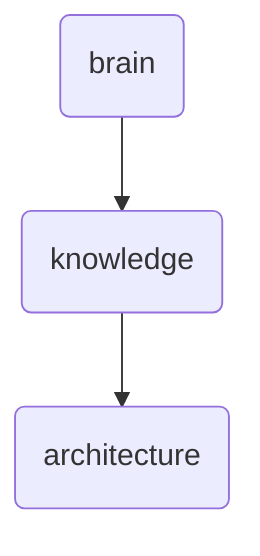

# Architecture Identity

This directory houses the architectural documentation for OmniClaw v5.0, including design patterns and frameworks used in its development.

---

## Topological View

---
*OmniClaw V5.0 | Forged by OMA AI Architect | brain.knowledge.architecture | 2026-04-10*
