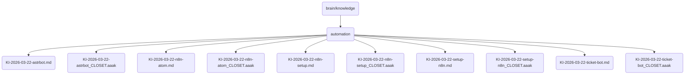

# Automation Identity

This directory contains the documentation and configuration files for the automation components of OmniClaw v5.0, including setup guides, scripts, and knowledge articles.

## Topological View

---
*OmniClaw V5.0 | Forged by AI Architect | Evaluated dynamically*
