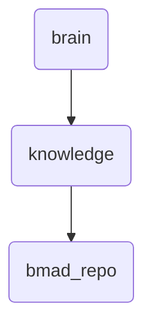

# Bmad Repo Identity

The bmad_repo directory serves as the primary repository for brain-related modules and assets in OmniClaw, managing knowledge and skills data.

---

## Topological View

---
*OmniClaw V5.0 | Forged by OMA AI Architect | brain.knowledge.bmad_repo | 2026-04-10*
