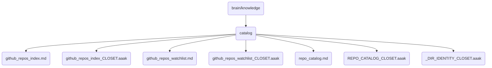

# Catalog Identity

This directory contains the catalog of GitHub repositories and related metadata for OmniClaw v5.0.

## Topological View

---
*OmniClaw V5.0 | Forged by AI Architect | Evaluated dynamically*
