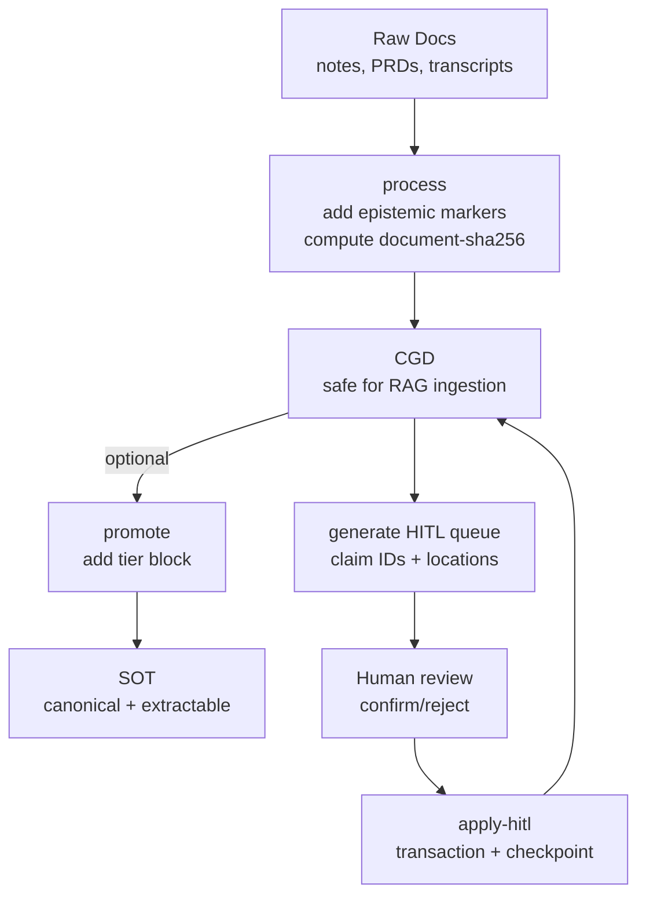
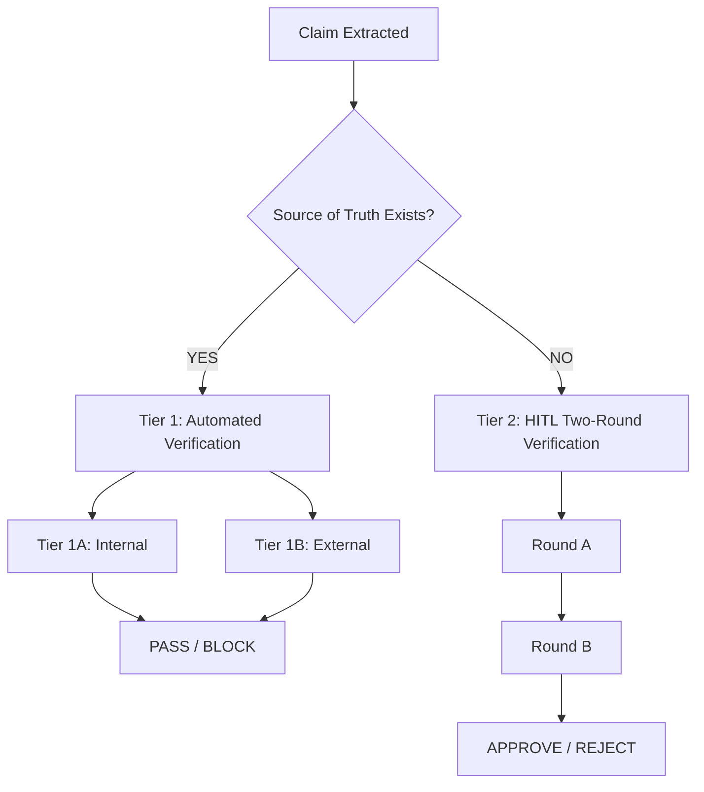

# clarity-gate
Raw knowledge dump assimilated by OA.

## SWALLOW ENGINE DISTILLATION

### File: README.md
```md
# Clarity Gate — Prevent LLMs from Misinterpreting Facts

> **⚠️ LATEST:** Version 2.1 released (2026-01-27). RFC-001 applied: claim status semantics, bundled scripts. See [CHANGELOG](CHANGELOG.md).

> ✅ **This README passed Clarity Gate verification** (2026-01-13, adversarial mode, Claude Opus 4.5)

**Open-source pre-ingestion verification for epistemic quality in RAG systems.**

[](https://creativecommons.org/licenses/by/4.0/)

> *"Detection finds what is; enforcement ensures what should be. In practice: find the missing uncertainty markers before they become confident hallucinations."*

---

## The Problem

If you feed a well-aligned model a document that states "Revenue will reach $50M by Q4" as fact (when it's actually a projection), the model will confidently report this as fact.

The model isn't hallucinating. It's faithfully representing what it was told.

**The failure happened before the model saw the input.**

| Document Says | Accuracy Check | Epistemic Check |
|---------------|----------------|-----------------|
| "Revenue will be $50M" (unmarked projection) | ✅ PASS | ❌ FAIL — projection stated as fact |
| "Our approach outperforms X" (no evidence) | ✅ PASS | ❌ FAIL — ungrounded assertion |
| "Users prefer feature Y" (no methodology) | ✅ PASS | ❌ FAIL — missing epistemic basis |

**Accuracy verification asks:** "Does this match the source?"  
**Epistemic verification asks:** "Is this claim properly qualified?"

Both matter. Accuracy verification has mature open-source tools. Epistemic verification has detection systems (UnScientify, HedgeHunter, BioScope), but at the date of 2.0 release (January 13th, 2026), I found no open-source pre-ingestion epistemic enforcement system (methodology: deep research conducted via multiple LLMs). Corrections welcome.

Clarity Gate is a proposal for that layer.

---

## What Is Clarity Gate?

Clarity Gate is an **open-source pre-ingestion verification system** for epistemic quality.

- **Clarity** — Making explicit what's fact, what's projection, what's hypothesis
- **Gate** — Documents don't enter the knowledge base until they pass verification

### The Gap It Addresses

| Component | Status |
|-----------|--------|
| Pre-ingestion gate pattern | ✅ Proven (Adlib, pharma QMS) |
| Epistemic detection | ✅ Proven (UnScientify, HedgeHunter) |
| **Pre-ingestion epistemic enforcement** | ❌ Gap (to my knowledge) |
| **Open-source accessibility** | ❌ Gap |

| Dimension | Enterprise (Adlib) | Clarity Gate |
|-----------|-------------------|--------------|
| **License** | Proprietary | Open source (CC BY 4.0) |
| **Focus** | Accuracy, compliance | Epistemic quality |
| **Target** | Fortune 500 | Founders, researchers, small teams |
| **Cost** | Enterprise pricing | Free |

---

## When to Use Clarity Gate

Most valuable when:

- Your RAG corpus includes **drafts, docs, tickets, meeting notes**, or user-provided content
- You care about **correctness** and want a verifiable ingestion gate
- You need a practical **HITL loop** that scales beyond manual spot checks
- You want **automated enforcement** of document quality before ingestion

---

## How Clarity Gate Differs from Knowledge Engineering Tools

| Aspect | Semantica / LlamaIndex | Clarity Gate |
|--------|------------------------|--------------|
| **Stage** | Post-extraction | Pre-ingestion |
| **Input** | Structured entities | Raw documents |
| **Problem** | "Which value is correct?" | "Is this claim properly qualified?" |
| **Output** | Resolved knowledge graph | Annotated document (CGD) |
| **Conflict** | Multi-source disagreement | Unmarked projections/assumptions |

**They're complementary:** Use Clarity Gate *before* Semantica/LlamaIndex.

---

## Quick Start

### Option 1: Claude.ai (Web) — Skill Upload

1. Download [`dist/clarity-gate.skill`](dist/clarity-gate.skill)
2. Go to claude.ai → Settings → Features → Skills → Upload
3. Upload the `.skill` file
4. Ask Claude: *"Run clarity gate on this document"*

### Option 2: Claude Desktop

Same as Option 1 — Claude Desktop uses the same skill format as claude.ai.

### Option 3: Claude Code

Clone the repo — Claude Code auto-detects skills in `.claude/skills/`:

```bash
git clone https://github.com/frmoretto/clarity-gate
cd clarity-gate
# Claude Code will automatically detect .claude/skills/clarity-gate/SKILL.md
```

Or copy `.claude/skills/clarity-gate/` to your project's `.claude/skills/` directory.

Ask Claude: *"Run clarity gate on this document"*

### Option 4: Claude Projects

Add [`skills/clarity-gate/SKILL.md`](skills/clarity-gate/SKILL.md) to project knowledge. Claude will search it when needed, though Skills provide better integration.

### Option 5: OpenAI Codex / GitHub Copilot

Copy the canonical skill to the appropriate directory:

| Platform | Location |
|----------|----------|
| OpenAI Codex | `.codex/skills/clarity-gate/SKILL.md` |
| GitHub Copilot | `.github/skills/clarity-gate/SKILL.md` |

Use [`skills/clarity-gate/SKILL.md`](skills/clarity-gate/SKILL.md) (agentskills.io format).

### Option 6: Manual / Other LLMs

Use the [9-point verification](docs/ARCHITECTURE.md#the-9-verification-points) as a manual review process.

For Cursor, Windsurf, or other AI tools, extract the 9 verification points into your `.cursorrules`. The methodology is tool-agnostic—only SKILL.md is Claude-optimized.

---

## Platform-Specific Skill Locations

| Platform | Skill Location | Frontmatter Format |
|----------|----------------|-------------------|
| Claude.ai / Claude Desktop | `.claude/skills/clarity-gate/` | Minimal (`name`, `description` only) |
| Claude Code | `.claude/skills/clarity-gate/` | Minimal |
| OpenAI Codex | `.codex/skills/clarity-gate/` | agentskills.io (full) |
| GitHub Copilot | `.github/skills/clarity-gate/` | agentskills.io (full) |
| Canonical | `skills/clarity-gate/` | agentskills.io (full) |

Pre-built skill file: [`dist/clarity-gate.skill`](dist/clarity-gate.skill)

---

## Format Specification

See [CLARITY_GATE_FORMAT_SPEC.md](docs/CLARITY_GATE_FORMAT_SPEC.md) for the complete format specification (v2.0).

---

## Two Modes

**Verify Mode (default):**
```
"Run clarity gate on this document"
→ Issues report + Two-Round HITL verification
```

**Annotate Mode:**
```
"Run clarity gate and annotate this document"
→ Complete document with fixes applied inline (CGD)
```

The annotated output is a **Clarity-Gated Document (CGD)**.

---

## Workflow Overview



---

## The 9 Verification Points

### Epistemic Checks (Core Focus)

1. **Hypothesis vs. Fact Labeling** — Claims marked as validated or hypothetical
2. **Uncertainty Marker Enforcement** — Forward-looking statements require qualifiers
3. **Assumption Visibility** — Implicit assumptions made explicit
4. **Authoritative-Looking Unvalidated Data** — Tables with percentages flagged if unvalidated

### Data Quality Checks (Complementary)

5. **Data Consistency** — Conflicting numbers within document
6. **Implicit Causation** — Claims implying causation without evidence
7. **Future State as Present** — Planned outcomes described as achieved

### Verification Routing

8. **Temporal Coherence** — Dates consistent with each other and with present
9. **Externally Verifiable Claims** — Pricing, statistics, competitor claims flagged for verification

See [ARCHITECTURE.md](docs/ARCHITECTURE.md) for full details and examples.

---

## Two-Round HITL Verification

Different claims need different types of verification:

| Claim Type | What Human Checks | Cognitive Load |
|------------|-------------------|----------------|
| LLM found source, human witnessed | "Did I interpret correctly?" | Low (quick scan) |
| Human's own data | "Is this actually true?" | High (real verification) |
| No source found | "Is this actually true?" | High (real verification) |

**The system separates these into two rounds:**

### Round A: Derived Data Confirmation

Quick scan of claims from sources found in the current session:

```
## Derived Data Confirmation

These claims came from sources found in this session:

- [Specific claim from source A] (source link)
- [Specific claim from source B] (source link)

Reply "confirmed" or flag any I misread.
```

### Round B: True HITL Verification

Full verification of claims needing actual checking:

```
## HITL Verification Required

| # | Claim | Why HITL Needed | Human Confirms |
|---|-------|-----------------|----------------|
| 1 | Benchmark scores (100%, 75%→100%) | Your experiment data | [ ] True / [ ] False |
```

**Result:** Human attention focused on claims that actually need it.

---

## Verification Hierarchy



### Tier 1A: Internal Consistency (Ready Now)

Checks for contradictions *within* a document — no external systems required.

| Check Type | Example |
|------------|---------|
| Figure vs. Text | Figure shows β=0.33, text claims β=0.73 |
| Abstract vs. Body | Abstract claims "40% improvement," body shows 28% |
| Table vs. Prose | Table lists 5 features, text references 7 |

See [biology paper example](examples/biology-paper-example.md) for a real case where Clarity Gate detected a Δ=0.40 discrepancy. Try it yourself at [arxiparse.org](https://arxiparse.org).

### Tier 1B: External Verification (Extension Interface)

For claims verifiable against structured sources. **Users provide connectors.**

### Tier 2: Two-Round HITL (Intelligent Routing)

The system detects *which* specific claims need human review AND *what kind of review* each needs.

*Example: Most claims in a document typically pass automated checks, with the remainder split between Round A (quick confirmation) and Round B (real verification). (Illustrative — actual ratios vary by document type.)*

---

## Where This Fits

```
Layer 4: Human Strategic Oversight
Layer 3: AI Behavior Verification (behavioral evals, red-teaming)
Layer 2: Input/Context Verification  <-- Clarity Gate
Layer 1: Deterministic Boundaries (rate limits, guardrails)
Layer 0: AI Execution
```

A perfectly aligned model (Layer 3) can confidently produce unsafe outputs from unsafe context (Layer 2). Alignment doesn't inoculate against misleading information.

---

## Prior Art

Clarity Gate builds on proven patterns. See [PRIOR_ART.md](docs/PRIOR_ART.md) for the full landscape.

**Enterprise Gates:** Adlib Software, Pharmaceutical QMS  
**Epistemic Detection:** UnScientify, HedgeHunter, FactBank  
**Fact-Checking:** FEVER, ClaimBuster  
**Post-Retrieval:** Self-RAG, RAGAS, TruLens

**The opportunity:** Existing detection tools (UnScientify, HedgeHunter, BioScope) excel at identifying uncertainty markers. Clarity Gate proposes a complementary enforcement layer that routes ambiguous claims to human review or marks them automatically. I believe these could work together. Community input on integration is welcome.

---

## Critical Limitation

> **Clarity Gate verifies FORM, not TRUTH.**

This system checks whether claims are properly marked as uncertain — it cannot verify if claims are actually true.

**Risk:** An LLM can hallucinate facts INTO a document, then "pass" Clarity Gate by adding source markers to false claims.

**Mitigation:** Two-Round HITL verification is **mandatory** before declaring PASS. See [SKILL.md](skills/clarity-gate/SKILL.md) for the full protocol.

---

## Non-Goals (By Design)

- Does **not** prove truth automatically — enforces correct labeling and verification workflow
- Does **not** replace source citations — prevents epistemic category errors
- Does **not** require a centralized database — file-first and Git-friendly

---

## Roadmap

| Phase | Status | Description |
|-------|--------|-------------|
| **Phase 1** | ✅ Ready | Internal consistency checks + Two-Round HITL + annotation (Claude skill) |
| **Phase 2** | 🔜 Planned | npm/PyPI validators for CI/CD integration |
| **Phase 3** | 🔜 Planned | External verification hooks (user connectors) |
| **Phase 4** | 🔜 Planned | Confidence scoring for HITL optimization |

See [ROADMAP.md](docs/ROADMAP.md) for details.

---

## Documentation

| Document | Description |
|----------|-------------|
| [CLARITY_GATE_FORMAT_SPEC.md](docs/CLARITY_GATE_FORMAT_SPEC.md) | Unified format specification (v2.0) |
| [CLARITY_GATE_PROCEDURES.md](docs/CLARITY_GATE_PROCEDURES.md) | Verification procedures and workflows |
| [ARCHITECTURE.md](docs/ARCHITECTURE.md) | Full 9-point system, verification hierarchy |
| [PRIOR_ART.md](docs/PRIOR_ART.md) | Landscape of existing systems |
| [ROADMAP.md](docs/ROADMAP.md) | Phase 1/2/3 development plan |
| [BENCHMARK_RESULTS.md](docs/research/BENCHMARK_RESULTS.md) | Empirical validation (+19-25% improvement for mid-tier models) |
| [SKILL.md](skills/clarity-gate/SKILL.md) | Claude skill implementation (v2.0) |
| [examples/](examples/) | Real-world verification examples |

---

## Related

**arxiparse.org** — Live implementation for scientific papers  
[arxiparse.org](https://arxiparse.org)

**Source of Truth Creator** — Create epistemically calibrated documents (use before verification)  
[github.com/frmoretto/source-of-truth-creator](https://github.com/frmoretto/source-of-truth-creator)

**Stream Coding** — Documentation-first methodology where Clarity Gate originated  
[github.com/frmoretto/stream-coding](https://github.com/frmoretto/stream-coding)

---

## License

CC BY 4.0 — Use freely with attribution.

---

## Author

**Francesco Marinoni Moretto**
- GitHub: [@frmoretto](https://github.com/frmoretto)
- LinkedIn: [francesco-moretto](https://www.linkedin.com/in/francesco-moretto/)

---

## Contributing

Looking for:

1. **Prior art** — Open-source pre-ingestion gates for epistemic quality I missed?
2. **Integration** — LlamaIndex, LangChain implementations
3. **Verification feedback** — Are the 9 points the right focus?
4. **Real-world examples** — Documents that expose edge cases

Open an issue or PR.

```

### File: examples\README.md
```md
# Examples

Real-world examples of Clarity Gate verification.

---

## Available Examples

| Example | Type | Document | Result |
|---------|------|----------|--------|
| [Biology Paper](biology-paper-example.md) | Tier 1A: Internal Consistency | Scientific paper (arXiv 2403.00001) | DISCREPANCY FOUND |
| [Self-Verification Report](self-verification-report.md) | Full 9-Point Verification | This repository's documentation | 14/18 PASS, 2 NEEDS REVIEW |

---

## How to Use These Examples

### Learning

Each example shows:
- The document type and problem
- What Clarity Gate found
- How to reproduce the verification
- Resolution options

### Validation

Use the reproducibility instructions to verify our claims yourself:
1. Download the source document
2. Run the provided prompt in Claude/Gemini
3. Compare your results to ours

### Contributing

Have an example to share? See [Contributing](#contributing) below.

---

## Example Structure

Each example follows this format:

```
# Example: [Name]

**Type:** [Tier 1A/1B/2]
**Document:** [Description]
**Result:** [PASS/FAIL/DISCREPANCY]
**Reproducible:** [Yes/No]

## Paper/Document Reference
[How to access the source]

## What Clarity Gate Found
[Detection results]

## How to Reproduce
[Step-by-step instructions]

## Why This Matters
[Failure mode if not caught]

## Resolution Options
[How to fix]
```

---

## Contributing

We're looking for examples that demonstrate:

1. **Different document types**
   - Legal documents
   - Financial reports
   - Technical documentation
   - Medical/clinical papers

2. **Different failure modes**
   - Internal consistency issues
   - Missing uncertainty markers
   - Implicit assumptions
   - Stale data

3. **Edge cases**
   - False positives (flagged but correct)
   - Complex multi-part discrepancies
   - Domain-specific challenges

### How to Contribute

1. Fork the repository
2. Add your example as `examples/[descriptive-name].md`
3. Follow the structure above
4. Include reproducibility instructions
5. Open a PR

**Important:** Do not include copyrighted documents directly. Provide references and instructions for obtaining source materials.

---

## License

Examples are provided under CC BY 4.0 — Use freely with attribution.

```

### File: .claude-plugin_DISTILLED.md
```md
---
id: .claude-plugin
type: distilled_knowledge
---
# .claude-plugin

## SWALLOW ENGINE DISTILLATION

### File: marketplace.json
```json
{
  "$schema": "https://claude.ai/schemas/plugin-manifest-v1.json",
  "name": "clarity-gate",
  "version": "2.1.0",
  "description": "Pre-ingestion verification for epistemic quality in RAG systems. Ensures documents are properly qualified before entering knowledge bases.",
  "author": "Francesco Marinoni Moretto",
  "license": "CC-BY-4.0",
  "repository": "https://github.com/frmoretto/clarity-gate",
  "homepage": "https://github.com/frmoretto/clarity-gate",
  "keywords": [
    "clarity-gate",
    "epistemic",
    "verification",
    "rag",
    "hallucination",
    "pre-ingestion",
    "cgd",
    "sot",
    "document-quality",
    "ai-safety"
  ],
  "skills": [
    {
      "name": "clarity-gate",
      "path": "skills/clarity-gate/SKILL.md",
      "triggers": [
        "clarity gate",
        "check for hallucination risks",
        "can an LLM read this safely",
        "review for equivocation",
        "verify document clarity",
        "pre-ingestion check",
        "cgd verify",
        "sot verify"
      ]
    }
  ],
  "specifications": {
    "format": "docs/CLARITY_GATE_FORMAT_SPEC.md",
    "procedures": "docs/CLARITY_GATE_PROCEDURES.md"
  },
  "compatibility": {
    "claude-code": ">=1.0.0",
    "claude-desktop": ">=1.0.0"
  }
}

```


```

### File: .claude_DISTILLED.md
```md
---
id: .claude
type: distilled_knowledge
---
# .claude

## SWALLOW ENGINE DISTILLATION

### File: skills_DISTILLED.md
```md
---
id: skills
type: distilled_knowledge
---
# skills

## SWALLOW ENGINE DISTILLATION

### File: clarity-gate_DISTILLED.md
```md
---
id: clarity-gate
type: distilled_knowledge
---
# clarity-gate

## SWALLOW ENGINE DISTILLATION

### File: scripts_DISTILLED.md
```md
---
id: scripts
type: distilled_knowledge
---
# scripts

## SWALLOW ENGINE DISTILLATION

### File: claim_id.py
```py
#!/usr/bin/env python3
"""
Clarity Gate: Claim ID Computation

Reference implementation per FORMAT_SPEC §1.3.4 (RFC-001).
Produces stable, hash-based claim IDs for HITL tracking.

Usage:
    python claim_id.py "Base price is $99/mo" "api-pricing/1"
    # Output: claim-75fb137a

Test Vectors (FORMAT_SPEC §18.2):
    claim_id("Base price is $99/mo", "api-pricing/1") == "claim-75fb137a"
    claim_id("The API supports GraphQL", "features/1") == "claim-eb357742"

Normalization (per RFC-001 §3.4):
    - Text: strip outer whitespace, collapse internal whitespace to single space
    - Location: strip outer whitespace
    
    This ensures stable IDs regardless of formatting variations:
    "Price is  $99" (2 spaces) → same hash as "Price is $99" (1 space)
"""

import hashlib
import sys


def normalize_text(text: str) -> str:
    """
    Normalize claim text for consistent hashing.
    
    Per RFC-001 §3.4:
    - Strip leading/trailing whitespace
    - Collapse multiple internal spaces to single space
    """
    return ' '.join(text.strip().split())


def claim_id(text: str, location: str) -> str:
    """
    Compute a stable claim ID from claim text and location.
    
    Args:
        text: The full claim text (e.g., "Base price is $99/mo")
        location: The heading_slug/ordinal (e.g., "api-pricing/1")
    
    Returns:
        Claim ID in format "claim-XXXXXXXX" (8-char hex hash)
    
    Algorithm:
        1. Normalize text (strip + collapse whitespace)
        2. Strip location whitespace
        3. Concatenate with pipe delimiter
        4. SHA-256 hash the UTF-8 encoded payload
        5. Take first 8 hex characters
        6. Prefix with "claim-"
    """
    normalized_text = normalize_text(text)
    normalized_location = location.strip()
    
    payload = f"{normalized_text}|{normalized_location}"
    hash_hex = hashlib.sha256(payload.encode('utf-8')).hexdigest()
    return f"claim-{hash_hex[:8]}"


def main():
    if len(sys.argv) == 3:
        text = sys.argv[1]
        location = sys.argv[2]
        print(claim_id(text, location))
    elif len(sys.argv) == 2 and sys.argv[1] == "--test":
        # Run test vectors
        print("=== Test Vectors ===")
        tests = [
            ("Base price is $99/mo", "api-pricing/1", "claim-75fb137a"),
            ("The API supports GraphQL", "features/1", "claim-eb357742"),
        ]
        all_pass = True
        for text, location, expected in tests:
            result = claim_id(text, location)
            status = "PASS" if result == expected else "FAIL"
            if result != expected:
                all_pass = False
            print(f"{status} claim_id({text!r}, {location!r})")
            print(f"    Expected: {expected}")
            print(f"    Got:      {result}")
        
        print("\n=== Normalization Tests ===")
        # These should all produce the same hash
        norm_tests = [
            ("Price is $99", "loc/1"),
            ("Price is  $99", "loc/1"),      # double space
            ("  Price is $99  ", "loc/1"),   # outer spaces
            ("Price is $99", "  loc/1  "),   # location spaces
        ]
        base_result = claim_id(norm_tests[0][0], norm_tests[0][1])
        print(f"Base: {base_result}")
        for text, location in norm_tests[1:]:
            result = claim_id(text, location)
            status = "PASS" if result == base_result else "FAIL"
            if result != base_result:
                all_pass = False
            print(f"{status} claim_id({text!r}, {location!r}) == base")
        
        print()
        sys.exit(0 if all_pass else 1)
    else:
        print("Usage: python claim_id.py <text> <location>")
        print("       python claim_id.py --test")
        print()
        print("Example:")
        print('  python claim_id.py "Base price is $99/mo" "api-pricing/1"')
        print("  # Output: claim-75fb137a")
        sys.exit(1)


if __name__ == "__main__":
    main()

```

### File: document_hash.py
```py
#!/usr/bin/env python3
"""
Clarity Gate: Document Hash Computation

Reference implementation per FORMAT_SPEC §2.1-2.4, §2.3 (RFC-001).
Computes SHA-256 hash excluding the document-sha256 line itself.

Usage:
    python document_hash.py path/to/file.cgd.md
    python document_hash.py --verify path/to/file.cgd.md
    python document_hash.py --test

Algorithm per FORMAT_SPEC:
    0. Pre-normalize: BOM removal, CRLF/CR to LF
    1. Extract hash window: content between '---\\n' and '<!-- CLARITY_GATE_END -->'
       - End marker detection uses fence-aware scanning (§2.3 Quine Protection)
    2. Exclude document-sha256 line(s) from YAML frontmatter only
       - Multiline YAML continuation handling (§2.2)
    3. Canonicalize per §2.4:
       - Strip trailing whitespace per line
       - Collapse 3+ consecutive newlines to 2
       - Normalize final newline (exactly 1 LF)
       - UTF-8 NFC normalization
    4. Compute SHA-256
"""

import hashlib
import re
import sys
import unicodedata


def canonicalize(text: str) -> str:
    """
    Canonicalize content for consistent hashing across platforms.

    Per FORMAT_SPEC §2.4:
    1. Trailing whitespace: Remove per line
    2. Consecutive newlines: Collapse 3+ to 2
    3. Final newline: Exactly one trailing LF
    4. Encoding: UTF-8 NFC normalization
    """
    # 1. Strip trailing whitespace per line
    lines = text.split('\n')
    lines = [line.rstrip() for line in lines]
    text = '\n'.join(lines)

    # 2. Collapse 3+ consecutive newlines to 2
    while '\n\n\n' in text:
        text = text.replace('\n\n\n', '\n\n')

    # 3. Normalize trailing newline (exactly 1)
    text = text.rstrip('\n') + '\n'

    # 4. UTF-8 NFC normalization
    text = unicodedata.normalize('NFC', text)

    return text


# Regex for fence opener/closer: 0-3 leading spaces, then 3+ backticks or tildes
_FENCE_RE = re.compile(r'^( {0,3})(`{3,}|~{3,})')

END_MARKER = '<!-- CLARITY_GATE_END -->'


def find_end_marker(text: str) -> int:
    """
    Find position of first <!-- CLARITY_GATE_END --> outside fenced code blocks.

    Per FORMAT_SPEC §2.3 (Quine Protection) and §8.5 fence-tracking:
    - Fence opens on line starting with 3+ backticks/tildes (after 0-3 spaces)
    - Fence closes on line with same character, equal or greater count
    - Lines indented 4+ spaces do NOT open/close fences
    - Info strings after opener are ignored

    Returns: character offset of the marker.
    Raises: ValueError if no valid marker found.
    """
    in_fence = False
    fence_char = ''
    fence_count = 0
    offset = 0

    for line in text.split('\n'):
        if not in_fence:
            marker_pos = line.find(END_MARKER)
            if marker_pos != -1:
                return offset + marker_pos

        m = _FENCE_RE.match(line)
        if m:
            char = m.group(2)[0]
            count = len(m.group(2))
            if not in_fence:
                in_fence = True
                fence_char = char
                fence_count = count
            elif char == fence_char and count >= fence_count:
                in_fence = False

        offset += len(line) + 1  # +1 for the \n consumed by split

    raise ValueError("No <!-- CLARITY_GATE_END --> found outside fenced code blocks")


def compute_hash(filepath: str) -> str:
    """
    Compute SHA-256 hash of document per FORMAT_SPEC §2.2-2.4.

    Algorithm:
        0. Pre-normalize for boundary detection (BOM, CRLF)
        1. Extract content between opening '---\n' and '<!-- CLARITY_GATE_END -->'
        2. Remove document-sha256 line(s) from YAML frontmatter ONLY
           (including multiline continuations)
        3. Canonicalize per §2.4
        4. Compute SHA-256
    """
    with open(filepath, 'r', encoding='utf-8') as f:
        file_content = f.read()

    # 0. Pre-normalize for boundary detection
    working = file_content
    if working.startswith('\ufeff'):
        working = working[1:]
    working = working.replace('\r\n', '\n').replace('\r', '\n')

    # 1. Extract content between opening YAML delimiter and end marker
    #    End marker uses fence-aware detection per §2.3 (Quine Protection)
    try:
        start = working.index('---\n') + len('---\n')
        end = find_end_marker(working)
        hashable = working[start:end]
    except ValueError as e:
        print(f"ERROR: Invalid CGD format - {e}")
        sys.exit(1)

    # 2. Remove document-sha256 line(s) - YAML frontmatter only
    lines = hashable.split('\n')
    filtered = []
    skip_multiline = False
    hash_indent = 0
    in_frontmatter = True

    for line in lines:
        # Detect end of YAML frontmatter
        if in_frontmatter and line.strip() == '---':
            in_frontmatter = False

        # Check if this is the hash line
        if in_frontmatter and re.match(r'^\s*document-sha256:', line):
            skip_multiline = True
            hash_indent = len(line) - len(line.lstrip())
            continue

        # If we're skipping multiline, check if this is a continuation
        if skip_multiline:
            current_indent = len(line) - len(line.lstrip())
            if in_frontmatter and current_indent > hash_indent:
                continue
            skip_multiline = False

        filtered.append(line)

    hashable = '\n'.join(filtered)

    # 3. Canonicalize
    hashable = canonicalize(hashable)

    # 4. Compute
    return hashlib.sha256(hashable.encode('utf-8')).hexdigest()


def verify(filepath: str) -> bool:
    """
    Verify document hash matches stored value.

    Returns True if hash matches, False otherwise.
    """
    with open(filepath, 'r', encoding='utf-8') as f:
        content = f.read()

    # Normalize for consistent matching
    if content.startswith('\ufeff'):
        content = content[1:]
    content = content.replace('\r\n', '\n').replace('\r', '\n')

    # Extract stored hash
    match = re.search(r'^\s*document-sha256:\s*["\']?([a-f0-9]{64})["\']?', content, re.MULTILINE)
    if not match:
        print("FAIL: No document-sha256 found")
        return False

    stored = match.group(1)
    computed = compute_hash(filepath)

    if stored == computed:
        print(f"PASS: Hash verified: {computed}")
        return True
    else:
        print(f"FAIL: Hash mismatch")
        print(f"  Stored:   {stored}")
        print(f"  Computed: {computed}")
        return False


def run_tests():
    """Run canonicalization and edge case tests."""
    print("=== Canonicalization Tests ===")

    # Test 1: BOM removal (happens in pre-normalization, not canonicalize)
    # Note: BOM is removed in compute_hash step 0, not in canonicalize
    with_bom = '\ufeff# Test'
    without_bom = '# Test'
    # After BOM removal in pre-normalization:
    assert with_bom.lstrip('\ufeff') == without_bom, "BOM removal in pre-normalization"
    print("PASS: BOM removal (pre-normalization)")

    # Test 2: Trailing whitespace removal
    with_trailing = "line1  \nline2\t\nline3"
    without_trailing = "line1\nline2\nline3"
    assert canonicalize(with_trailing) == canonicalize(without_trailing), "Trailing whitespace should be stripped"
    print("PASS: Trailing whitespace removal")

    # Test 3: Newline collapsing (3+ → 2)
    multiple_newlines = "para1\n\n\n\npara2"
    collapsed = "para1\n\npara2"
    assert canonicalize(multiple_newlines) == collapsed + '\n', "3+ newlines should collapse to 2"
    print("PASS: Newline collapsing")

    # Test 4: Final newline normalization
    no_trailing = "content"
    one_trailing = "content\n"
    two_trailing = "content\n\n"
    assert canonicalize(no_trailing) == "content\n", "Missing final newline should be added"
    assert canonicalize(one_trailing) == "content\n", "Single final newline should be preserved"
    assert canonicalize(two_trailing) == "content\n", "Multiple final newlines should collapse to 1"
    print("PASS: Final newline normalization")

    # Test 5: NFC normalization
    # é as single codepoint (U+00E9) vs e + combining acute (U+0065 U+0301)
    nfc = '\u00e9'  # NFC form
    nfd = '\u0065\u0301'  # NFD form
    assert canonicalize(nfc) == canonicalize(nfd), "NFC normalization should make equivalent"
    print("PASS: UTF-8 NFC normalization")

    # Test 6: Preserve tabs and leading whitespace
    with_tabs = "line1\n\tindented\n  spaces"
    canonical = canonicalize(with_tabs)
    assert '\t' in canonical, "Tabs should be preserved"
    assert '  spaces' in canonical, "Leading whitespace should be preserved"
    print("PASS: Preserve tabs and leading whitespace")

    print("\n=== Line Ending Tests ===")

    # Test 7: CRLF normalization (in pre-processing)
    crlf = "line1\r\nline2\r\n"
    lf = "line1\nline2\n"
    # Note: CRLF normalization happens in compute_hash step 0, not canonicalize
    assert canonicalize(crlf.replace('\r\n', '\n')) == canonicalize(lf), "CRLF should normalize to LF"
    print("PASS: CRLF to LF")

    # Test 8: CR normalization
    cr = "line1\rline2\r"
    assert canonicalize(cr.replace('\r', '\n')) == canonicalize(lf), "CR should normalize to LF"
    print("PASS: CR to LF")

    print("\n=== Fence-Aware End Marker Tests (§2.3 Quine Protection) ===")

    # Test 9: Simple marker detection (no fences)
    simple = "some content\n<!-- CLARITY_GATE_END -->\nafter"
    assert find_end_marker(simple) == simple.index(END_MARKER), \
        "Simple end marker detection"
    print("PASS: Simple end marker detection")

    # Test 10: Marker inside backtick fence should be skipped
    fenced = "before\n```\n<!-- CLARITY_GATE_END -->\n```\n<!-- CLARITY_GATE_END -->\nafter"
    expected = fenced.rfind(END_MARKER)
    assert find_end_marker(fenced) == expected, \
        "Marker inside backtick fence should be skipped"
    print("PASS: Marker inside backtick fence skipped")

    # Test 11: Marker inside tilde fence should be skipped
    tilde = "before\n~~~\n<!-- CLARITY_GATE_END -->\n~~~\n<!-- CLARITY_GATE_END -->\nafter"
    expected = tilde.rfind(END_MARKER)
    assert find_end_marker(tilde) == expected, \
        "Marker inside tilde fence should be skipped"
    print("PASS: Marker inside tilde fence skipped")

    # Test 12: Longer fence — ``` does NOT close ````
    long_fence = "````\n<!-- CLARITY_GATE_END -->\n```\n<!-- CLARITY_GATE_END -->\n````\n<!-- CLARITY_GATE_END -->"
    expected = long_fence.rfind(END_MARKER)
    assert find_end_marker(long_fence) == expected, \
        "Shorter fence delimiter should not close longer fence"
    print("PASS: Fence l
... [TRUNCATED]
```

### File: .codex_DISTILLED.md
```md
---
id: .codex
type: distilled_knowledge
---
# .codex

## SWALLOW ENGINE DISTILLATION

### File: skills_DISTILLED.md
```md
---
id: skills
type: distilled_knowledge
---
# skills

## SWALLOW ENGINE DISTILLATION

### File: clarity-gate_DISTILLED.md
```md
---
id: clarity-gate
type: distilled_knowledge
---
# clarity-gate

## SWALLOW ENGINE DISTILLATION

### File: scripts_DISTILLED.md
```md
---
id: scripts
type: distilled_knowledge
---
# scripts

## SWALLOW ENGINE DISTILLATION

### File: claim_id.py
```py
#!/usr/bin/env python3
"""
Clarity Gate: Claim ID Computation

Reference implementation per FORMAT_SPEC §1.3.4 (RFC-001).
Produces stable, hash-based claim IDs for HITL tracking.

Usage:
    python claim_id.py "Base price is $99/mo" "api-pricing/1"
    # Output: claim-75fb137a

Test Vectors (FORMAT_SPEC §18.2):
    claim_id("Base price is $99/mo", "api-pricing/1") == "claim-75fb137a"
    claim_id("The API supports GraphQL", "features/1") == "claim-eb357742"

Normalization (per RFC-001 §3.4):
    - Text: strip outer whitespace, collapse internal whitespace to single space
    - Location: strip outer whitespace
    
    This ensures stable IDs regardless of formatting variations:
    "Price is  $99" (2 spaces) → same hash as "Price is $99" (1 space)
"""

import hashlib
import sys


def normalize_text(text: str) -> str:
    """
    Normalize claim text for consistent hashing.
    
    Per RFC-001 §3.4:
    - Strip leading/trailing whitespace
    - Collapse multiple internal spaces to single space
    """
    return ' '.join(text.strip().split())


def claim_id(text: str, location: str) -> str:
    """
    Compute a stable claim ID from claim text and location.
    
    Args:
        text: The full claim text (e.g., "Base price is $99/mo")
        location: The heading_slug/ordinal (e.g., "api-pricing/1")
    
    Returns:
        Claim ID in format "claim-XXXXXXXX" (8-char hex hash)
    
    Algorithm:
        1. Normalize text (strip + collapse whitespace)
        2. Strip location whitespace
        3. Concatenate with pipe delimiter
        4. SHA-256 hash the UTF-8 encoded payload
        5. Take first 8 hex characters
        6. Prefix with "claim-"
    """
    normalized_text = normalize_text(text)
    normalized_location = location.strip()
    
    payload = f"{normalized_text}|{normalized_location}"
    hash_hex = hashlib.sha256(payload.encode('utf-8')).hexdigest()
    return f"claim-{hash_hex[:8]}"


def main():
    if len(sys.argv) == 3:
        text = sys.argv[1]
        location = sys.argv[2]
        print(claim_id(text, location))
    elif len(sys.argv) == 2 and sys.argv[1] == "--test":
        # Run test vectors
        print("=== Test Vectors ===")
        tests = [
            ("Base price is $99/mo", "api-pricing/1", "claim-75fb137a"),
            ("The API supports GraphQL", "features/1", "claim-eb357742"),
        ]
        all_pass = True
        for text, location, expected in tests:
            result = claim_id(text, location)
            status = "✓" if result == expected else "✗"
            if result != expected:
                all_pass = False
            print(f"{status} claim_id({text!r}, {location!r})")
            print(f"    Expected: {expected}")
            print(f"    Got:      {result}")
        
        print("\n=== Normalization Tests ===")
        # These should all produce the same hash
        norm_tests = [
            ("Price is $99", "loc/1"),
            ("Price is  $99", "loc/1"),      # double space
            ("  Price is $99  ", "loc/1"),   # outer spaces
            ("Price is $99", "  loc/1  "),   # location spaces
        ]
        base_result = claim_id(norm_tests[0][0], norm_tests[0][1])
        print(f"Base: {base_result}")
        for text, location in norm_tests[1:]:
            result = claim_id(text, location)
            status = "✓" if result == base_result else "✗"
            if result != base_result:
                all_pass = False
            print(f"{status} claim_id({text!r}, {location!r}) == base")
        
        print()
        sys.exit(0 if all_pass else 1)
    else:
        print("Usage: python claim_id.py <text> <location>")
        print("       python claim_id.py --test")
        print()
        print("Example:")
        print('  python claim_id.py "Base price is $99/mo" "api-pricing/1"')
        print("  # Output: claim-75fb137a")
        sys.exit(1)


if __name__ == "__main__":
    main()

```

### File: document_hash.py
```py
#!/usr/bin/env python3
"""
Clarity Gate: Document Hash Computation

Reference implementation per FORMAT_SPEC §2.1-2.4, §2.3 (RFC-001).
Computes SHA-256 hash excluding the document-sha256 line itself.

Usage:
    python document_hash.py path/to/file.cgd.md
    python document_hash.py --verify path/to/file.cgd.md
    python document_hash.py --test

Algorithm per FORMAT_SPEC:
    0. Pre-normalize: BOM removal, CRLF/CR to LF
    1. Extract hash window: content between '---\\n' and '<!-- CLARITY_GATE_END -->'
       - End marker detection uses fence-aware scanning (§2.3 Quine Protection)
    2. Exclude document-sha256 line(s) from YAML frontmatter only
       - Multiline YAML continuation handling (§2.2)
    3. Canonicalize per §2.4:
       - Strip trailing whitespace per line
       - Collapse 3+ consecutive newlines to 2
       - Normalize final newline (exactly 1 LF)
       - UTF-8 NFC normalization
    4. Compute SHA-256
"""

import hashlib
import re
import sys
import unicodedata


def canonicalize(text: str) -> str:
    """
    Canonicalize content for consistent hashing across platforms.

    Per FORMAT_SPEC §2.4:
    1. Trailing whitespace: Remove per line
    2. Consecutive newlines: Collapse 3+ to 2
    3. Final newline: Exactly one trailing LF
    4. Encoding: UTF-8 NFC normalization
    """
    # 1. Strip trailing whitespace per line
    lines = text.split('\n')
    lines = [line.rstrip() for line in lines]
    text = '\n'.join(lines)

    # 2. Collapse 3+ consecutive newlines to 2
    while '\n\n\n' in text:
        text = text.replace('\n\n\n', '\n\n')

    # 3. Normalize trailing newline (exactly 1)
    text = text.rstrip('\n') + '\n'

    # 4. UTF-8 NFC normalization
    text = unicodedata.normalize('NFC', text)

    return text


# Regex for fence opener/closer: 0-3 leading spaces, then 3+ backticks or tildes
_FENCE_RE = re.compile(r'^( {0,3})(`{3,}|~{3,})')

END_MARKER = '<!-- CLARITY_GATE_END -->'


def find_end_marker(text: str) -> int:
    """
    Find position of first <!-- CLARITY_GATE_END --> outside fenced code blocks.

    Per FORMAT_SPEC §2.3 (Quine Protection) and §8.5 fence-tracking:
    - Fence opens on line starting with 3+ backticks/tildes (after 0-3 spaces)
    - Fence closes on line with same character, equal or greater count
    - Lines indented 4+ spaces do NOT open/close fences
    - Info strings after opener are ignored

    Returns: character offset of the marker.
    Raises: ValueError if no valid marker found.
    """
    in_fence = False
    fence_char = ''
    fence_count = 0
    offset = 0

    for line in text.split('\n'):
        if not in_fence:
            marker_pos = line.find(END_MARKER)
            if marker_pos != -1:
                return offset + marker_pos

        m = _FENCE_RE.match(line)
        if m:
            char = m.group(2)[0]
            count = len(m.group(2))
            if not in_fence:
                in_fence = True
                fence_char = char
                fence_count = count
            elif char == fence_char and count >= fence_count:
                in_fence = False

        offset += len(line) + 1  # +1 for the \n consumed by split

    raise ValueError("No <!-- CLARITY_GATE_END --> found outside fenced code blocks")


def compute_hash(filepath: str) -> str:
    """
    Compute SHA-256 hash of document per FORMAT_SPEC §2.2-2.4.

    Algorithm:
        0. Pre-normalize for boundary detection (BOM, CRLF)
        1. Extract content between opening '---\n' and '<!-- CLARITY_GATE_END -->'
        2. Remove document-sha256 line(s) from YAML frontmatter ONLY
           (including multiline continuations)
        3. Canonicalize per §2.4
        4. Compute SHA-256
    """
    with open(filepath, 'r', encoding='utf-8') as f:
        file_content = f.read()

    # 0. Pre-normalize for boundary detection
    working = file_content
    if working.startswith('\ufeff'):
        working = working[1:]
    working = working.replace('\r\n', '\n').replace('\r', '\n')

    # 1. Extract content between opening YAML delimiter and end marker
    #    End marker uses fence-aware detection per §2.3 (Quine Protection)
    try:
        start = working.index('---\n') + len('---\n')
        end = find_end_marker(working)
        hashable = working[start:end]
    except ValueError as e:
        print(f"ERROR: Invalid CGD format - {e}")
        sys.exit(1)

    # 2. Remove document-sha256 line(s) - YAML frontmatter only
    lines = hashable.split('\n')
    filtered = []
    skip_multiline = False
    hash_indent = 0
    in_frontmatter = True

    for line in lines:
        # Detect end of YAML frontmatter
        if in_frontmatter and line.strip() == '---':
            in_frontmatter = False

        # Check if this is the hash line
        if in_frontmatter and re.match(r'^\s*document-sha256:', line):
            skip_multiline = True
            hash_indent = len(line) - len(line.lstrip())
            continue

        # If we're skipping multiline, check if this is a continuation
        if skip_multiline:
            current_indent = len(line) - len(line.lstrip())
            if in_frontmatter and current_indent > hash_indent:
                continue
            skip_multiline = False

        filtered.append(line)

    hashable = '\n'.join(filtered)

    # 3. Canonicalize
    hashable = canonicalize(hashable)

    # 4. Compute
    return hashlib.sha256(hashable.encode('utf-8')).hexdigest()


def verify(filepath: str) -> bool:
    """
    Verify document hash matches stored value.

    Returns True if hash matches, False otherwise.
    """
    with open(filepath, 'r', encoding='utf-8') as f:
        content = f.read()

    # Normalize for consistent matching
    if content.startswith('\ufeff'):
        content = content[1:]
    content = content.replace('\r\n', '\n').replace('\r', '\n')

    # Extract stored hash
    match = re.search(r'^\s*document-sha256:\s*["\']?([a-f0-9]{64})["\']?', content, re.MULTILINE)
    if not match:
        print("FAIL: No document-sha256 found")
        return False

    stored = match.group(1)
    computed = compute_hash(filepath)

    if stored == computed:
        print(f"PASS: Hash verified: {computed}")
        return True
    else:
        print(f"FAIL: Hash mismatch")
        print(f"  Stored:   {stored}")
        print(f"  Computed: {computed}")
        return False


def run_tests():
    """Run canonicalization and edge case tests."""
    print("=== Canonicalization Tests ===")

    # Test 1: BOM removal (happens in pre-normalization, not canonicalize)
    # Note: BOM is removed in compute_hash step 0, not in canonicalize
    with_bom = '\ufeff# Test'
    without_bom = '# Test'
    # After BOM removal in pre-normalization:
    assert with_bom.lstrip('\ufeff') == without_bom, "BOM removal in pre-normalization"
    print("PASS: BOM removal (pre-normalization)")

    # Test 2: Trailing whitespace removal
    with_trailing = "line1  \nline2\t\nline3"
    without_trailing = "line1\nline2\nline3"
    assert canonicalize(with_trailing) == canonicalize(without_trailing), "Trailing whitespace should be stripped"
    print("PASS: Trailing whitespace removal")

    # Test 3: Newline collapsing (3+ → 2)
    multiple_newlines = "para1\n\n\n\npara2"
    collapsed = "para1\n\npara2"
    assert canonicalize(multiple_newlines) == collapsed + '\n', "3+ newlines should collapse to 2"
    print("PASS: Newline collapsing")

    # Test 4: Final newline normalization
    no_trailing = "content"
    one_trailing = "content\n"
    two_trailing = "content\n\n"
    assert canonicalize(no_trailing) == "content\n", "Missing final newline should be added"
    assert canonicalize(one_trailing) == "content\n", "Single final newline should be preserved"
    assert canonicalize(two_trailing) == "content\n", "Multiple final newlines should collapse to 1"
    print("PASS: Final newline normalization")

    # Test 5: NFC normalization
    # é as single codepoint (U+00E9) vs e + combining acute (U+0065 U+0301)
    nfc = '\u00e9'  # NFC form
    nfd = '\u0065\u0301'  # NFD form
    assert canonicalize(nfc) == canonicalize(nfd), "NFC normalization should make equivalent"
    print("PASS: UTF-8 NFC normalization")

    # Test 6: Preserve tabs and leading whitespace
    with_tabs = "line1\n\tindented\n  spaces"
    canonical = canonicalize(with_tabs)
    assert '\t' in canonical, "Tabs should be preserved"
    assert '  spaces' in canonical, "Leading whitespace should be preserved"
    print("PASS: Preserve tabs and leading whitespace")

    print("\n=== Line Ending Tests ===")

    # Test 7: CRLF normalization (in pre-processing)
    crlf = "line1\r\nline2\r\n"
    lf = "line1\nline2\n"
    # Note: CRLF normalization happens in compute_hash step 0, not canonicalize
    assert canonicalize(crlf.replace('\r\n', '\n')) == canonicalize(lf), "CRLF should normalize to LF"
    print("PASS: CRLF to LF")

    # Test 8: CR normalization
    cr = "line1\rline2\r"
    assert canonicalize(cr.replace('\r', '\n')) == canonicalize(lf), "CR should normalize to LF"
    print("PASS: CR to LF")

    print("\n=== Fence-Aware End Marker Tests (§2.3 Quine Protection) ===")

    # Test 9: Simple marker detection (no fences)
    simple = "some content\n<!-- CLARITY_GATE_END -->\nafter"
    assert find_end_marker(simple) == simple.index(END_MARKER), \
        "Simple end marker detection"
    print("PASS: Simple end marker detection")

    # Test 10: Marker inside backtick fence should be skipped
    fenced = "before\n```\n<!-- CLARITY_GATE_END -->\n```\n<!-- CLARITY_GATE_END -->\nafter"
    expected = fenced.rfind(END_MARKER)
    assert find_end_marker(fenced) == expected, \
        "Marker inside backtick fence should be skipped"
    print("PASS: Marker inside backtick fence skipped")

    # Test 11: Marker inside tilde fence should be skipped
    tilde = "before\n~~~\n<!-- CLARITY_GATE_END -->\n~~~\n<!-- CLARITY_GATE_END -->\nafter"
    expected = tilde.rfind(END_MARKER)
    assert find_end_marker(tilde) == expected, \
        "Marker inside tilde fence should be skipped"
    print("PASS: Marker inside tilde fence skipped")

    # Test 12: Longer fence — ``` does NOT close ````
    long_fence = "````\n<!-- CLARITY_GATE_END -->\n```\n<!-- CLARITY_GATE_END -->\n````\n<!-- CLARITY_GATE_END -->"
    expected = long_fence.rfind(END_MARKER)
    assert find_end_marker(long_fence) == expected, \
        "Shorter fence delimiter should not close longer fence"
    print("PASS: Fence length tracking
... [TRUNCATED]
```

### File: AGENTS.md
```md
# AGENTS.md - Clarity Gate

> Universal discovery file for AI agents and coding assistants.

## What This Repository Does

**Clarity Gate** is a pre-ingestion verification system for epistemic quality in RAG systems. It ensures documents are properly qualified (claims marked as projections, hypotheses labeled, assumptions explicit) before they enter knowledge bases.

**Core Question:** "If another LLM reads this document, will it mistake assumptions for facts?"

## Quick Start for Agents

### 1. Load the Skill

The main skill file is at: `skills/clarity-gate/SKILL.md`

```
Read: skills/clarity-gate/SKILL.md
```

### 2. Understand the Specifications

| Document | Purpose | Location |
|----------|---------|----------|
| Format Spec | Unified CGD/SOT specification (v2.1) | `docs/CLARITY_GATE_FORMAT_SPEC.md` |
| Procedures | Verification workflows | `docs/CLARITY_GATE_PROCEDURES.md` |

### 3. Trigger Phrases

Use any of these to activate Clarity Gate:
- "clarity gate"
- "check for hallucination risks"
- "can an LLM read this safely"
- "review for equivocation"
- "verify document clarity"
- "pre-ingestion check"

## Repository Structure

```
clarity-gate/
├── skills/clarity-gate/      # Canonical skill (agentskills.io compliant)
│   └── SKILL.md              # v2.1 skill definition
├── .claude/skills/clarity-gate/  # Claude.ai format (metadata wrapper)
│   └── SKILL.md
├── .codex/skills/clarity-gate/   # OpenAI Codex (agentskills.io format)
│   └── SKILL.md
├── .github/skills/clarity-gate/  # GitHub Copilot (agentskills.io format)
│   └── SKILL.md
├── docs/                     # Specifications (v2.1)
│   ├── CLARITY_GATE_FORMAT_SPEC.md   # Unified format spec
│   ├── CLARITY_GATE_PROCEDURES.md    # Verification procedures
│   ├── ARCHITECTURE.md       # 9-point verification system
│   └── ...                   # Supporting docs
├── examples/                 # Usage examples
├── .claude-plugin/           # Claude Code marketplace
└── AGENTS.md                 # This file
```

## Platform-Specific Locations

| Platform | Skill Location | Format |
|----------|----------------|--------|
| Claude Desktop/Code | `.claude/skills/clarity-gate/` | Minimal (`name`, `description` only) |
| OpenAI Codex | `.codex/skills/clarity-gate/` | agentskills.io (full) |
| GitHub Copilot | `.github/skills/clarity-gate/` | agentskills.io (full) |
| Universal (canonical) | `skills/clarity-gate/` | agentskills.io (full) |

Each platform directory contains a full copy of SKILL.md with platform-appropriate frontmatter.

## Key Concepts

### The 9 Verification Points

1. **Hypothesis vs Fact Labeling** - Are claims marked as validated or hypothetical?
2. **Uncertainty Marker Enforcement** - Do projections have qualifiers?
3. **Assumption Visibility** - Are implicit assumptions explicit?
4. **Authoritative-Looking Unvalidated Data** - Could tables be mistaken for empirical data?
5. **Data Consistency** - Do numbers match across sections?
6. **Implicit Causation** - Are causal claims evidence-backed?
7. **Future State as Present** - Are plans written as achievements?
8. **Temporal Coherence** - Are dates internally consistent?
9. **Externally Verifiable Claims** - Are specific numbers flagged for verification?

### Output Format

| Format | Extension | Purpose |
|--------|-----------|---------|
| CGD | `.cgd.md` | Clarity-Gated Document (unified format) |

> **Note:** v2.1 uses a single `.cgd.md` extension. SOT is now a CGD with an optional `tier:` block in YAML frontmatter.

### Two-Round HITL Verification

- **Round A:** Derived data confirmation (quick scan)
- **Round B:** True HITL verification (actual verification needed)

## For Validator Implementers

If building a validator, read:
1. `docs/CLARITY_GATE_FORMAT_SPEC.md` - Complete format and rule definitions

Validator packages:
- npm: `clarity-gate` v1.0.0 — Validates v1.x spec (validation only); v2.1 update planned
- PyPI: `clarity-gate` v1.0.0 — Validates v1.x spec (validation only); v2.1 update planned

> **Note:** Separate `cgd-validator` and `sot-validator` packages are deprecated in v2.1.

## Related Projects

| Project | Purpose | URL |
|---------|---------|-----|
| Source of Truth Creator | Create epistemically calibrated docs | github.com/frmoretto/source-of-truth-creator |
| Stream Coding | Documentation-first methodology | github.com/frmoretto/stream-coding |
| ArXiParse | Scientific paper verification | arxiparse.org |

## License

CC-BY-4.0

## Author

Francesco Marinoni Moretto

```


> [!WARNING]
> Distillation threshold (50000 chars) reached. Truncating further files.
