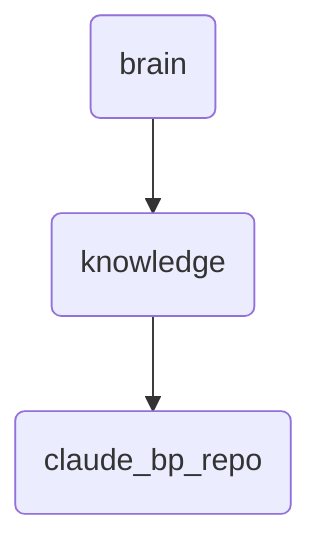

# Claude Bp Repo Identity

This directory contains the blueprint repository for Claude, including video workflows and related documentation. It serves as a central hub for managing and updating Claude's knowledge base.

---

## Topological View

---
*OmniClaw V5.0 | Forged by OMA AI Architect | brain.knowledge.claude_bp_repo | 2026-04-10*
