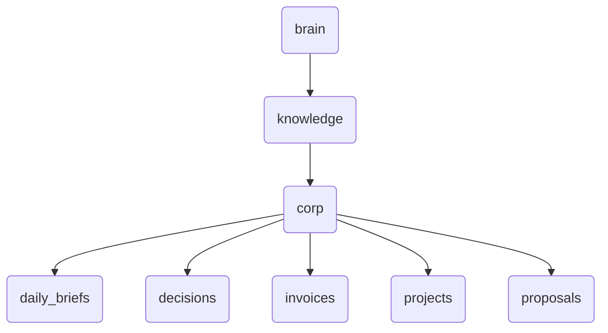

# Corp Identity

The 'corp' directory serves as the central repository for all corporate-related documents and data, including daily briefs, decisions, invoices, projects, and proposals. It also houses system maps, master indexes, and vocabularies essential for knowledge management within OmniClaw.

---

## Topological View

---
*OmniClaw V5.0 | Forged by OMA AI Architect | brain.knowledge.corp | 2026-04-10*
