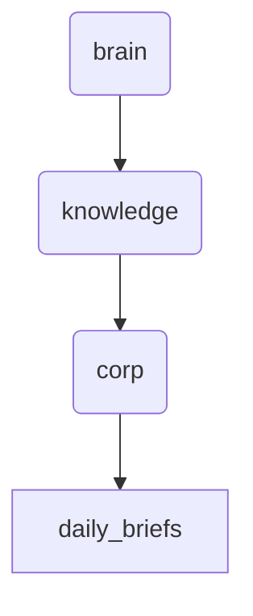

# Daily Briefs Identity

This directory holds daily briefs for the corporation, covering various departments and operations. It serves as a central repository for day-to-day updates and insights.

---

## Topological View

---
*OmniClaw V5.0 | Forged by OMA AI Architect | brain.knowledge.corp.daily_briefs | 2026-04-10*
