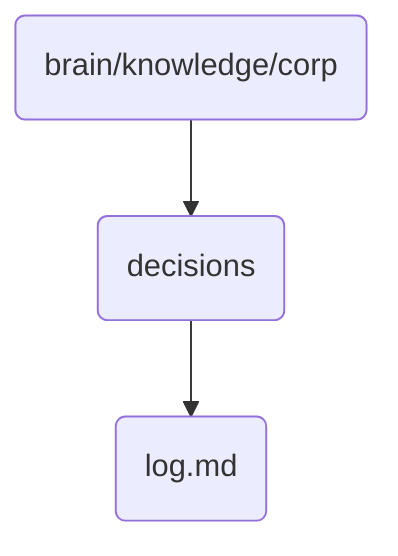

# Decisions Identity

Contains log files related to decision-making processes within the corporation.

## Topological View

```mermaid
graph TD
  Parent("brain/knowledge/corp") --> Node("decisions")
  Node --> Sub1("log.md")
```

---
*OmniClaw V5.0 | Forged by AI Architect | Evaluated dynamically*
