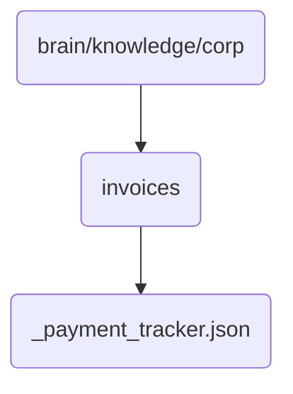

# Invoices Identity

This directory contains payment tracking information for the company's invoices.

## Topological View

```mermaid
graph TD
  Parent("brain/knowledge/corp") --> Node("invoices")
  Node --> Sub1("_payment_tracker.json")
```

---
*OmniClaw V5.0 | Forged by AI Architect | Evaluated dynamically*
