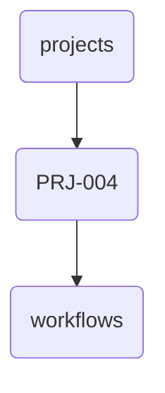

# Prj-004 Identity

This directory node represents PRJ-004 within the OmniClaw project structure, responsible for housing workflows and related documentation specific to this project.

---

## Topological View

---
*OmniClaw V5.0 | Forged by OMA AI Architect | brain.knowledge.corp.projects.prj_004 | 2026-04-10*
