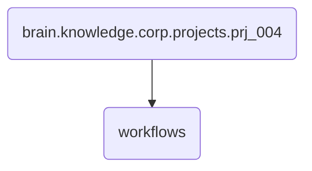

# Workflows Identity

This directory contains the workflow definitions for PRJ-004, including development and post-session processes. It ensures that all project-related workflows are well-defined and executed correctly.

---

## Topological View

---
*OmniClaw V5.0 | Forged by OMA AI Architect | brain.knowledge.corp.projects.prj_004.workflows | 2026-04-10*
