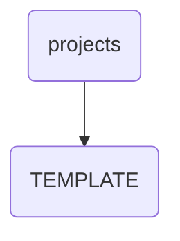

# Template Identity

This directory serves as a template for project documentation within OmniClaw, ensuring consistency and standardization across all projects.

---

## Topological View

---
*OmniClaw V5.0 | Forged by OMA AI Architect | brain.knowledge.corp.projects.template | 2026-04-10*
