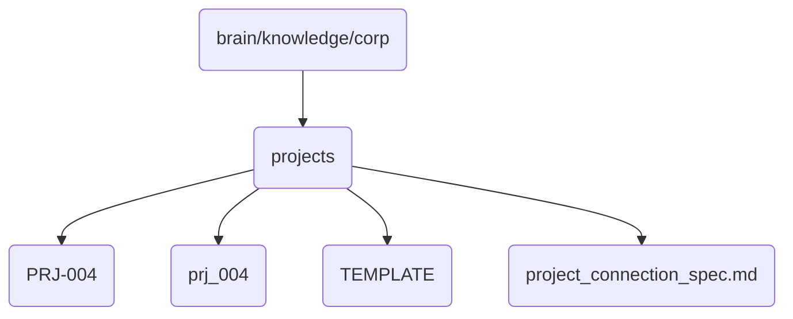

# Projects Identity

Contains project-related directories and files, including templates and specific projects.

## Topological View

---
*OmniClaw V5.0 | Forged by AI Architect | Evaluated dynamically*
