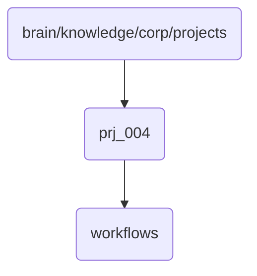

# Prj 004 Identity

Project prj_004 is a critical component of the OmniClaw v5.0 project, focusing on advanced workflow management and integration.

## Topological View

---
*OmniClaw V5.0 | Forged by AI Architect | Evaluated dynamically*
