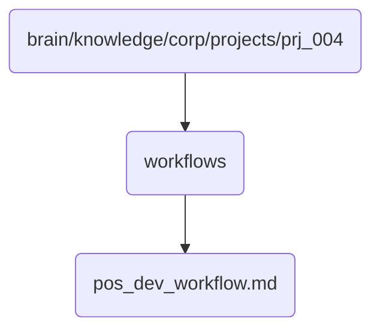

# Workflows Identity

Contains the development workflows for project prj_004.

## Topological View

```mermaid
graph TD
  Parent("brain/knowledge/corp/projects/prj_004") --> Node("workflows")
  Node --> Sub1("pos_dev_workflow.md")
```

---
*OmniClaw V5.0 | Forged by AI Architect | Evaluated dynamically*
