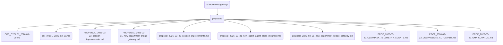

# Proposals Identity

Contains various proposals related to OmniClaw's operations and development, including session improvements, new department bridge gateways, and CLI enhancements.

## Topological View

---
*OmniClaw V5.0 | Forged by AI Architect | Evaluated dynamically*
