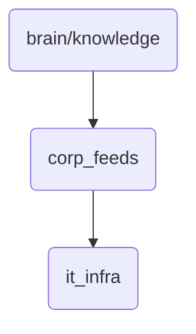

# Corp Feeds Identity

Contains templates and metadata for corporate feeds related to IT infrastructure.

## Topological View

```mermaid
graph TD
  Parent("brain/knowledge") --> Node("corp_feeds")
  Node --> Sub1("it_infra")
```

---
*OmniClaw V5.0 | Forged by AI Architect | Evaluated dynamically*
