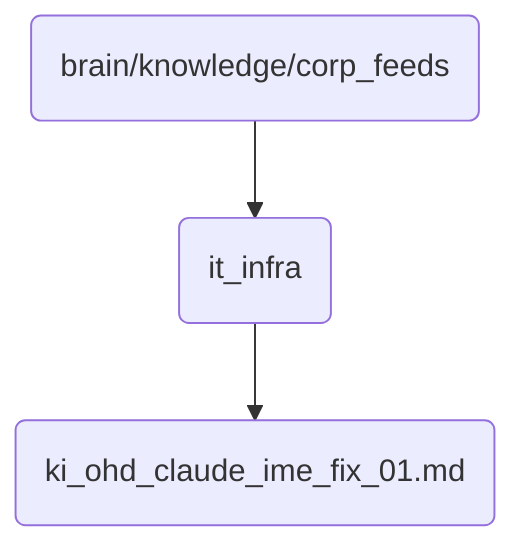

# It Infra Identity

This directory contains critical infrastructure information for the organization, including IT systems and networks.

## Topological View

---
*OmniClaw V5.0 | Forged by AI Architect | Evaluated dynamically*
