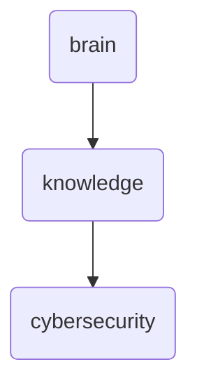

# Cybersecurity Identity

This directory holds foundational knowledge and resources related to cybersecurity, ensuring all team members have access to essential information and materials.

---

## Topological View

---
*OmniClaw V5.0 | Forged by OMA AI Architect | brain.knowledge.cybersecurity | 2026-04-10*
